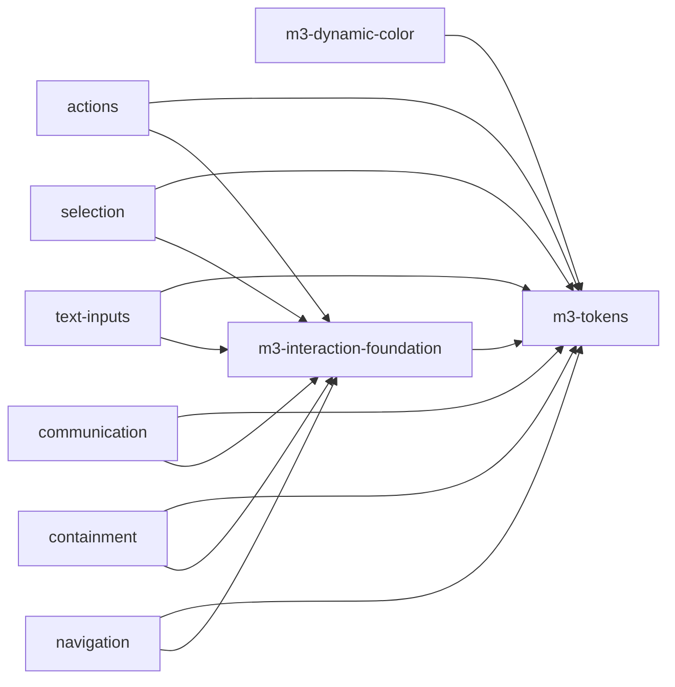

# Project Plan: ngguide-ui

> All specs inherit the strict-M3 rule from `vision.md`: every visual/behavioral choice must trace to
> a specific m3.material.io guideline — no improvisation.

## Specs

### 1. m3-tokens: Complete M3 token system
- **Purpose:** Replace the partial light-only `libs/ui/src/styles/theme.css` with the full M3 token
  set as CSS custom properties — reference + system color roles (light **and** dark), typography
  type scale, shape scale, elevation, state-layer opacities, and motion (duration/easing).
- **Boundary:**
  - IN: complete `--md-ref-*` and `--md-sys-*` token definitions per M3; light/dark scheme structure;
    the `GuiSize` (xs–xl) scale alignment with M3 size tokens; documented token contract for consumers.
  - NOT: algorithmic scheme generation from a source color (that is `m3-dynamic-color`); any component
    markup or behavior; ripple/state-layer directives (that is `m3-interaction-foundation`).
- **Depends on:** none
- **Complexity:** Medium
- **Status:** [ ] Not started

### 2. m3-dynamic-color: Dynamic color (HCT / tonal palettes)
- **Purpose:** Generate M3 color schemes (the `--md-sys-color-*` token values, light + dark) from a
  source color using the M3 HCT / tonal-palette algorithm, exposed as an Angular provider/utility.
- **Boundary:**
  - IN: tonal-palette generation, color-role mapping to the token contract, light/dark + contrast
    levels per M3, an Angular API to apply a generated scheme at runtime.
  - NOT: the static token definitions themselves (consumes the `m3-tokens` contract); component styling.
- **Depends on:** m3-tokens
- **Complexity:** Large
- **Status:** [ ] Not started

### 3. m3-interaction-foundation: State layers, ripple, focus, a11y primitives
- **Purpose:** Shared, reusable interaction layer used by every component — M3 state-layer + ripple +
  focus-ring directives, plus the `@angular/aria` headless behavior wiring (listbox/menu/tabs/combobox).
- **Boundary:**
  - IN: state-layer/ripple/focus-ring directives driven by `--md-sys-state-*` tokens; helpers/re-exports
    layering M3 styling over Angular Aria primitives; shared a11y utilities (focus management, roving
    tabindex usage patterns).
  - NOT: any concrete M3 component; token definitions; scheme generation.
- **Depends on:** m3-tokens
- **Complexity:** Medium
- **Status:** [ ] Not started

### 4. actions: Action components
- **Purpose:** All M3 "Actions" components as `@ngguide/ui/*` entry points.
- **Boundary:**
  - IN: common buttons (elevated/filled/tonal/outlined/text), icon buttons, FAB, extended FAB, FAB menu,
    segmented buttons, split button, button groups. Retrofit existing **button**, **fab**, **icon**
    entry points onto the token + interaction foundation (resolves their `// todo: icon`, `// todo: toggled`).
  - NOT: non-M3 variants; selection controls (chips live in `selection`).
- **Depends on:** m3-tokens, m3-interaction-foundation
- **Complexity:** Large
- **Status:** [ ] Not started

### 5. selection: Selection components
- **Purpose:** M3 selection controls as entry points.
- **Boundary:**
  - IN: checkbox, radio button, switch, chips (assist/filter/input/suggestion), sliders, menus.
  - NOT: text fields; navigation menus' container chrome (menus the control vs. nav are per M3).
- **Depends on:** m3-tokens, m3-interaction-foundation
- **Complexity:** Large
- **Status:** [ ] Not started

### 6. text-inputs: Text input components
- **Purpose:** M3 text-entry components as entry points.
- **Boundary:**
  - IN: text fields (filled/outlined), date pickers, time pickers.
  - NOT: non-M3 form abstractions; form-state libraries (consumers wire their own forms).
- **Depends on:** m3-tokens, m3-interaction-foundation
- **Complexity:** Large
- **Status:** [ ] Not started

### 7. communication: Communication components
- **Purpose:** M3 feedback/communication components as entry points.
- **Boundary:**
  - IN: badges, progress indicators (linear/circular), loading indicator, snackbar, tooltips (plain/rich).
  - NOT: dialogs (containment).
- **Depends on:** m3-tokens, m3-interaction-foundation
- **Complexity:** Medium
- **Status:** [ ] Not started

### 8. containment: Containment components
- **Purpose:** M3 containment/surface components as entry points.
- **Boundary:**
  - IN: cards, carousel, dialogs, divider, lists, bottom sheets.
  - NOT: navigation surfaces (drawer/rail/bar live in `navigation`).
- **Depends on:** m3-tokens, m3-interaction-foundation
- **Complexity:** Large
- **Status:** [ ] Not started

### 9. navigation: Navigation components
- **Purpose:** M3 navigation components as entry points.
- **Boundary:**
  - IN: navigation bar, navigation rail, navigation drawer, top app bar, toolbars, tabs (primary/secondary), search.
  - NOT: the menu *control* (lives in `selection`); routing logic.
- **Depends on:** m3-tokens, m3-interaction-foundation
- **Complexity:** Large
- **Status:** [ ] Not started

> Specs 4–9 are Large because each spans a full M3 category. During `spec:requirements`, any of them
> may be split into per-component sub-specs if a single spec exceeds ~5 implementation sessions.

## Dependency Graph



## Execution Order

| Phase | Specs | Parallelizable? |
|-------|-------|-----------------|
| 1 | m3-tokens | - |
| 2 | m3-dynamic-color, m3-interaction-foundation | Yes |
| 3 | actions, selection, text-inputs, communication, containment, navigation | Yes |

`m3-dynamic-color` (Phase 2) is not required before Phase 3 component work — components only need the
token *contract* from Phase 1 and the directives from `m3-interaction-foundation`. It is grouped in
Phase 2 because it can proceed in parallel once tokens exist.

## Shared Interfaces

### M3 token contract (CSS custom properties)
**Defined by:** m3-tokens | **Consumed by:** all specs

The canonical names every component styles against, e.g.:

```
--md-sys-color-primary, --md-sys-color-on-primary, --md-sys-color-surface, --md-sys-color-on-surface,
--md-sys-color-surface-container(-low/-high/-highest), --md-sys-color-outline(-variant),
--md-sys-color-error, --md-sys-color-on-error, ...
--md-sys-typescale-{display,headline,title,body,label}-{large,medium,small}-{font,size,line-height,weight,tracking}
--md-sys-shape-corner-{none,extra-small,small,medium,large,extra-large,full}
--md-sys-elevation-level{0..5}
--md-sys-state-{hover,focus,pressed,dragged}-state-layer-opacity
--md-sys-motion-{duration-*,easing-*}
```

### GuiSize
**Defined by:** `@ngguide/ui` root (existing) | **Consumed by:** all component specs

```typescript
export type GuiSize = 'xs' | 'sm' | 'md' | 'lg' | 'xl'; // aligned to the M3 expressive size scale
```

### M3 theme provider
**Defined by:** m3-dynamic-color | **Consumed by:** consuming apps (e.g. apps/web)

```typescript
// Generate and apply an M3 scheme from a source color, writing the --md-sys-color-* tokens.
function provideM3Theme(options: {
  sourceColor: string;            // hex seed
  scheme?: 'light' | 'dark' | 'auto';
  contrast?: 'standard' | 'medium' | 'high';
}): EnvironmentProviders;
```

### Interaction directives
**Defined by:** m3-interaction-foundation | **Consumed by:** specs 4–9

```typescript
// State-layer / ripple / focus-ring applied to interactive host elements,
// driven by --md-sys-state-* tokens. Exact selectors/inputs defined in that spec.
// e.g. [guiStateLayer], [guiRipple], [guiFocusRing]
```
