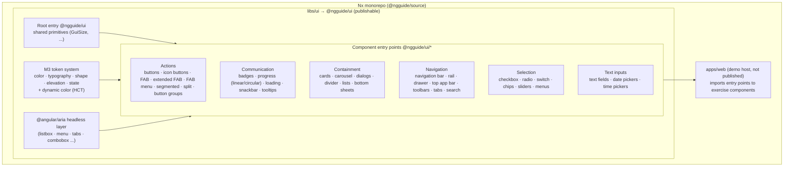

# Project Vision: ngguide-ui

> **Guiding principle:** Strictly implement the Material Design 3 (M3) specification as published at
> [m3.material.io](https://m3.material.io/). No invented behavior, no improvised styling, no
> deviations. Every component's anatomy, states, measurements, tokens, and accessibility behavior
> must trace back to a specific M3 guideline. When the spec is ambiguous, document the open question
> rather than guessing.

## Problem Statement

Teams building Angular applications need a Material-Design-3 component library that is faithful to the
official M3 specification, modern (standalone, signals, zoneless), and framework-native — not a thin
wrapper around an existing toolkit. `@ngguide/ui` is built from scratch for the
[ng.guide](https://ng.guide/ui-kit) course, demonstrating how a production-grade M3 kit is
constructed component-by-component while staying strictly within the published guidelines.

The problem this solves: existing Angular Material is its own evolving interpretation and carries
legacy API surface; developers learning M3 (and consumers wanting an exact, current M3
implementation) lack a clean, from-scratch, spec-literal reference built on Angular 21 primitives.

## Stakeholders

| Role | Needs | Priority |
|------|-------|----------|
| App developers (consumers of `@ngguide/ui`) | Accurate, accessible, themeable M3 components with stable signal-based APIs | High |
| ng.guide course learners | A readable, idiomatic reference showing how each M3 component is built | High |
| Designers / design-system owners | Components that match M3 anatomy, tokens, and states exactly so design and code stay in sync | High |
| Library maintainer (Igor) | Consistent conventions, enforced module boundaries, fast CI (lint/test/build), publishable via Nx release | High |
| A11y-dependent end users | Correct ARIA roles, keyboard interaction, and focus management per M3 + WAI-ARIA APG | High |

## Goals

1. **Spec-literal coverage of the full M3 component catalog** (see System Boundary). Each component
   ships only behavior and visuals defined by M3 — anatomy, variants, sizes, and states matched
   1:1 to the guideline page.
2. **Complete M3 token system with dynamic color.** Implement the M3 color (ref/sys tonal palettes,
   color roles, light + dark), typography (type scale), shape (shape scale), elevation, and state
   (state-layer opacities) tokens as CSS custom properties; plus dynamic color scheme generation
   from a source color via the M3 HCT / tonal-palette algorithm.
3. **Accessibility via `@angular/aria` headless primitives.** Behavior and ARIA patterns
   (listbox, menu, tabs, combobox, etc.) are built on Angular Aria; M3 styling is layered on top.
   Components meet the keyboard and screen-reader expectations of the M3 spec and WAI-ARIA APG.
4. **Consistent Angular 21 component conventions.** Standalone, `OnPush`, signal inputs/outputs,
   attribute selectors, zoneless-safe, host-driven theming attributes — uniform across every
   entry point.
5. **Every published component is tested and builds clean.** Each secondary entry point has specs
   on the native Angular Vitest runner; `lint test build` is green for `ui` and `web`.

## Non-Goals

- **Not a wrapper** around Angular Material, MDC Web, or any other library — built from scratch.
- **No bespoke/non-M3 components or variants.** If it isn't in the M3 spec, it isn't in scope.
- **No design improvisation.** Colors, spacing, motion, and shape come from M3 tokens — not
  ad-hoc values chosen for taste.
- **No application-level concerns** in the library: no routing, no data layer, no global app state.
- **`apps/web` is not published** — it is a demo/playground host only.
- **No backwards-compat shims** for pre-M3 or legacy Angular Material APIs.
- Release/verdaccio and Nx release configuration are **not changed** as part of feature work.

## Technical Constraints

- **Angular 21** — standalone components, signal inputs (`input()`, `input(false, { transform: booleanAttribute })`),
  `ChangeDetectionStrategy.OnPush`, signal outputs, host bindings via the `host` metadata property.
  Members referenced in host bindings must be at least `protected` (Angular 21 disallows `private`).
- **Zoneless** — `provideZonelessChangeDetection()`; no `zone.js`. Components and tests must not
  depend on Zone-based change detection.
- **Nx 22 monorepo**, package manager **pnpm** (`.npmrc` `node-linker=hoisted`). Prefix Nx commands
  with `pnpm exec`.
- **Single publishable library with secondary entry points.** `libs/ui` is one Nx project publishing
  `@ngguide/ui`; each component is a secondary entry point (`@ngguide/ui/<name>`) with its own
  `ng-package.json` + `index.ts` barrel, wired through `tsconfig.base.json` `paths`. Build via
  `@nx/angular:package` (ng-packagr) → `dist/libs/ui`.
- **Native Angular Vitest** (`@nx/angular:unit-test`, Vitest 4). No `vite.config`, no `test-setup.ts`.
  Secondary-entry specs live outside `sourceRoot`, so they must be listed in the `include` option of
  the `ui` `test` target. Every project with a `test` target needs at least one spec (no
  `passWithNoTests`).
- **Module boundaries** enforced by `@nx/enforce-module-boundaries` (eslint).
- **Accessibility floor:** WCAG 2.1 AA color contrast must hold for M3 color roles in both light and
  dark schemes; all interactive components fully keyboard-operable.

## Shared Architectural Decisions

| Decision | Rationale |
|----------|-----------|
| Strict adherence to m3.material.io as the single source of truth | Eliminates guesswork; every visual/behavioral choice is traceable to the spec |
| One Nx library (`ui`) with per-component secondary entry points | Tree-shakable granular imports (`@ngguide/ui/button`) while keeping a single publishable package |
| Standalone + OnPush + signals, zoneless throughout | Aligns with Angular 21 best practices and keeps the kit modern and fast |
| M3 tokens as CSS custom properties (ref/sys layers) | Native theming, runtime theme switching, and SSR-safe styling without a runtime style engine |
| Dynamic color via M3 HCT / tonal-palette algorithm | Spec-correct scheme generation from a source color; supports light/dark and custom brand seeds |
| Behavior/ARIA on `@angular/aria` headless primitives | First-party, accessible interaction patterns; we own only the M3 styling layer |
| Attribute selectors + host-driven `data-variant`/`data-size` attributes | Matches existing `button`/`fab`/`icon` convention; CSS keys off attributes for variants/sizes |
| Shared primitives (e.g. `GuiSize`) in `@ngguide/ui` root entry | Single definition reused by every component entry point |
| Native Angular Vitest, spec per entry point | First-party toolchain; zoneless-correct; explicit `include` for secondary entries |

## System Boundary

Currently implemented entry points: **button**, **fab**, **icon**. The boundary above is the full
M3 target catalog to grow into; each component becomes a secondary entry point as it is built.

## Success Criteria

- Every component on m3.material.io has a corresponding `@ngguide/ui/<name>` entry point whose
  anatomy, variants, sizes, and states map 1:1 to its M3 guideline page (tracked per-component).
- The M3 token system is complete: ref + sys tokens for color/typography/shape/elevation/state,
  light and dark schemes, and dynamic-color generation from a source color.
- All interactive components pass keyboard + screen-reader checks consistent with M3 and WAI-ARIA
  APG, and color roles meet WCAG 2.1 AA contrast in light and dark.
- `pnpm exec nx run-many -t lint test build` is green for `ui` and `web`; every published entry
  point has at least one passing spec on the native Vitest runner.
- `pnpm exec nx build ui` produces a clean ng-packagr build of `@ngguide/ui` with all entry points.
- No component ships visuals or behavior absent from the M3 spec (enforced by review).
