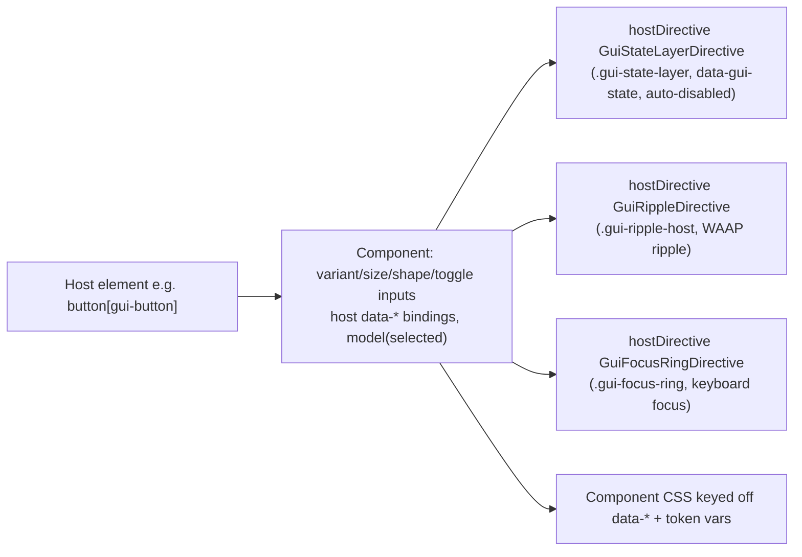
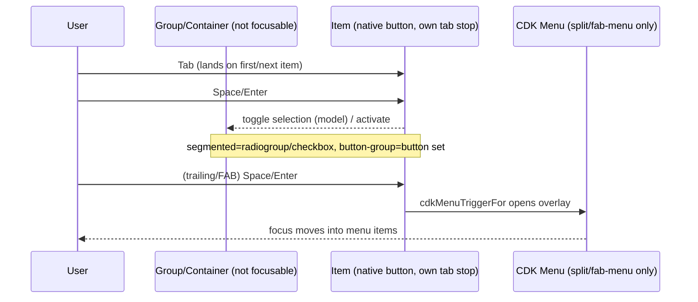

# Design Document: Actions Components

## Overview

This design implements the full Material Design 3 "Actions" catalog as secondary entry
points of `@ngguide/ui`, and retrofits the existing `button`/`fab`/`icon` entry points onto
the M3 token contract and the M3 interaction foundation. Every component composes the shipped
`GuiStateLayerDirective` / `GuiRippleDirective` / `GuiFocusRingDirective` via `hostDirectives`,
drives variant/size/shape/state through host `data-*` attributes styled from `--md-sys-*`
tokens, exposes toggle/selection through signal `model()` inputs, follows M3's documented
Tab-per-item keyboard model with native ARIA roles, and delegates the FAB-menu / split-button
overlays to `@angular/cdk/menu`.

### Key Changes

1. **New entry points:** `@ngguide/ui/icon-button`, `/fab-menu`, `/segmented-button`,
   `/split-button`, `/button-group`. `extended-fab` ships inside `@ngguide/ui/fab`.
2. **Retrofit** `button`, `fab`, `icon`: drop hand-rolled `:hover/:focus-visible/:active` +
   `color-mix()` + `rgba()` + hardcoded radii; compose the interaction directives; source all
   color/shape/elevation/motion from tokens. Resolve `// todo: icon`, `// todo: toggled`,
   `// todo: add extended variant`.
3. **Shared core, no new abstraction layer:** components compose the three interaction
   directives via `hostDirectives` (Decision 1A); a small framework-free TS module holds the
   size/shape/variant→token maps. Disabled is auto-detected by the directives — no input forwarding.
4. **Toggle & selection** via `model()` two-way signals; group selection (segmented, button
   group) via a lightweight signal-based child registry.
5. **Composite a11y** is native focus + manual ARIA roles (radiogroup/radio, checkbox,
   menu-trigger) matching M3's Tab-per-item model; menus use `@angular/cdk/menu`.
6. **No `m3-tokens` change required** — the M3 button corner table maps onto existing shape tokens.

### Decisions

| Problem Area | Chosen Variant | Why chosen | Reference |
|---|---|---|---|
| 1 Composition & shared core | **A — `hostDirectives`** | Med/Low; reuses the shipped interaction directives idiomatically; disabled auto-detected so no input-forwarding collision | research.md §1 |
| 2 Variant/size/shape & morph | **A — data-attrs + token CSS** | Med/Low; continues `button.css`/`interaction.css.ts`; `data-gui-state=pressed` already emitted → morph is a CSS `border-radius` transition on motion tokens | research.md §2 |
| 3 Toggle/selected & forms | **A — `model()` two-way** | Low/Low; signal-native, zoneless-correct, no forms dependency | research.md §3 |
| 4 Composite a11y | **C — native ARIA + CDK menu** | Med/Low; matches M3's sourced Tab-per-item model (radiogroup/checkbox); CDK menu only where a real menu exists | research.md §4 |
| 5 Menu overlay | **A — `@angular/cdk/menu` now** | Med/Med; pairs with 4C, CDK already a peer dep, ships functional FAB-menu/split-button (zoneless #28984 validated in testing) | research.md §5 |
| 6 Icon slot | **B — named slots** | Med/Low; expresses M3 anatomy and the toggle selected-icon swap (Req 6.3) declaratively | research.md §6 |

## Architecture

### Entry-point map

```mermaid
graph TB
    subgraph root["@ngguide/ui (root)"]
        size["GuiSize, GuiActionVariant maps (shared TS)"]
    end
    subgraph interaction["@ngguide/ui/interaction (existing)"]
        sl["GuiStateLayerDirective"]
        rp["GuiRippleDirective"]
        fr["GuiFocusRingDirective"]
    end
    subgraph cdk["@angular/cdk/menu (peer)"]
        menu["CdkMenuTrigger / CdkMenu / CdkMenuItem"]
    end
    subgraph actions["Actions entry points @ngguide/ui/*"]
        btn["button (retrofit)\nButtonComponent"]
        ib["icon-button (new)\nIconButtonComponent"]
        fab["fab (retrofit)\nFabComponent + ExtendedFabComponent"]
        fm["fab-menu (new)\nFabMenuComponent + items"]
        seg["segmented-button (new)\nGroup + Segment"]
        split["split-button (new)\nSplitButtonComponent"]
        grp["button-group (new)\nButtonGroupComponent"]
        icon["icon (retrofit)\nIconComponent"]
    end
    size --> actions
    sl --> actions
    rp --> actions
    fr --> actions
    menu --> fm
    menu --> split
    icon --> btn
    icon --> ib
```



### Composition model (every interactive Action)



### Keyboard / focus model (composite components)



## Components and Interfaces

> Conventions for **all** components: standalone, `ChangeDetectionStrategy.OnPush`, signal
> inputs, attribute selectors with the `// eslint-disable-next-line @angular-eslint/component-selector`
> comment where needed, members used in host bindings are `protected`, SSR-safe (no DOM access at
> construction). Each composes the three interaction directives via `hostDirectives`. **Disabled is
> not forwarded** — `GuiStateLayerDirective`/`GuiRippleDirective` already read native `disabled` /
> `aria-disabled` from the host (`isHostDisabled`), so a component sets the host disabled state and
> the directives suppress feedback automatically.

### Shared TS maps — `@ngguide/ui` root (`libs/ui/src/lib/`)

```typescript
// Path: libs/ui/src/lib/action-tokens.ts  (framework-free, unit-testable)

import { GuiSize } from './size';

/** M3 button corner radii per size, mapped to EXISTING shape tokens (no m3-tokens change). */
export interface GuiShapeSet {
  round: string;    // var(--md-sys-shape-corner-full)
  square: string;   // XS/S=medium(12) M=large(16) L/XL=extra-large(28)
  pressed: string;  // XS/S=small(8) M=medium(12) L/XL=large(16)
}

// Source: m3.material.io buttons/specs corner table (research.md §M3 reference).
export const GUI_BUTTON_SHAPES: Record<GuiSize, GuiShapeSet> = {
  xs: { round: 'var(--md-sys-shape-corner-full)', square: 'var(--md-sys-shape-corner-medium)',      pressed: 'var(--md-sys-shape-corner-small)'  },
  sm: { round: 'var(--md-sys-shape-corner-full)', square: 'var(--md-sys-shape-corner-medium)',      pressed: 'var(--md-sys-shape-corner-small)'  },
  md: { round: 'var(--md-sys-shape-corner-full)', square: 'var(--md-sys-shape-corner-large)',       pressed: 'var(--md-sys-shape-corner-medium)' },
  lg: { round: 'var(--md-sys-shape-corner-full)', square: 'var(--md-sys-shape-corner-extra-large)', pressed: 'var(--md-sys-shape-corner-large)'  },
  xl: { round: 'var(--md-sys-shape-corner-full)', square: 'var(--md-sys-shape-corner-extra-large)', pressed: 'var(--md-sys-shape-corner-large)'  },
};
```

The size *measurements* (height/padding/icon/gap from research §M3 reference: 32/40/56/96/136 dp
heights etc.) live in each component's CSS keyed by `[data-size]`, not in TS — CSS is the styling
layer and reads no values that aren't either literals-from-spec or token vars. The shape morph is
expressed in CSS as a `border-radius` swap on `[data-gui-state~='pressed']` and `[data-selected]`
with `transition: border-radius var(--md-sys-motion-duration-short4) var(--md-sys-motion-easing-standard)`.

### ButtonComponent — `@ngguide/ui/button` (retrofit)

```typescript
// Path: libs/ui/button/src/button.ts
export type GuiButtonVariant = 'elevated' | 'filled' | 'tonal' | 'outlined' | 'text';
export type GuiButtonShape = 'round' | 'square';

@Component({
  selector: 'button[gui-button], button[guiButton], a[gui-button], a[guiButton]',
  template: `
    <ng-content select="[guiIcon]" />
    <span class="gui-button-label"><ng-content /></span>
    <ng-content select="[guiSelectedIcon]" />
  `,
  styleUrl: './button.css',
  hostDirectives: [GuiStateLayerDirective, GuiRippleDirective, GuiFocusRingDirective],
  host: {
    '[attr.data-variant]': 'variant()',
    '[attr.data-size]': 'size()',
    '[attr.data-shape]': 'shape()',
    '[attr.data-selected]': 'toggle() && selected() ? "" : null',
    '[attr.aria-pressed]': 'toggle() ? selected() : null',
    '[attr.disabled]': 'isButton && disabled() ? "" : null',
    '[attr.aria-disabled]': '!isButton && disabled() ? "true" : null',
    '[class.gui-disabled]': 'disabled()',
    '(click)': 'onActivate($event)',
  },
  exportAs: 'guiButton',
  changeDetection: ChangeDetectionStrategy.OnPush,
})
export class ButtonComponent {
  variant = input<GuiButtonVariant>('filled');
  size = input<GuiSize>('sm');                                  // M3 baseline = small
  shape = input<GuiButtonShape>('round');
  disabled = input(false, { transform: booleanAttribute });
  toggle = input(false, { transform: booleanAttribute });      // resolves // todo: toggled
  selected = model(false);                                      // two-way (Decision 3A)
  // text variant has no toggle form (M3): guard selected when variant==='text'
}
```

- **Toggle:** `onActivate` flips `selected` only when `toggle()` is true and not disabled; the
  selected container color + selected shape are applied by CSS via `[data-selected]` (round↔square
  flip per M3). Color-role tables from research §M3 reference drive the per-variant CSS.
- **Icon slots (Decision 6B):** `[guiIcon]` (leading) + default label + `[guiSelectedIcon]`
  (shown only when `[data-selected]`, hidden otherwise via CSS). Resolves `// todo: icon`.
- **`isButton`** is computed once from the host tag (`button` vs `a`) to pick native `disabled`
  vs `aria-disabled`.

### IconButtonComponent — `@ngguide/ui/icon-button` (new)

```typescript
// Path: libs/ui/icon-button/src/icon-button.ts
export type GuiIconButtonVariant = 'standard' | 'filled' | 'tonal' | 'outlined';
export type GuiIconButtonWidth = 'narrow' | 'uniform' | 'wide';

@Component({
  selector: 'button[gui-icon-button], button[guiIconButton], a[gui-icon-button], a[guiIconButton]',
  template: `<ng-content /><ng-content select="[guiSelectedIcon]" />`,
  hostDirectives: [GuiStateLayerDirective, GuiRippleDirective, GuiFocusRingDirective],
  host: {
    '[attr.data-variant]': 'variant()',
    '[attr.data-size]': 'size()',
    '[attr.data-width]': 'width()',
    '[attr.data-selected]': 'toggle() && selected() ? "" : null',
    '[attr.aria-pressed]': 'toggle() ? selected() : null',
    /* disabled handling identical to ButtonComponent */
  },
  changeDetection: ChangeDetectionStrategy.OnPush,
})
export class IconButtonComponent {
  variant = input<GuiIconButtonVariant>('standard');
  size = input<GuiSize>('sm');
  width = input<GuiIconButtonWidth>('uniform');
  disabled = input(false, { transform: booleanAttribute });
  toggle = input(false, { transform: booleanAttribute });
  selected = model(false);
  // Req 6.4 / 15: aria-label is required on the host (consumer-supplied); documented, not enforced.
}
```

XS/S icon buttons require a 48×48 dp target area (M3 a11y) — CSS adds a transparent expanded hit
area for `[data-size='xs']`/`[data-size='sm']` without changing visual size.

### FabComponent + ExtendedFabComponent — `@ngguide/ui/fab` (retrofit)

```typescript
// Path: libs/ui/fab/src/fab.ts
export type GuiFabSize = 'sm' | 'md' | 'lg';        // small / baseline / large (M3 FAB sizes)
export type GuiFabColor =
  | 'primary-container' | 'secondary-container' | 'tertiary-container'   // default = primary-container
  | 'primary' | 'secondary' | 'tertiary';

@Component({
  selector: 'button[gui-fab], button[guiFab], a[gui-fab], a[guiFab]',
  template: `<ng-content />`,
  hostDirectives: [GuiStateLayerDirective, GuiRippleDirective, GuiFocusRingDirective],
  host: { '[attr.data-color]': 'color()', '[attr.data-size]': 'size()',
          '[attr.data-lowered]': 'lowered() ? "" : null', /* disabled as above */ },
  changeDetection: ChangeDetectionStrategy.OnPush,
})
export class FabComponent {
  color = input<GuiFabColor>('primary-container');   // M3 default (surface deprecated)
  size = input<GuiFabSize>('md');
  lowered = input(false, { transform: booleanAttribute });
  disabled = input(false, { transform: booleanAttribute });
}
```

```typescript
// Path: libs/ui/fab/src/extended-fab.ts   (resolves // todo: add extended variant)
@Component({
  selector: 'button[gui-extended-fab], button[guiExtendedFab]',
  template: `<ng-content select="[guiIcon]" />
             <span class="gui-extended-fab-label" [hidden]="!expanded()"><ng-content /></span>`,
  hostDirectives: [GuiStateLayerDirective, GuiRippleDirective, GuiFocusRingDirective],
  host: { '[attr.data-color]': 'color()', '[attr.data-size]': 'size()',
          '[attr.data-expanded]': 'expanded() ? "" : null' },
  changeDetection: ChangeDetectionStrategy.OnPush,
})
export class ExtendedFabComponent {
  color = input<GuiFabColor>('primary-container');
  size = input<GuiFabSize>('md');
  expanded = input(true, { transform: booleanAttribute });     // collapse → icon-only FAB
}
```

FAB elevation: resting level 3, hovered level 4 (research §M3 reference) via `--md-sys-elevation-*`
on state. `lowered` swaps container to `surface-container-low`. Collapse/expand animates label
width/opacity via motion tokens; reduced-motion presents the end state (the interaction CSS already
has a `prefers-reduced-motion` block; the label transition is additionally guarded).

### FabMenuComponent — `@ngguide/ui/fab-menu` (new, CDK menu)

```typescript
// Path: libs/ui/fab-menu/src/fab-menu.ts
@Component({
  selector: 'gui-fab-menu',
  imports: [CdkMenuTrigger, CdkMenu, CdkMenuItem, FabComponent, IconButtonComponent],
  template: `
    <button gui-fab [color]="color()" [cdkMenuTriggerFor]="menu"
            [attr.aria-label]="opened() ? 'Toggle menu' : ariaLabel()"
            [attr.aria-expanded]="opened()"
            (cdkMenuOpened)="opened.set(true)" (cdkMenuClosed)="opened.set(false)">
      <ng-content select="[guiFabIcon]" />
    </button>
    <ng-template #menu>
      <div class="gui-fab-menu-list" cdkMenu><ng-content select="[guiFabMenuItem]" /></div>
    </ng-template>
  `,
  changeDetection: ChangeDetectionStrategy.OnPush,
})
export class FabMenuComponent {
  color = input<GuiFabColor>('primary-container');
  ariaLabel = input<string>('');
  protected opened = signal(false);
  // M3: close button takes the FAB's place — Label "Toggle menu", Role Button, State expanded/collapsed.
}
// FabMenuItemComponent: button[gui-fab-menu-item][cdkMenuItem] — flat M3 item, 48dp min target.
```

> **Zoneless validation (Req 18.4, research open question):** `cdkMenuTriggerFor` had a reported
> zoneless positioning bug (#28984, closed-inactive on v17). The test plan MUST verify the overlay
> positions at the trigger (not top-left) under this project's zoneless setup before this component
> is considered done; if broken on CDK 21.x, fall back to research §5 Variant C (contract + stub).

### SegmentedButtonGroup + Segment — `@ngguide/ui/segmented-button` (new)

```typescript
// Path: libs/ui/segmented-button/src/segmented-button-group.ts
@Component({
  selector: 'gui-segmented-buttons',
  host: { 'role': 'radiogroup', '[attr.aria-multiselectable]': 'multiple() ? "true" : null' },
  // multi-select: role stays a group of checkbox-buttons; single-select: radiogroup/radio.
  changeDetection: ChangeDetectionStrategy.OnPush,
})
export class SegmentedButtonGroupComponent {
  multiple = input(false, { transform: booleanAttribute });
  value = model<string | string[] | null>(null);   // single → string|null; multi → string[]
  // Children register via a provided token; group owns selection + enforces 2..5 (warns on out-of-range).
  protected segments = contentChildren(SegmentedButtonComponent);
}
```

```typescript
// Path: libs/ui/segmented-button/src/segmented-button.ts
@Component({
  selector: 'button[gui-segmented-button]',
  template: `@if (selected()) { <span class="gui-segment-check" aria-hidden="true">✓</span> }
             <ng-content select="[guiIcon]" /><span class="gui-segment-label"><ng-content /></span>`,
  hostDirectives: [GuiStateLayerDirective, GuiRippleDirective, GuiFocusRingDirective],
  host: {
    '[attr.role]': 'group.multiple() ? "checkbox" : "radio"',
    '[attr.aria-checked]': 'selected()',
    '[attr.data-selected]': 'selected() ? "" : null',
    '(click)': 'group.toggleValue(value())',           // Space/Enter on a native button → click
  },
  changeDetection: ChangeDetectionStrategy.OnPush,
})
export class SegmentedButtonComponent {
  value = input.required<string>();
  protected group = inject(SegmentedButtonGroupComponent);
  protected selected = computed(() => this.group.isSelected(this.value()));
}
```

M3 keyboard: each segment is its own tab stop (native `<button>`), Space/Enter selects (native
click), checkmark shown on the active segment. Single-select = radiogroup/radio + `aria-checked`;
multi-select = checkbox role per segment.

### SplitButtonComponent — `@ngguide/ui/split-button` (new, CDK menu)

```typescript
// Path: libs/ui/split-button/src/split-button.ts
@Component({
  selector: 'gui-split-button',
  imports: [ButtonComponent, CdkMenuTrigger, CdkMenu, CdkMenuItem],
  template: `
    <button gui-button [variant]="variant()" [size]="size()" class="gui-split-leading"
            (click)="action.emit()"><ng-content select="[guiLeading]" /></button>
    <button gui-button [variant]="variant()" [size]="size()" class="gui-split-trailing"
            [cdkMenuTriggerFor]="menu" [attr.aria-expanded]="opened()"
            [attr.data-open]="opened() ? '' : null"
            (cdkMenuOpened)="opened.set(true)" (cdkMenuClosed)="opened.set(false)">
      <ng-content select="[guiTrailingIcon]" />
    </button>
    <ng-template #menu><div class="gui-split-menu" cdkMenu><ng-content select="[guiMenuItem]" /></div></ng-template>
  `,
  changeDetection: ChangeDetectionStrategy.OnPush,
})
export class SplitButtonComponent {
  variant = input<GuiButtonVariant>('tonal');
  size = input<GuiSize>('sm');
  action = output<void>();
  protected opened = signal(false);
}
```

M3: focus lands leading→trailing; trailing announces expanded/collapsed; trailing corners morph —
pressed → inner-pressed radius, `[data-open]` → full radius (CSS on the trailing button).

### ButtonGroupComponent — `@ngguide/ui/button-group` (new)

```typescript
// Path: libs/ui/button-group/src/button-group.ts
@Component({
  selector: 'gui-button-group',
  // container NOT focusable; projects gui-button / gui-icon-button children, each its own tab stop.
  host: { '[attr.data-connected]': 'connected() ? "" : null', 'role': 'group' },
  template: `<ng-content />`,
  changeDetection: ChangeDetectionStrategy.OnPush,
})
export class ButtonGroupComponent {
  connected = input(false, { transform: booleanAttribute });   // connected vs standard
  // Expressive press: pressed child expands ~15%, neighbors compress. Implemented with CSS
  // :has([data-gui-state~='pressed']) sibling rules driven by the state-layer's pressed attribute;
  // gated by prefers-reduced-motion.
}
```

### IconComponent — `@ngguide/ui/icon` (retrofit, minor)

No API change; confirm it sizes from `--gui-comp-icon-size` and is consumed by the button/icon-button
icon slots. Buttons set the icon size per `[data-size]` via that custom property (Req 5.3).

## Data Models

```typescript
// Variant / size / shape / color enums (per entry point, exported from each barrel)
type GuiButtonVariant = 'elevated' | 'filled' | 'tonal' | 'outlined' | 'text';
type GuiButtonShape   = 'round' | 'square';
type GuiIconButtonVariant = 'standard' | 'filled' | 'tonal' | 'outlined';
type GuiIconButtonWidth   = 'narrow' | 'uniform' | 'wide';
type GuiFabSize   = 'sm' | 'md' | 'lg';
type GuiFabColor  = 'primary-container' | 'secondary-container' | 'tertiary-container'
                  | 'primary' | 'secondary' | 'tertiary';
// GuiSize ('xs'|'sm'|'md'|'lg'|'xl') reused from @ngguide/ui for buttons & icon buttons.
```

### Toggle color roles (CSS source of truth — from m3.material.io buttons/specs)

| Variant | Default | Toggle unselected | Toggle selected |
|---|---|---|---|
| elevated | `surface-container-low` / `primary` | same | `primary` / `on-primary` |
| filled | `primary` / `on-primary` | `surface-container` / `on-surface-variant` | `primary` / `on-primary` |
| tonal | `secondary-container` / `on-secondary-container` | same | `secondary` / `on-secondary` |
| outlined | `outline-variant` / `on-surface-variant` | same | `inverse-surface` / `inverse-on-surface` |
| text | `primary` | — (no toggle text button) | — |

### Shape morph mapping (proves no `m3-tokens` change needed)

| Size | Round | Square | Pressed | Tokens used |
|---|---|---|---|---|
| xs / sm | full | 12dp | 8dp | `corner-full` / `corner-medium` / `corner-small` |
| md | full | 16dp | 12dp | `corner-full` / `corner-large` / `corner-medium` |
| lg / xl | full | 28dp | 16dp | `corner-full` / `corner-extra-large` / `corner-large` |

## Data Flow Completeness

Each new/retrofit component is a "field" that must appear in every wiring layer:

| Entry point | Dir + ng-package.json | Barrel `index.ts` | tsconfig path | test `include` | Demo (apps/web) |
|---|---|---|---|---|---|
| button (retrofit) | exists | exists | exists | exists | exists |
| icon-button | `libs/ui/icon-button/` | `export * from './icon-button'` | add | add `../icon-button/src/*.spec.ts` | add |
| fab (+ extended) | exists | add `export * from './extended-fab'` | exists | add extended spec | add |
| fab-menu | `libs/ui/fab-menu/` | barrel | add | add | add |
| segmented-button | `libs/ui/segmented-button/` | barrel (group+segment) | add | add | add |
| split-button | `libs/ui/split-button/` | barrel | add | add | add |
| button-group | `libs/ui/button-group/` | barrel | add | add | add |
| shared maps | `libs/ui/src/lib/action-tokens.ts` | `export * from './lib/action-tokens'` in root index | N/A (root path) | add spec | N/A |

`@angular/cdk/menu` is already covered by the existing `@angular/cdk` peer dependency; no
`package.json` change. ng-packagr auto-discovers each new secondary entry point from its
`ng-package.json` (no root build change).

## Error Handling

This is a presentational library; "errors" are misuse/edge inputs surfaced to the developer, not
runtime user errors.

| Condition | Handling |
|---|---|
| Toggle activated while disabled | `onActivate` no-ops (guarded on `disabled()`); no `selected` change, no event |
| Segmented group with <2 or >5 segments | `console.warn` in dev (M3 guidance); render anyway, do not throw |
| Icon button without `aria-label` | Documented requirement; not enforced at runtime (no a11y assertion in a UI lib) |
| `text` variant + `toggle=true` | Ignore toggle (M3 has no toggle text button); `selected` stays inert |
| CDK menu overlay mispositioned under zoneless | Caught by the test plan (#28984 validation); fallback = contract+stub (research §5C) |

## Testing Strategy

### Approach

Native Angular Vitest (`@nx/angular:unit-test`, jsdom, zoneless) per the repo convention; each
secondary-entry spec is registered in `libs/ui/project.json` `include`. Unit tests assert host
attributes, ARIA roles/states, toggle/selection behavior, disabled suppression, and slot rendering
— DOM-observable behavior, not internal signals. Geometry, real ripple animation, overlay
positioning, contrast, and reduced-motion runtime are deferred to the browser test plan
(`spec:test-plan` → `spec:test`), since jsdom can't measure them.

### Unit Tests (representative)

```typescript
describe('ButtonComponent', () => {
  it('reflects variant/size/shape to data-* attributes', () => { /* ... */ });
  it('toggles selected on click only when toggle=true, and sets aria-pressed', () => { /* ... */ });
  it('does not change selected when disabled', () => { /* ... */ });
  it('applies [data-selected] and shows guiSelectedIcon slot when selected', () => { /* ... */ });
});

describe('SegmentedButtonGroupComponent', () => {
  it('single-select assigns role=radio + aria-checked and updates value', () => { /* ... */ });
  it('multi-select assigns role=checkbox and accumulates an array value', () => { /* ... */ });
  it('warns when fewer than 2 or more than 5 segments are projected', () => { /* ... */ });
});

describe('FabMenuComponent', () => {
  it('sets aria-expanded and "Toggle menu" label when the menu opens', () => { /* ... */ });
});
```

### Edge Cases

1. **Anchor vs button host** — `a[gui-button]` has no native `disabled`; uses `aria-disabled` and
   the directives still suppress feedback (host `isHostDisabled` reads `aria-disabled`).
2. **Reduced motion** — shape morph, FAB expand/collapse, and button-group expansion present end
   states without animation (reuse `GuiReducedMotion` + the interaction CSS media block).
3. **Controlled toggle** — when the parent binds `[(selected)]`, the component reflects the external
   value and does not override it on activation beyond the two-way emit.
4. **SSR** — no overlay opens during server render; CDK menu attaches only on interaction; no orphan
   nodes (mirrors the interaction-foundation SSR guarantee). Verified by prerender in the test plan.
5. **Disabled toggle** — keeps and displays current selected state, disallows change (Req 14.4).

## Deviations (logged during implementation)

- **Minor (Group B, task 5):** `ButtonComponent` host gained `[attr.data-toggle]` (`toggle() ? "" : null`)
  in addition to the bindings listed above. It is required so the CSS can distinguish the M3
  toggle-*unselected* column (e.g. filled = `surface-container`) from the non-toggle *default*
  column (filled = `primary`) — both lack `[data-selected]`. Same pattern will apply to icon buttons.

- **Moderate (Groups G & H):** the original FAB-menu / split-button snippets projected `cdkMenuItem`
  into the component's own `<div cdkMenu>` via `<ng-content>`. That breaks CDK menu's DI — a projected
  element resolves `inject(CdkMenu)` through its *declaration* (consumer) context, not the projection
  context, so the items can't find the component-owned `CdkMenu`. **Corrected approach (DI-safe,
  keeps `@angular/cdk/menu`):** the **consumer provides the menu panel as an `<ng-template>`**
  (containing `<div cdkMenu>` + `<button gui-fab-menu-item>` items); the component queries it with
  `contentChild(TemplateRef)` and binds `[cdkMenuTriggerFor]="menu()"`. `FabMenuItemComponent`
  composes `CdkMenuItem` (+ the interaction directives) via `hostDirectives`, resolving `CdkMenu`
  correctly because both live in the consumer's template. The split button's trailing button binds
  the same consumer-provided template.

## Open items carried into implementation

- **Zoneless CDK-menu positioning (#28984)** — ✅ VALIDATED 2026-06-02 in the browser on CDK 21.2.13:
  the FAB-menu overlay anchored to the trigger (overlay x=191/y=329 == trigger x=191/bottom=329), not
  pinned top-left. No fallback needed. Same overlay path is reused by the split button (Group H).
- **Per-size label typography & exact dp** for icon-button S/L/XL and split/group — confirm against
  m3.material.io per component while building (research open questions); values go in component CSS.
- **`aria-expanded` auto-reflection by `CdkMenuTrigger`** — verify in DOM; if not auto-set, the
  explicit `[attr.aria-expanded]` bindings above cover it.
- **Stray 32dp expressive shape** — not needed for the button corner table; if a specific component
  needs `extra-large-increased`, coordinate a minimal `m3-tokens` addition rather than hardcoding.
