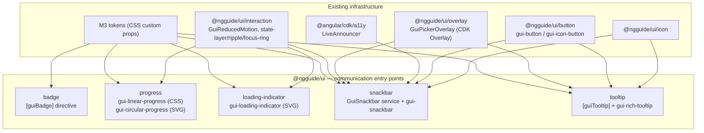

# Design Document: Communication Components

## Overview

This design implements the M3 **communication** family for `@ngguide/ui` as new secondary entry
points, built on the kit's existing CDK-overlay service, M3 token system, and interaction foundation.
All anatomy/measurements/color-roles come from the verified values read live from m3.material.io
(see `research.md` → "Verified M3 Measurements"). Nothing here is improvised.

New entry points:
- `@ngguide/ui/badge` — `[guiBadge]` host directive (dot + numeric, "max+" cap).
- `@ngguide/ui/progress` — `gui-linear-progress` (CSS) and `gui-circular-progress` (SVG).
- `@ngguide/ui/loading-indicator` — `gui-loading-indicator` (SVG morphing shapes).
- `@ngguide/ui/snackbar` — `GuiSnackbar` service (queue + timer + announce) + `gui-snackbar` surface.
- `@ngguide/ui/tooltip` — `[guiTooltip]` plain directive + `gui-rich-tooltip` panel + trigger directive.

Plus a small additive extension to `@ngguide/ui/overlay` (`GuiPickerOverlay`): a bottom-anchored,
no-focus-trap global opener for the snackbar, and a connected opener (no focus capture/restore) for
tooltips.

### Key Changes

1. **Two new floating openers on `GuiPickerOverlay`** — `openGlobalBottom()` (snackbar) and
   `openConnected()` (tooltips). Neither captures/restores focus (unlike `openModal`/`openDocked`),
   because snackbars and tooltips must not steal focus.
2. **Five new presentational/feedback entry points** following kit conventions (standalone, OnPush,
   signal inputs, attribute selectors, host-driven theming, zoneless-safe). None use `GuiFormControl`.
3. **Shared a11y via first-party primitives** — CDK `LiveAnnouncer` for the snackbar, `GuiReducedMotion`
   (from `@ngguide/ui/interaction`) + `@media (prefers-reduced-motion)` for motion, native
   `role="progressbar"`/`role="tooltip"`/`role="status"` semantics.

### Decisions

| Problem Area | Chosen Variant | Why chosen | Reference |
|-------------|----------------|------------|-----------|
| 1. Badge anchoring | A — `[guiBadge]` host directive | Low effort/risk, strong fit with the kit's attribute-selector convention; no wrapper DOM around the host | research.md §1 |
| 2. Progress/loading rendering | C — hybrid (CSS linear + SVG circular/loading) | each visual uses its best-fit technique; faithful rounded caps/gap on circular; loading shape-morph needs SVG regardless | research.md §2 |
| 3. Snackbar service/overlay/queue | A — extend `GuiPickerOverlay` + `GuiSnackbar` queue service | literal "reuse CDK overlay" constraint; keeps one overlay service for the kit | research.md §3 |
| 4. Tooltip structure | B — split plain directive + rich component | plain (non-interactive, `aria-describedby`) and rich (interactive, persistent) have materially different a11y lifecycles; mirrors M3's own split | research.md §4 |
| 5. Shared a11y | A — CDK `LiveAnnouncer` + `GuiReducedMotion` | reuses first-party + existing foundation; no reinvented a11y primitives | research.md §5 |
| Sub: progress visual | Classic (flat) now | flat determinate+indeterminate per M3 baseline; wavy/expressive deferred to a later iteration | research.md §2 note |
| Sub: snackbar role | `role="status"` / polite + timer-pause | reconciles M3 auto-dismiss with APG alert guidance (no focus theft, adequate time via pause-on-hover/focus + reachable action) | research.md APG |

## Architecture

### Component Diagram



### Data Flow — Snackbar (queue + announce + dismiss)

```mermaid
sequenceDiagram
    participant App as App code
    participant Svc as GuiSnackbar (service)
    participant Q as Queue (signal FIFO)
    participant Ovl as GuiPickerOverlay.openGlobalBottom
    participant Sur as gui-snackbar surface
    participant LA as LiveAnnouncer (polite)

    App->>Svc: open({message, action, duration})
    Svc->>Q: enqueue(config) → return GuiSnackbarRef
    alt nothing showing
        Svc->>Ovl: attach surface portal (bottom, no trap, no backdrop)
        Ovl-->>Sur: render
        Svc->>LA: announce(message, 'polite')
        Svc->>Svc: start auto-dismiss timer (if duration != null)
    end
    Note over Sur,Svc: pointerenter/focusin → pause timer; leave/blur → resume (req 9.7)
    App->>Sur: click action / close / swipe / timeout
    Sur->>Svc: dismiss(reason)
    Svc->>Ovl: detach + dispose
    Svc-->>App: ref.afterDismissed.next(reason)
    Svc->>Q: dequeue; if next → show next
```

## Components and Interfaces

### Overlay extension — `@ngguide/ui/overlay`

```typescript
// Path: libs/ui/overlay/src/picker-overlay.ts  (additive — existing methods unchanged)
import { ConnectedPosition } from '@angular/cdk/overlay';
import { Portal } from '@angular/cdk/portal';

export interface GuiGlobalBottomConfig {
  /** Horizontal alignment of the bottom-anchored surface. Caller drives via breakpoint. */
  alignment?: 'center' | 'leading';   // M3: centered on compact, leading on wide
  /** Distance from the bottom edge, e.g. '16px' or an above-FAB offset. */
  bottomOffset?: string;
  /** Max inline width (M3 snackbar max width). */
  maxWidth?: string;
  panelClass?: string | string[];
}

export interface GuiConnectedConfig {
  origin: HTMLElement;
  /** Preferred connected positions (e.g. above-then-below for tooltips). */
  positions?: ConnectedPosition[];
  panelClass?: string | string[];
}

export interface GuiPickerOverlay {
  // existing:
  openDocked(portal: Portal<unknown>, cfg: GuiDockedConfig): GuiOverlayHandle;
  openModal(portal: Portal<unknown>, cfg: GuiModalConfig): GuiOverlayHandle;

  // NEW — bottom-anchored, GlobalPositionStrategy, NO backdrop, NO focus trap, NO focus restore.
  // Scroll strategy: reposition. Used by the snackbar.
  openGlobalBottom(portal: Portal<unknown>, cfg?: GuiGlobalBottomConfig): GuiOverlayHandle;

  // NEW — connected to an origin, FlexibleConnectedPositionStrategy, NO backdrop,
  // NO focus capture/restore (tooltips must not move focus). Scroll: reposition.
  openConnected(portal: Portal<unknown>, cfg: GuiConnectedConfig): GuiOverlayHandle;
}
// GuiOverlayHandle { ref: OverlayRef; closed: Observable<void>; close(): void } — unchanged.
```

### Badge — `@ngguide/ui/badge`

```typescript
// Path: libs/ui/badge/src/badge.ts
@Directive({
  // eslint-disable-next-line @angular-eslint/directive-selector
  selector: '[guiBadge]',
  host: {
    'class': 'gui-badge-host',
    '[style.position]': '"relative"',          // anchor for the absolutely-positioned badge
    '[attr.data-gui-badge-variant]': 'variant()',
    '[attr.data-gui-badge-hidden]': 'isHidden()',
  },
})
export class GuiBadge {
  /** Numeric/string value. Empty/absent ⇒ small dot; present ⇒ large numeric badge. */
  readonly value = input<number | string | null>(null, { alias: 'guiBadge' });
  /** Max before "max+" cap. M3 does not publish the number; default 999. */
  readonly max = input(999, { alias: 'guiBadgeMax', transform: numberAttribute });
  /** Force-hide without removing the directive. */
  readonly hidden = input(false, { alias: 'guiBadgeHidden', transform: booleanAttribute });

  protected readonly variant = computed<'small' | 'large'>(() =>
    this.value() === null || this.value() === '' ? 'small' : 'large');
  protected readonly isHidden = computed(() => this.hidden());
  /** Capped display text for the large badge (e.g. "999+"). */
  protected readonly display = computed(() => {
    const v = this.value();
    if (typeof v === 'number' && v > this.max()) return `${this.max()}+`;
    return v == null ? '' : String(v);
  });
  // On init, the directive creates a child <span class="gui-badge" aria-hidden="true"> via Renderer2,
  // positioned in the host's top-trailing corner. The dot/label is aria-hidden; meaning is conveyed
  // through the host's own accessible name (consumer sets aria-label, e.g. "Notifications, 3 unread").
}
```

Measurements (from verified M3): small dot **6dp** / 3dp corner; large **16dp** min, **8dp** corner;
max-count container **16×34dp**, 4dp internal padding; offsets small **6×6dp**, large **14×12dp**.
Color: container `--md-sys-color-error`, label `--md-sys-color-on-error`. Label typography:
`--md-sys-typescale-label-small`.

### Progress — `@ngguide/ui/progress`

```typescript
// Path: libs/ui/progress/src/linear-progress.ts   (CSS rendering)
@Component({
  selector: 'gui-linear-progress',
  changeDetection: ChangeDetectionStrategy.OnPush,
  host: {
    'class': 'gui-linear-progress',
    'role': 'progressbar',
    '[attr.data-mode]': 'mode()',
    '[attr.aria-label]': 'label() || null',
    '[attr.aria-valuemin]': 'mode() === "determinate" ? 0 : null',
    '[attr.aria-valuemax]': 'mode() === "determinate" ? 100 : null',
    '[attr.aria-valuenow]': 'mode() === "determinate" ? percent() : null',
  },
  template: `
    <div class="gui-linear-track"></div>
    <div class="gui-linear-active" [style.transform]="activeTransform()"></div>
    <div class="gui-linear-stop"></div>`,
})
export class GuiLinearProgress {
  /** 0..1. null ⇒ indeterminate. */
  readonly value = input<number | null>(null);
  readonly label = input<string>();
  protected readonly mode = computed(() => this.value() == null ? 'indeterminate' : 'determinate');
  protected readonly clamped = computed(() => Math.min(1, Math.max(0, this.value() ?? 0)));
  protected readonly percent = computed(() => Math.round(this.clamped() * 100));
  protected readonly activeTransform = computed(() => `scaleX(${this.clamped()})`);
  // Track thickness 4dp; rounded ends; 4dp gap to stop indicator; inset 4dp applied by consumer/layout.
  // Colors: active --md-sys-color-primary; track --md-sys-color-secondary-container;
  //         stop indicator --md-sys-color-primary. Indeterminate animation via @keyframes,
  //         disabled under prefers-reduced-motion (CSS @media), replaced by a low-key pulse.
}
```

```typescript
// Path: libs/ui/progress/src/circular-progress.ts   (SVG rendering)
@Component({
  selector: 'gui-circular-progress',
  changeDetection: ChangeDetectionStrategy.OnPush,
  host: {
    'class': 'gui-circular-progress',
    'role': 'progressbar',
    '[attr.data-mode]': 'mode()',
    '[attr.aria-label]': 'label() || null',
    '[attr.aria-valuemin]': 'mode() === "determinate" ? 0 : null',
    '[attr.aria-valuemax]': 'mode() === "determinate" ? 100 : null',
    '[attr.aria-valuenow]': 'mode() === "determinate" ? percent() : null',
  },
  // SVG <circle> track + active arc using stroke-dasharray/offset, stroke-linecap="round".
})
export class GuiCircularProgress {
  readonly value = input<number | null>(null);   // 0..1, null ⇒ indeterminate
  readonly label = input<string>();
  protected readonly mode = computed(() => this.value() == null ? 'indeterminate' : 'determinate');
  protected readonly clamped = computed(() => Math.min(1, Math.max(0, this.value() ?? 0)));
  protected readonly percent = computed(() => Math.round(this.clamped() * 100));
  protected readonly dashOffset = computed(() => this.CIRCUMFERENCE * (1 - this.clamped()));
  // Diameter/stroke: M3 default (~48dp/4dp) — confirm against the token browser at build (figure-only).
  // Color: --md-sys-color-primary (active) over --md-sys-color-secondary-container (track).
}
```

### Loading indicator — `@ngguide/ui/loading-indicator`

```typescript
// Path: libs/ui/loading-indicator/src/loading-indicator.ts   (SVG morphing shapes)
@Component({
  selector: 'gui-loading-indicator',
  changeDetection: ChangeDetectionStrategy.OnPush,
  host: {
    'class': 'gui-loading-indicator',
    'role': 'progressbar',                 // busy/indeterminate — no aria-valuenow
    '[attr.data-variant]': 'variant()',
    '[attr.aria-label]': 'label() || "Loading"',
  },
  // SVG <path> whose `d` is driven by a deterministic shape-tween between the M3 shapes.
})
export class GuiLoadingIndicator {
  readonly variant = input<'default' | 'contained'>('default');
  readonly label = input<string>();
  // Size 48dp overall, 38dp shape container. Color: default --md-sys-color-primary;
  // contained: active --md-sys-color-on-primary-container over --md-sys-color-primary-container.
  // Morph animation deterministic (no Math.random/Date.now). Under prefers-reduced-motion the
  // morph stops at a resting shape (GuiReducedMotion / @media), surface stays visible & busy.
}
```

### Snackbar — `@ngguide/ui/snackbar`

```typescript
// Path: libs/ui/snackbar/src/snackbar-config.ts
export type GuiSnackbarCloseReason = 'action' | 'dismiss' | 'timeout' | 'swipe' | 'programmatic';

export interface GuiSnackbarConfig {
  message: string;
  /** Optional single action affordance. */
  action?: string;
  /** Show a trailing close (dismiss) icon. */
  showClose?: boolean;
  /** Auto-dismiss after ms. null disables auto-dismiss (for action-required snackbars). Default M3-aligned (~4–10s). */
  duration?: number | null;
  /** Force two-line layout; otherwise inferred from content length. */
  twoLine?: boolean;
  /** Lift above a bottom-anchored FAB. true ⇒ default offset, string ⇒ explicit offset. */
  aboveFab?: boolean | string;
  /** Live-region politeness. Default 'polite'. */
  politeness?: 'polite' | 'assertive';
}

export interface GuiSnackbarRef {
  /** Emits once with the reason when the snackbar closes. */
  readonly afterDismissed: Observable<GuiSnackbarCloseReason>;
  /** Emits when the action is activated. */
  readonly onAction: Observable<void>;
  dismiss(reason?: GuiSnackbarCloseReason): void;
}
```

```typescript
// Path: libs/ui/snackbar/src/snackbar.service.ts
@Injectable({ providedIn: 'root' })
export class GuiSnackbar {
  private readonly overlay = inject(GuiPickerOverlay);
  private readonly announcer = inject(LiveAnnouncer);     // @angular/cdk/a11y
  private readonly queue = signal<QueueItem[]>([]);        // FIFO; show one at a time

  /** Enqueue a snackbar; returns a ref. Shows immediately if nothing is open. */
  open(config: GuiSnackbarConfig | string): GuiSnackbarRef { /* ... */ }

  /** Dismiss the current and clear the queue. */
  dismissAll(): void { /* ... */ }
  // Internals: timer (setTimeout) paused on pointerenter/focusin, resumed on leave/blur (req 9.7);
  //  LiveAnnouncer.announce(message, politeness); on close → afterDismissed(reason), then show next.
  //  Swipe: pointer drag past threshold → dismiss('swipe'). All timing in the service (side-effectful,
  //  outside the no-Date.now pure-logic rule); pure helpers (queue ops, two-line inference) stay deterministic.
}
```

```typescript
// Path: libs/ui/snackbar/src/snackbar.ts   (surface component, rendered into the overlay)
@Component({
  selector: 'gui-snackbar',
  changeDetection: ChangeDetectionStrategy.OnPush,
  host: { 'class': 'gui-snackbar', 'role': 'status', '[attr.data-two-line]': 'twoLine()' },
  // container --md-sys-color-inverse-surface; text + close --md-sys-color-inverse-on-surface;
  // action (gui-button text) --md-sys-color-inverse-primary; corner-extra-small (4dp); elevation level 3.
})
export class GuiSnackbarSurface { /* message, action label, showClose, twoLine inputs + outputs */ }
```

### Tooltip — `@ngguide/ui/tooltip`

```typescript
// Path: libs/ui/tooltip/src/tooltip.ts   (PLAIN — directive on the trigger)
export type GuiTooltipPosition = 'above' | 'below' | 'before' | 'after';

@Directive({
  // eslint-disable-next-line @angular-eslint/directive-selector
  selector: '[guiTooltip]',
  host: { '[attr.aria-describedby]': 'visible() ? tooltipId : null' },
})
export class GuiTooltip {
  readonly message = input<string>('', { alias: 'guiTooltip' });
  readonly position = input<GuiTooltipPosition>('above');
  readonly showDelay = input(500);       // M3 doesn't publish; accessible default
  readonly hideDelay = input(0);
  readonly disabled = input(false, { transform: booleanAttribute });
  protected readonly visible = signal(false);
  protected readonly tooltipId = `gui-tooltip-${nextId++}`;
  // pointerenter/focus/long-press → after showDelay, openConnected() a TemplatePortal carrying a
  //   <div role="tooltip" id="tooltipId"> with --md-sys-color-inverse-surface bg / inverse-on-surface text,
  //   24dp height, 8dp padding, corner-extra-small.
  // pointerleave/blur/Escape → hide. Escape keeps focus on the trigger (APG).
}
```

```typescript
// Path: libs/ui/tooltip/src/rich-tooltip.ts   (RICH — panel component + trigger directive)
@Component({
  selector: 'gui-rich-tooltip',
  changeDetection: ChangeDetectionStrategy.OnPush,
  // Projects: [guiRichTooltipSubhead], default body, [guiRichTooltipActions] (up to two gui-buttons).
  // Surface: --md-sys-color-surface-container; subhead/body --md-sys-color-on-surface-variant;
  //   padding 12/8/16dp; corner-medium (12dp); elevation level 2. role="tooltip".
  template: `<ng-template>...</ng-template>`,
})
export class GuiRichTooltip { /* exposes the TemplatePortal + open/close API */ }

@Directive({
  // eslint-disable-next-line @angular-eslint/directive-selector
  selector: '[guiRichTooltipTrigger]',
})
export class GuiRichTooltipTrigger {
  /** The panel this trigger controls. */
  readonly panel = input.required<GuiRichTooltip>({ alias: 'guiRichTooltipTrigger' });
  // hover/focus opens openConnected(); PERSISTENT: stays open while pointer is over trigger OR panel
  //   (track both; close only when pointer is over neither, after a small grace delay).
  // Escape or action activation → close. Actions inside the panel are gui-buttons → already focusable.
  // Sets aria-describedby on the trigger to the panel id while open.
}
```

## Data Models

```typescript
// Snackbar queue item (internal)
interface QueueItem {
  config: Required<Pick<GuiSnackbarConfig, 'message'>> & GuiSnackbarConfig;
  ref: GuiSnackbarRef;
  // resolved at show time: handle: GuiOverlayHandle, timer state
}
```

No persisted data models / DTOs — every component in this category is presentational/feedback. No
schema, migration, query, or API layers are involved.

## Data Flow Completeness

These components introduce no cross-stack data fields (no DB/API). The "layers" that matter here are
the component surface area: public input/output, host a11y attributes, rendered DOM, token-driven
styling, and the spec registration. Traced per entry point:

| Surface | Public API | Host a11y attrs | Rendered DOM | Token styling | Path alias | Spec in project.json |
|--------|-----------|-----------------|--------------|---------------|-----------|----------------------|
| badge | `guiBadge`/`Max`/`Hidden` | host name (consumer), badge `aria-hidden` | injected `<span>` corner | error/on-error, label-small | `@ngguide/ui/badge` | `../badge/src/badge.spec.ts` |
| linear-progress | `value`,`label` | role=progressbar, valuenow/min/max | track/active/stop divs | primary/secondary-container | `@ngguide/ui/progress` | `../progress/src/linear-progress.spec.ts` |
| circular-progress | `value`,`label` | role=progressbar, valuenow/min/max | SVG circle+arc | primary/secondary-container | `@ngguide/ui/progress` | `../progress/src/circular-progress.spec.ts` |
| loading-indicator | `variant`,`label` | role=progressbar (busy), aria-label | SVG morph path | primary / on-primary-container | `@ngguide/ui/loading-indicator` | `../loading-indicator/src/loading-indicator.spec.ts` |
| snackbar | `GuiSnackbar.open()`, `Ref` | role=status, LiveAnnouncer | overlay surface | inverse-surface trio | `@ngguide/ui/snackbar` | `../snackbar/src/snackbar.service.spec.ts`, `../snackbar/src/snackbar.spec.ts` |
| tooltip (plain) | `guiTooltip`,`position`,delays | aria-describedby, role=tooltip | overlay text panel | inverse-surface/on-surface | `@ngguide/ui/tooltip` | `../tooltip/src/tooltip.spec.ts` |
| rich tooltip | panel + trigger directive | aria-describedby, role=tooltip | overlay rich panel | surface-container/on-surface-variant | `@ngguide/ui/tooltip` | `../tooltip/src/rich-tooltip.spec.ts` |
| overlay ext | `openGlobalBottom`,`openConnected` | — | CDK overlay pane | — (structural CSS exists) | `@ngguide/ui/overlay` | `../overlay/src/picker-overlay.spec.ts` (extend) |

Each new entry point also needs: `ng-package.json`, `src/index.ts` barrel, a `tsconfig.base.json`
`paths` entry, and the demo wiring in `apps/web` (not published).

## Error Handling

| Situation | Handling |
|-----------|----------|
| Badge value `> max` | Render `"{max}+"` (e.g. "999+"). |
| Badge value `null`/empty | Render small dot (no label). `hidden` ⇒ render nothing. |
| Progress `value` out of [0,1] | Clamp to [0,1]; `aria-valuenow` stays within min/max. |
| Progress `value` null | Indeterminate mode; omit `aria-valuenow` (APG). |
| Snackbar requested while one is showing | Queue it (FIFO); show after current dismisses. |
| Snackbar `duration: null` | No auto-dismiss; stays until action/close/swipe (e.g. action-required). |
| Pointer/focus on snackbar during auto-dismiss | Pause timer; resume on leave/blur (req 9.7). |
| Tooltip trigger disabled | Do not open. |
| Escape while tooltip open | Hide; keep focus on trigger (APG). |
| `prefers-reduced-motion` | Indeterminate progress / loading morph / snackbar enter-exit reduced or stopped; surfaces remain visible; determinate values still update. |

## Testing Strategy

### Approach

Native Angular Vitest (`@nx/angular:unit-test`, zoneless, jsdom). Specs live in each entry point's
`src/` and are registered in `libs/ui/project.json` `test.options.include`. jsdom can't measure
layout or run real overlay positioning, so tests assert **state, ARIA, and DOM structure**, not pixel
geometry; overlay positioning and motion are verified by browser dogfood.

### Unit Tests (per entry point)

```typescript
describe('GuiBadge', () => {
  it('renders a dot when no value', () => { /* variant === 'small', no label text */ });
  it('caps numeric value at max with "+"', () => { /* value 1200, max 999 → "999+" */ });
  it('hides when guiBadgeHidden', () => { /* data-gui-badge-hidden, no visible badge */ });
  it('marks the badge graphic aria-hidden', () => { /* badge span aria-hidden="true" */ });
});

describe('GuiLinearProgress', () => {
  it('is indeterminate with no value (no aria-valuenow)', () => { /* role=progressbar, valuenow null */ });
  it('clamps and exposes aria-valuenow for determinate', () => { /* value 0.5 → 50, value 2 → 100 */ });
});

describe('GuiSnackbar (service)', () => {
  it('shows one at a time and queues the rest (FIFO)', () => { /* open a,b,c → a shows; b,c queued */ });
  it('reports the close reason', () => { /* dismiss('action') → afterDismissed emits 'action' */ });
  it('announces via LiveAnnouncer politely', () => { /* spy announce(message,'polite') */ });
  it('does not auto-dismiss when duration is null', () => { /* timer never fires */ });
});

describe('GuiTooltip (plain)', () => {
  it('sets aria-describedby only while visible', () => {});
  it('hides on Escape and keeps focus on trigger', () => {});
});

describe('GuiPickerOverlay (extension)', () => {
  it('openGlobalBottom attaches without a focus trap or backdrop', () => {});
  it('openConnected does not capture or restore focus', () => {});
});
```

### Edge Cases

1. **Badge** value exactly `max` → no "+"; `max+1` → "max+".
2. **Progress** value `0` (determinate, valuenow=0) vs `null` (indeterminate, no valuenow) — must differ.
3. **Snackbar** rapid `open()` burst → strict FIFO order; `dismissAll()` clears queue + closes current.
4. **Snackbar** timer pause/resume across multiple hover cycles → still dismisses once after total duration.
5. **Rich tooltip** pointer travels trigger → gap → panel → stays open (persistent), but closes when over neither.
6. **Reduced motion** → indeterminate progress/loading present and `role`/busy intact with animation removed.
7. **Tooltip** with empty `guiTooltip` string or `disabled` → never opens.
