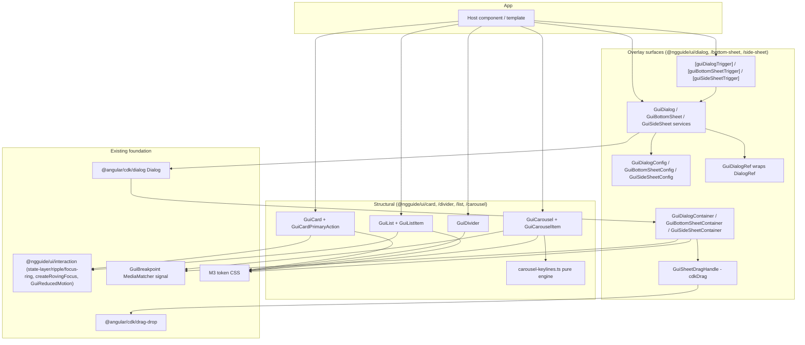
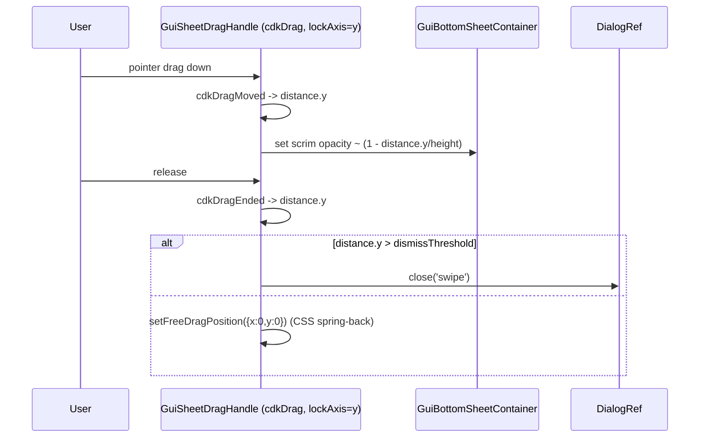

# Design Document: Containment Components

## Overview

This design adds the M3 **containment** category to `@ngguide/ui` as seven secondary entry points:
`card`, `divider`, `list`, `dialog`, `bottom-sheet`, `side-sheet`, `carousel`. The four overlay surfaces
(dialog ×2 variants, modal bottom sheet, modal side sheet) are built on the headless **`@angular/cdk/dialog`
`Dialog`** service for APG-complete modal behavior; standard (non-modal) sheets render inline without a focus
trap. The carousel implements the true M3 **keyline sizing engine** (pure math + a client-side layout pass).
Card, divider, and list are token-driven structural components reusing the existing interaction directives.

### Key Changes

1. **Seven new entry points** wired through `tsconfig.base.json` paths, `libs/ui/project.json` test `include`,
   and (for global chrome) `libs/ui/src/styles/theme.css` `@import`s — following the snackbar/tooltip precedent.
2. **Modal foundation = CDK `Dialog`** with three custom container components (`GuiDialogContainer`,
   `GuiBottomSheetContainer`, `GuiSideSheetContainer`) swapped via `DialogConfig.container`; each provides M3
   chrome, motion, and (sheets) the drag gesture. Imperative `GuiDialog`/`GuiBottomSheet`/`GuiSideSheet`
   services wrap `Dialog.open`, **plus** declarative `[guiDialogTrigger]` / `[guiBottomSheetTrigger]` /
   `[guiSideSheetTrigger]` directives that open a `TemplateRef` (CDK `Dialog.open` supports the `TemplateRef` overload).
3. **Bottom-sheet drag-to-dismiss** via `@angular/cdk/drag-drop` (`cdkDragLockAxis="y"`, `cdkDragMoved`/`cdkDragEnded`
   `distance`, `setFreeDragPosition` spring-back, `cdkDragConstrainPosition` to clamp upward).
4. **Carousel keyline engine** — pure sizing functions (`small = clamp(large/3, 40, 56)`, `medium = (large+small)/2`,
   per-layout arrangement) + a client-side `ResizeObserver`/scroll pass that morphs item widths between keylines.
   SSR renders a static large-size first frame.
5. **List with opt-in modes** (`action` list of controls / `listbox` with `createRovingFocus` + `aria-selected`),
   **card with both actionable shapes** (whole-surface control + primary-action region), structural **divider**.
6. **Compact-window signal** — a `GuiBreakpoint` service (the `GuiReducedMotion` `MediaMatcher` pattern) driving
   full-screen-dialog auto-selection and carousel full-screen orientation; pure styling differences stay in CSS.
7. **No new dependencies** — `@angular/cdk` is already a peer dependency at `^21.2.0`; `cdk/dialog`, `cdk/drag-drop`,
   and `cdk/layout` are sub-paths of it.

### Decisions

| Problem Area | Chosen Variant | Why chosen | Reference |
|-------------|----------------|------------|-----------|
| 1. Modal overlay foundation | **B — CDK headless `Dialog`** | APG-complete (aria-modal/role/focus-trap/restore/autofocus) out of the box, lowest risk, reuses installed CDK; `container` swap renders dialog vs sheet chrome from one service. | research.md §1 |
| 2. Open API + content projection | **C + imperative `open()`** | Declarative `TemplateRef` trigger for inline content (rich-tooltip pattern) **plus** a thin `open()` over `Dialog.open` to satisfy Req 16.2 (imperative open returning a ref). | research.md §2 |
| 3. Bottom-sheet drag | **A — CDK drag-drop** | Purpose-built one-axis gesture (`lockAxis`, `distance`, `setFreeDragPosition`, `constrainPosition`); lowest risk; same CDK package. | research.md §3 |
| 4. Carousel sizing | **B — JS keyline engine** | Only variant with true M3 keyline fidelity — mandated by the project's strict-M3 rule; sizing constants verified from Compose source. | research.md §4 |
| 5. List semantics | **C — opt-in modes** | One component serves action-lists and selection-listboxes; covers Req 4/5/6 without forcing one APG pattern. | research.md §5 |
| 6. Card actionability | **C — both modes** | Whole-surface control for simple cards + primary-action region for cards with inner actions; both M3 actionable shapes, APG-correct. | research.md §6 |
| 7. Responsive detection | **C — hybrid** | CSS for pure styling; a `MediaMatcher` compact signal only where logic must branch (full-screen dialog choice, carousel orientation). | research.md §7 |

**Cross-area note:** Decision 2 keeps the declarative trigger (catalogue C) *and adds* a thin imperative `open()`
that — because Decision 1 is CDK Dialog — reduces to a near-trivial wrapper over `Dialog.open` + `DIALOG_DATA` +
`DialogRef` (catalogue B's mechanics). The two are combined deliberately, not in conflict.

## Architecture

### Component Diagram



### Data Flow — opening a modal dialog (imperative)

```mermaid
sequenceDiagram
    participant U as Host code
    participant S as GuiDialog service
    participant D as CDK Dialog
    participant C as GuiDialogContainer
    participant R as GuiDialogRef

    U->>S: open(ContentCmp, { role, fullScreen, data })
    S->>S: normalizeConfig() -> CDK DialogConfig (ariaModal, role, autoFocus, restoreFocus, hasBackdrop, backdropClass='gui-scrim', scrollStrategy=block(), container=GuiDialogContainer)
    S->>D: Dialog.open(ContentCmp, cdkConfig)
    D->>C: instantiate container (focus trap, scrim, aria-modal)
    C-->>U: render M3 dialog surface + project content
    S-->>U: return GuiDialogRef (wraps DialogRef)
    U->>R: closed.subscribe(result)
    Note over C,R: Escape / scrim click / action -> ref.close(result)
    R-->>U: closed emits result; focus restored to opener
```

### Data Flow — bottom-sheet drag-to-dismiss



## Components and Interfaces

### Shared overlay layer

All three overlay families share a small internal pattern: a **config → CDK `DialogConfig` normalizer**, a
**custom container** (extends CDK's `CdkDialogContainer` to add M3 chrome + motion), and a **ref wrapper**.
The shared modal config lives in each entry point but follows one shape:

```typescript
// Common modal config surface (each family extends it). Path: libs/ui/<family>/src/<family>-config.ts
export type GuiDialogRole = 'dialog' | 'alertdialog';

export interface GuiModalConfigBase<D = unknown> {
  data?: D;                         // injected via DIALOG_DATA into the content component
  role?: GuiDialogRole;             // default 'dialog'
  ariaLabel?: string;               // when no visible headline exists
  ariaLabelledBy?: string;          // id of the headline element
  disableClose?: boolean;           // Escape + scrim-click disabled (non-dismissible)
  panelClass?: string | string[];
  autoFocus?: 'dialog' | 'first-tabbable' | 'first-heading' | string; // default 'first-tabbable'
  restoreFocus?: boolean;           // default true
  injector?: Injector;              // parent injector for the content
}
```

Normalization maps these onto the **verified** CDK `DialogConfig` fields (`ariaModal:true`, `role`, `ariaLabel`,
`ariaLabelledBy`, `disableClose`, `autoFocus`, `restoreFocus`, `hasBackdrop`, `backdropClass`, `scrollStrategy`,
`panelClass`, `data`, `container`, `injector`). Scroll-lock uses `Dialog`'s injected scroll strategy set to
`block()`; the scrim uses `backdropClass:'gui-scrim'` styled from `--md-sys-color-scrim` at 32% (Req 12.1/12.6).

### `@ngguide/ui/dialog`

```typescript
// Path: libs/ui/dialog/src/dialog-config.ts
export type GuiDialogFullScreen = 'never' | 'compact' | 'always'; // Req 8 (compact-only) + auto

export interface GuiDialogConfig<D = unknown> extends GuiModalConfigBase<D> {
  fullScreen?: GuiDialogFullScreen;   // default 'never'; 'compact' uses GuiBreakpoint
  maxWidth?: string;                  // default 'min(560px, calc(100% - 48px))' (M3 basic dialog)
}

export const GUI_DIALOG_DATA = DIALOG_DATA;       // re-export CDK token for content components
// GuiDialogRef is the public ref; thin wrapper over CDK DialogRef.
export interface GuiDialogRef<R = unknown> {
  readonly closed: Observable<R | undefined>;
  readonly backdropClick: Observable<MouseEvent>;
  readonly keydownEvents: Observable<KeyboardEvent>;
  close(result?: R): void;
}
```

```typescript
// Path: libs/ui/dialog/src/dialog.service.ts
@Injectable({ providedIn: 'root' })
export class GuiDialog {
  private readonly cdkDialog = inject(Dialog);
  private readonly breakpoint = inject(GuiBreakpoint);

  open<R = unknown, D = unknown, C = unknown>(
    content: ComponentType<C> | TemplateRef<C>,
    config?: GuiDialogConfig<D>,
  ): GuiDialogRef<R> {
    const fullScreen = this.resolveFullScreen(config?.fullScreen);
    const ref = this.cdkDialog.open<R, D, C>(content, {
      ...normalizeModalConfig(config),
      container: GuiDialogContainer,                 // M3 chrome + motion
      maxWidth: config?.maxWidth ?? 'min(560px, calc(100% - 48px))',
      panelClass: [fullScreen ? 'gui-dialog-fullscreen' : 'gui-dialog', ...asArray(config?.panelClass)],
    });
    return wrapDialogRef(ref);
  }

  private resolveFullScreen(mode: GuiDialogFullScreen = 'never'): boolean {
    return mode === 'always' || (mode === 'compact' && this.breakpoint.isCompact());
  }
}
```

```typescript
// Path: libs/ui/dialog/src/dialog.ts — structural slots projected into the container
// Selectors for content authors to compose the M3 dialog anatomy:
//   gui-dialog-icon, gui-dialog-headline (h2), gui-dialog-content, gui-dialog-actions
// and the full-screen header: gui-dialog-fullscreen-header (close + title + confirm action).
@Component({ selector: 'gui-dialog-headline', host: { class: 'gui-dialog-headline', role: 'heading', 'aria-level': '2' }, /* ... */ })
export class GuiDialogHeadline {}
// (GuiDialogIcon, GuiDialogContent, GuiDialogActions analogous — token-styled wrappers.)
```

```typescript
// Path: libs/ui/dialog/src/dialog.trigger.ts — declarative open (Decision 2C)
@Directive({
  selector: '[guiDialogTrigger]',
  host: { '(click)': 'open()' },
})
export class GuiDialogTrigger {
  private readonly dialog = inject(GuiDialog);
  readonly template = input.required<TemplateRef<unknown>>({ alias: 'guiDialogTrigger' });
  readonly config = input<GuiDialogConfig>();        // alias 'guiDialogConfig'
  protected open(): void { this.dialog.open(this.template(), this.config()); }
}
```

`GuiDialogContainer extends CdkDialogContainer` adds: `data-fullscreen` host attr, M3 enter/exit animation
(emphasized-decelerate in / emphasized-accelerate out via motion tokens), `surface-container-high` background,
`corner-extra-large` (28dp) shape, `elevation-level3`. The basic dialog is centered (CDK global centered
position by default); full-screen sets `maxWidth:100% / height:100%` and renders the top-app-bar header slot.

### `@ngguide/ui/bottom-sheet` and `@ngguide/ui/side-sheet`

Both expose **two modes**:
- **Modal** — opened via the service (`GuiBottomSheet.open` / `GuiSideSheet.open`) on CDK `Dialog` with a custom
  container; full APG modal (scrim, trap, restore, Escape). Bottom-sheet container hosts the drag handle.
- **Standard** — a structural component (`<gui-bottom-sheet variant="standard" [(open)]>`) rendered inline as a
  fixed-position surface, **no scrim, no focus trap** (Req 9.2 / 10.3), coexisting with page content.

```typescript
// Path: libs/ui/bottom-sheet/src/bottom-sheet-config.ts
export interface GuiBottomSheetConfig<D = unknown> extends GuiModalConfigBase<D> {
  showDragHandle?: boolean;     // default true
  aboveFab?: boolean;           // raise bottom offset to clear a FAB
  dismissThreshold?: number;    // px dragged-down to dismiss; default 96
  maxWidth?: string;            // default '640px' on larger screens; full-width on compact
}

@Injectable({ providedIn: 'root' })
export class GuiBottomSheet {
  private readonly cdkDialog = inject(Dialog);
  open<R, D, C>(content: ComponentType<C> | TemplateRef<C>, config?: GuiBottomSheetConfig<D>): GuiDialogRef<R> {
    const ref = this.cdkDialog.open<R, D, C>(content, {
      ...normalizeModalConfig(config),
      container: GuiBottomSheetContainer,
      panelClass: ['gui-bottom-sheet-pane', ...asArray(config?.panelClass)],
      positionStrategy: bottomCenteredGlobalStrategy(),   // anchored to bottom edge
    });
    return wrapDialogRef(ref);
  }
}
```

```typescript
// Path: libs/ui/bottom-sheet/src/bottom-sheet.ts — surface used by BOTH modes
@Component({
  selector: 'gui-bottom-sheet',
  changeDetection: ChangeDetectionStrategy.OnPush,
  imports: [CdkDrag],
  host: { class: 'gui-bottom-sheet-surface', '[attr.data-variant]': 'variant()' },
  // template: optional <div class="gui-bottom-sheet-handle" cdkDrag cdkDragLockAxis="y" ...></div> + <ng-content/>
})
export class GuiBottomSheet /* surface */ {
  readonly variant = input<'modal' | 'standard'>('standard');
  readonly open = model(false);                 // standard mode toggle (two-way)
  readonly showDragHandle = input(true, { transform: booleanAttribute });
  protected onDragEnded(e: CdkDragEnd): void { /* distance.y > threshold -> dismiss; else setFreeDragPosition */ }
}
```

`GuiSideSheetContainer` mirrors this for the **end** edge (slide-in from the right in LTR), `corner-large` (16dp),
width `256–400px`; standard side sheet coexists without scrim. Side sheet has no drag gesture (M3 side sheets
dismiss via the close affordance / scrim).

### `@ngguide/ui/card` and `@ngguide/ui/divider`

```typescript
// Path: libs/ui/card/src/card.ts
export type GuiCardVariant = 'elevated' | 'filled' | 'outlined';

@Component({
  selector: 'gui-card',
  changeDetection: ChangeDetectionStrategy.OnPush,
  template: `<ng-content />`,
  styleUrl: './card.css',
  host: {
    class: 'gui-card',
    '[attr.data-variant]': 'variant()',
    '[attr.data-disabled]': 'disabled() ? "" : null',
  },
})
export class GuiCard {
  readonly variant = input<GuiCardVariant>('elevated');
  readonly disabled = input(false, { transform: booleanAttribute });
}

// Whole-surface control mode (Variant A): apply to an <a> or a [role=button] host.
@Directive({
  selector: '[guiCardClickable]',
  hostDirectives: [GuiStateLayerDirective, GuiRippleDirective, GuiFocusRingDirective],
  host: {
    '[attr.tabindex]': 'disabled() ? null : 0',
    '[attr.role]': 'isAnchor ? null : "button"',
    '(click)': 'activate($event)',
    '(keydown.enter)': 'activate($event)',
    '(keydown.space)': 'activate($event)',
  },
})
export class GuiCardClickable { /* emits (cardActivate); guards disabled */ }

// Primary-action region (Variant B): a clickable sub-region; action buttons live outside it.
@Directive({
  selector: '[guiCardPrimaryAction]',
  hostDirectives: [GuiStateLayerDirective, GuiRippleDirective, GuiFocusRingDirective],
  host: { tabindex: '0', role: 'button', '(click)': 'activate($event)', '(keydown.enter)': 'activate($event)', '(keydown.space)': 'activate($event)' },
})
export class GuiCardPrimaryAction { /* (primaryAction) output */ }
```

Card variant tokens (verified): elevated = `surface-container-low` + `elevation-level1` (hover `level2`, dragged
`level4`); filled = `surface-container-highest` + `level0` (hover `level1`); outlined = `surface` + `level0` +
`outline-variant` 1px border (focus border → `on-surface`). Corner `medium` (12dp). Disabled = 0.38 opacity, no
state layers, no activation.

```typescript
// Path: libs/ui/divider/src/divider.ts
export type GuiDividerInset = 'none' | 'inset' | 'middle-inset';

@Component({
  selector: 'gui-divider',
  changeDetection: ChangeDetectionStrategy.OnPush,
  template: '',
  styleUrl: './divider.css',
  host: {
    class: 'gui-divider',
    role: 'separator',
    '[attr.aria-orientation]': 'orientation()',
    '[attr.data-inset]': 'inset()',
  },
})
export class GuiDivider {
  readonly inset = input<GuiDividerInset>('none');
  readonly orientation = input<'horizontal' | 'vertical'>('horizontal');
}
```

Divider: 1px, `outline-variant`; `inset` = 16px leading inset; `middle-inset` = 16px both sides.

### `@ngguide/ui/list`

```typescript
// Path: libs/ui/list/src/list.ts
export type GuiListMode = 'action' | 'listbox';

@Component({
  selector: 'gui-list',
  changeDetection: ChangeDetectionStrategy.OnPush,
  template: `<ng-content />`,
  styleUrl: './list.css',
  host: {
    class: 'gui-list',
    '[attr.role]': 'mode() === "listbox" ? "listbox" : "list"',
    '[attr.aria-multiselectable]': 'mode() === "listbox" ? (multiselectable() ? "true" : "false") : null',
    '(keydown)': 'onKeydown($event)',
  },
})
export class GuiList {
  readonly mode = input<GuiListMode>('action');
  readonly multiselectable = input(false, { transform: booleanAttribute });
  private readonly items = contentChildren(GuiListItem);
  private manager?: FocusKeyManager<GuiListItem>;     // built via createRovingFocus in listbox mode
  protected onKeydown(e: KeyboardEvent): void { this.manager?.onKeydown(e); }
}

// Path: libs/ui/list/src/list-item.ts
@Component({
  selector: 'gui-list-item',
  changeDetection: ChangeDetectionStrategy.OnPush,
  // template projects: [guiListItemLeading], headline (default), [guiListItemSupporting], [guiListItemTrailing]
  styleUrl: './list-item.css',
  host: {
    class: 'gui-list-item',
    '[attr.data-lines]': 'lines()',
    '[attr.role]': 'listMode() === "listbox" ? "option" : (interactive() ? null : "listitem")',
    '[attr.aria-selected]': 'listMode() === "listbox" ? (selected() ? "true" : "false") : null',
    '[attr.aria-disabled]': 'disabled() ? "true" : null',
    '[attr.data-selected]': 'selected() ? "" : null',
  },
})
export class GuiListItem implements FocusableOption {
  readonly lines = input<1 | 2 | 3>(1);
  readonly interactive = input(false, { transform: booleanAttribute }); // action mode
  readonly selectable = input(false, { transform: booleanAttribute });  // listbox mode
  readonly selected = model(false);
  readonly disabled = input(false, { transform: booleanAttribute });
  focus(): void { /* FocusableOption for the key manager */ }
}
```

List tokens (verified): heights 56/72/88dp; leading icon 24 / avatar 40 / image 56dp; headline `body-large`,
supporting `body-medium`, trailing supporting `label-small`; 16dp start/end padding; container `surface`;
selected container `secondary-container` (Req 6.3). In `listbox` mode the list owns a `createRovingFocus`
manager (single tab stop + arrow/typeahead/home-end); in `action` mode items contain their own native
`<button>`/`<a>` and rely on natural tab order. Trailing checkbox/switch in action mode carry their own
accessible state; the item does not duplicate it (Req 6.4).

### `@ngguide/ui/carousel`

```typescript
// Path: libs/ui/carousel/src/carousel-keylines.ts — PURE engine (no Date.now/random; SSR-safe, deterministic)
export type GuiCarouselLayout = 'multi-browse' | 'uncontained' | 'hero' | 'full-screen';

export const MIN_SMALL_ITEM = 40;   // dp (verified, Compose CarouselDefaults)
export const MAX_SMALL_ITEM = 56;   // dp (verified)

export interface KeylineArrangement {
  large: number;            // px
  medium: number;           // px (0 if layout has no medium)
  small: number;            // px
  largeCount: number;
  mediumCount: number;
  smallCount: number;
}

/** small = clamp(large/3, 40, 56); medium = (large+small)/2 — verified M3 rules. */
export function arrange(
  layout: GuiCarouselLayout,
  viewportWidth: number,
  opts: { preferredLargeWidth: number; itemSpacing: number; itemCount: number },
): KeylineArrangement { /* per-layout fit; drops small below 80px width; hero start/center variants */ }

/** Interpolated size/clip for an item given its distance from the focal keyline. */
export function maskForOffset(arrangement: KeylineArrangement, scrollOffset: number, index: number): { width: number; clipInset: number } { /* ... */ }
```

```typescript
// Path: libs/ui/carousel/src/carousel.ts
@Component({
  selector: 'gui-carousel',
  changeDetection: ChangeDetectionStrategy.OnPush,
  template: `<div class="gui-carousel-track" #track><ng-content /></div>`,
  styleUrl: './carousel.css',
  host: { class: 'gui-carousel', '[attr.data-layout]': 'effectiveLayout()', role: 'group', 'aria-roledescription': 'carousel' },
})
export class GuiCarousel {
  private readonly breakpoint = inject(GuiBreakpoint);
  private readonly reducedMotion = inject(GuiReducedMotion);
  readonly layout = input<GuiCarouselLayout>('multi-browse');
  readonly preferredLargeWidth = input(186, { transform: numberAttribute });
  readonly itemSpacing = input(8, { transform: numberAttribute });
  private readonly items = contentChildren(GuiCarouselItem);
  // effectiveLayout(): full-screen on compact uses vertical orientation (Req 11.6).
  // afterNextRender(): set up ResizeObserver(track) + scroll listener -> recompute arrange() and apply
  //   item widths/clip via signals. On the server / first frame, items render at large size (static).
}

// Path: libs/ui/carousel/src/carousel-item.ts
@Component({
  selector: 'gui-carousel-item',
  changeDetection: ChangeDetectionStrategy.OnPush,
  template: `<ng-content />`,
  host: { class: 'gui-carousel-item', '[style.width.px]': 'width()', '[style.scroll-snap-align]': '"start"' },
})
export class GuiCarouselItem { readonly width = signal<number | null>(null); /* set by the engine */ }
```

The carousel uses native scroll + `scroll-snap` for momentum/snapping; the engine recomputes item widths on
`ResizeObserver` and morphs sizes between keylines on `scroll`. Item corner = `extra-large` (28dp). Under
reduced motion, size morphing is disabled (items render at their arranged sizes without per-scroll interpolation).

### `GuiBreakpoint` (compact-window signal)

```typescript
// Path: libs/ui/overlay/src/breakpoint.ts (or a small shared util) — mirrors GuiReducedMotion
@Injectable({ providedIn: 'root' })
export class GuiBreakpoint {
  private readonly mql = inject(MediaMatcher).matchMedia('(max-width: 599.98px)'); // M3 compact < 600dp
  private readonly compact = signal(this.mql.matches);
  readonly isCompact: Signal<boolean> = this.compact.asReadonly();
  constructor() { this.mql.addEventListener?.('change', (e) => this.compact.set(e.matches)); }
}
```

## Data Models

The containment category introduces no persisted data. The "models" are the public config/ref types:
`GuiModalConfigBase`, `GuiDialogConfig`, `GuiBottomSheetConfig`, `GuiSideSheetConfig`, `GuiDialogRef`,
`KeylineArrangement`, and the component input unions (`GuiCardVariant`, `GuiDividerInset`, `GuiListMode`,
`GuiCarouselLayout`). All are defined above.

## Data Flow Completeness

This is a component library, so the "layers" are the entry-point wiring rather than schema→DB→API. Each new
entry point must appear in every layer below (a missing layer = build/test failure, the analogue of a dropped field):

| Entry point | tsconfig path | ng-package.json + index.ts | Component/Service files | Global CSS @import | project.json test include | apps/web demo |
|-------------|--------------|----------------------------|-------------------------|--------------------|---------------------------|---------------|
| card | `@ngguide/ui/card` | `libs/ui/card/{ng-package.json,src/index.ts}` | `card.ts`, `card.css`, `card.spec.ts` | `styles/card.css` (if global chrome) | `../card/src/card.spec.ts` | card section |
| divider | `@ngguide/ui/divider` | ✓ | `divider.ts`, `.css`, `.spec.ts` | N/A (component CSS only) | `../divider/src/divider.spec.ts` | divider section |
| list | `@ngguide/ui/list` | ✓ | `list.ts`, `list-item.ts`, CSS, specs | `styles/list.css` | `../list/src/{list,list-item}.spec.ts` | list section |
| dialog | `@ngguide/ui/dialog` | ✓ | `dialog-config.ts`, `dialog.ts`, `dialog.service.ts`, `dialog.trigger.ts`, `dialog-container.ts`, CSS, specs | `styles/dialog.css` (scrim/surface) | `../dialog/src/{dialog,dialog.service}.spec.ts` | dialog buttons |
| bottom-sheet | `@ngguide/ui/bottom-sheet` | ✓ | `bottom-sheet-config.ts`, `bottom-sheet.ts`, `bottom-sheet.service.ts`, `bottom-sheet-container.ts`, CSS, specs | `styles/bottom-sheet.css` | `../bottom-sheet/src/{bottom-sheet,bottom-sheet.service}.spec.ts` | sheet button |
| side-sheet | `@ngguide/ui/side-sheet` | ✓ | `side-sheet-config.ts`, `side-sheet.ts`, `side-sheet.service.ts`, `side-sheet-container.ts`, CSS, specs | `styles/side-sheet.css` | `../side-sheet/src/{side-sheet,side-sheet.service}.spec.ts` | sheet button |
| carousel | `@ngguide/ui/carousel` | ✓ | `carousel-keylines.ts`, `carousel.ts`, `carousel-item.ts`, CSS, specs | `styles/carousel.css` (if global) | `../carousel/src/{carousel,carousel-keylines,carousel-item}.spec.ts` | carousel section |

Schema / migration / API-DTO layers are **N/A** (no backend). `GuiBreakpoint` lives under `@ngguide/ui/overlay`
(or a shared util) and needs its own spec appended to `include`. After editing `project.json`, run
`pnpm exec nx reset`. `libs/ui/package.json` needs **no change** (`@angular/cdk ^21.2.0` already a peer dep).

## Error Handling

| Condition | Handling |
|-----------|----------|
| `open()` with neither component nor template | Throw a descriptive error before calling CDK (developer error). |
| Modal opened during SSR | `GuiBreakpoint`/`MediaMatcher` returns non-match on server; services are client-only in practice (no overlay on server render). Container animations gate on `afterNextRender`. |
| `disableClose` + Escape/scrim | Suppressed (no close); documented (Req 12.4/12.5 exceptions). |
| Carousel with 0 items / width 0 | `arrange()` returns an empty/degenerate arrangement; no NaN widths; track renders empty. |
| Carousel item smaller than `MIN_SMALL_ITEM*2` available | Engine drops small items per M3 (verified rule); logged via a dev-only guard if the container is too narrow for any layout. |
| List `listbox` mode with focusable trailing controls | Documented anti-pattern; `listbox` mode expects selection via the option, not nested controls (use `action` mode for rows with their own controls). |
| Reduced motion | All enter/exit + carousel morph animations disabled via `GuiReducedMotion`; open/close + arranged sizes still apply (Req 15). |
| Stacked modals | CDK `Dialog` stacks overlays in DOM order; Escape targets the top-most ref; restore-focus unwinds in reverse (Req 12.8) — verified behavior to be asserted in tests. |

## Testing Strategy

### Approach

Vitest native builder (`@nx/angular:unit-test`), zoneless, jsdom. Each entry point gets ≥1 spec (the runner has
no `passWithNoTests`). Overlay specs append the surface to `document.body` and flush via
`TestBed.inject(ApplicationRef).tick()` (snackbar/rich-tooltip precedent). Avoid the NG0100 anti-pattern: set
inputs before a single `detectChanges()` per test; never mutate-then-second-detectChanges; one fixture per
`it()` to avoid the shared-ApplicationRef re-check trap. Keylines are pure → tested as plain functions.

### Unit Tests (representative)

```typescript
describe('GuiDialog', () => {
  it('opens with role=dialog + aria-modal and restores focus on close', () => {
    const opener = document.createElement('button'); document.body.appendChild(opener); opener.focus();
    const ref = TestBed.inject(GuiDialog).open(DialogContentCmp, { ariaLabel: 'Test' });
    TestBed.inject(ApplicationRef).tick();
    const surface = document.querySelector('.gui-dialog');
    expect(surface?.getAttribute('aria-modal')).toBe('true');
    expect(surface?.getAttribute('role')).toBe('dialog');
    ref.close('ok');
    TestBed.inject(ApplicationRef).tick();
    expect(document.activeElement).toBe(opener);
  });
});

describe('carousel-keylines', () => {
  it('multi-browse: small = clamp(large/3, 40, 56), medium = midpoint', () => {
    const a = arrange('multi-browse', 360, { preferredLargeWidth: 186, itemSpacing: 8, itemCount: 6 });
    expect(a.small).toBeGreaterThanOrEqual(40);
    expect(a.small).toBeLessThanOrEqual(56);
    expect(a.medium).toBeCloseTo((a.large + a.small) / 2, 0);
  });
});

describe('GuiBottomSheet drag', () => {
  it('dismisses when dragged past threshold, springs back otherwise', () => { /* simulate cdkDragEnded distance.y */ });
});

describe('GuiListItem', () => {
  it('listbox mode exposes role=option + aria-selected; action mode is listitem', () => { /* ... */ });
});
```

### Edge Cases

1. **Escape on stacked modals** → only top-most closes; focus returns to the modal beneath (Req 12.8).
2. **Full-screen dialog on compact** → `fullScreen:'compact'` picks full-screen only when `GuiBreakpoint.isCompact()`.
3. **Standard sheet** → no scrim, no focus trap, page behind remains interactive and scrollable (Req 9.2/10.3).
4. **Drag below threshold** → `setFreeDragPosition({x:0,y:0})` spring-back; sheet stays open.
5. **Carousel resize** → `ResizeObserver` re-arranges without leaving disallowed partial items (Req 11.5).
6. **Actionable card with inner buttons** → use primary-action region; whole-surface mode documented as invalid with nested controls.
7. **Reduced motion** → no enter/exit or scroll-morph animation; state changes still apply.
8. **Disabled card / list item** → no activation event, no state layers, 0.38 opacity.
9. **SSR render** → carousel items render at large size; no `matchMedia`/`ResizeObserver` access on the server; hydrates without layout shift.
```
