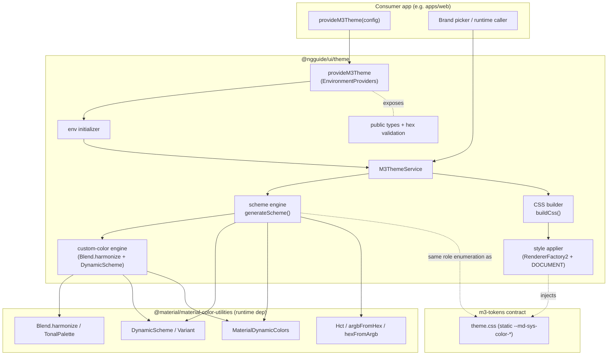
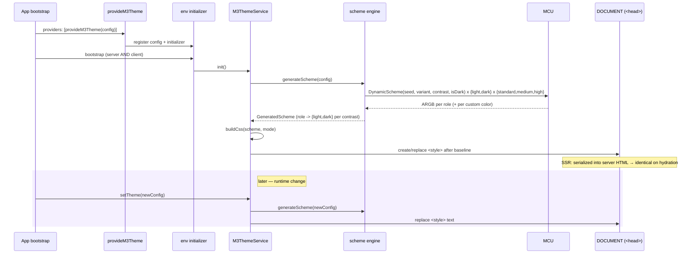

# Design Document: M3 Dynamic Color

## Overview

Add a runtime dynamic-color system to `@ngguide/ui`, shipped as a new secondary entry point
**`@ngguide/ui/theme`**. It generates a full M3 color scheme from a source color (plus optional
custom colors) using `@material/material-color-utilities` (MCU) — the same `DynamicScheme` /
`MaterialDynamicColors` path the static `m3-tokens` generator uses — and applies it by injecting a
`<style>` element whose CSS mirrors the static `_color.generated.css` shape (`light-dark()` pairs
under `[data-contrast]` scopes). An Angular provider (`provideM3Theme`) applies the configured scheme
at bootstrap (server and browser) and a service swaps it at runtime. A pure, DOM-free generation core
makes it SSR-safe; an SSR host is added to `apps/web` to verify Req 10 end-to-end.

### Key Changes

1. **New entry point `@ngguide/ui/theme`** exporting `provideM3Theme`, `M3ThemeService`, the scheme
   generation/read API, and all public types.
2. **MCU promoted to a runtime dependency** of `libs/ui` (`dependencies`); the role-enumeration logic
   used by the build-time generator is reproduced in shipped library code so runtime output matches
   the static token contract by construction.
3. **Runtime `<style>` injection** via `RendererFactory2` + `DOCUMENT`, producing CSS identical in
   shape to `m3-tokens` so OS light/dark auto-switch and `[data-contrast]` scopes keep working; the
   injected element is appended after the static baseline so it overrides it.
4. **Contrast-aware custom colors** derived through the canonical DynamicScheme algorithm (the custom
   color seeds its own scheme; its primary family becomes the 4 custom roles), with optional
   `Blend.harmonize` toward the source.
5. **SSR host added to `apps/web`** (`@angular/ssr` + server entry + build options) to exercise
   SSR-safety; the library itself stays framework-host-agnostic.

### Decisions

| Problem Area | Chosen Variant | Why chosen | Reference |
|-------------|----------------|------------|-----------|
| 1. Scheme generation engine | **1A** — `DynamicScheme` + `MaterialDynamicColors` | Same MCU API as the static generator → token contract matches by construction; all 9 variants + 3 contrasts from one code path; Effort Low / Risk Low | research.md §1 |
| 2. Color-engine packaging | **2A** — MCU as `dependencies` | Works out-of-the-box for consumers; lowest risk; matches "ship a working theme API" goal | research.md §2 |
| 3. Runtime token application | **3A** — injected `<style>` text | Reproduces the static CSS shape so `light-dark()` + `[data-contrast]` + OS switch survive; SSR-safe; reliably overrides baseline via document order | research.md §3 |
| 4. Angular & SSR lifecycle | **4A** — `EnvironmentProviders` + bootstrap initializer + service | Theme in effect for first render on server and client; matches the pre-defined `provideM3Theme(): EnvironmentProviders` interface; runtime updates via injectable | research.md §4 |
| 5. Custom-color modeling | **5B** — palette per color through the contrast pipeline | Only variant satisfying Req 5.4 (contrast-aware custom colors); consistent with 1A; harmonize is per-color | research.md §5 |

Additional decisions (open questions resolved with the user during the Decision Pass):

- **Entry-point placement:** a **new** secondary entry `@ngguide/ui/theme` (not the root entry), so
  importing `GuiSize` from `@ngguide/ui` never pulls MCU into the bundle.
- **SSR verification:** add a real **SSR host** to `apps/web` so Req 10 is verified end-to-end (not
  only via DOM-free unit tests).

### Spec-fidelity note (M3 ambiguity, documented per the strict-M3 rule)

Official MCU `customColor()` produces custom-color roles at **fixed tones with no contrast
adjustment** — M3 does not publish a contrast-adjusted custom-color table. Req 5.4 nonetheless
requires custom colors to respond to contrast. To stay within the canonical algorithm rather than
invent tone deltas, each custom color is treated as the **seed of its own `DynamicScheme`** (same
variant, the selected `contrastLevel`, light/dark); its **primary family** —
`primary` / `onPrimary` / `primaryContainer` / `onPrimaryContainer` — becomes the custom color's
`color` / `on-color` / `color-container` / `on-color-container`. This reuses M3's own contrast-aware
role math, so the values are spec-traceable. This interpretation is recorded here as the resolution
of an M3 gap (see Open Questions in research.md).

## Architecture

### Component Diagram



### Data Flow



## Components and Interfaces

### Public types

```typescript
// Path: libs/ui/theme/src/types.ts

/** M3 scheme variants (maps 1:1 to MCU's Variant enum). */
export type M3SchemeVariant =
  | 'monochrome' | 'neutral' | 'tonal-spot' | 'vibrant' | 'expressive'
  | 'fidelity' | 'content' | 'rainbow' | 'fruit-salad';

/** M3 contrast levels (map to MCU contrastLevel 0 / 0.5 / 1). */
export type M3Contrast = 'standard' | 'medium' | 'high';

/** Active-mode policy. 'auto' follows the OS via color-scheme + light-dark(). */
export type M3Mode = 'light' | 'dark' | 'auto';

/** A named brand color folded into the scheme as its own role set. */
export interface M3CustomColor {
  /** Identifier used to build role names: --md-sys-color-<name>, -on-<name>, … */
  name: string;
  /** Source hex for this color. */
  value: string;
  /** Blend the hue toward the source color (M3 harmonize). Default: true. */
  harmonize?: boolean;
}

/** Configuration accepted by provideM3Theme and M3ThemeService.setTheme. */
export interface M3ThemeConfig {
  /** Source/seed hex color. Required. */
  sourceColor: string;
  /** Default: 'tonal-spot'. */
  variant?: M3SchemeVariant;
  /** Default: 'standard'. */
  contrast?: M3Contrast;
  /** Default: 'auto'. */
  mode?: M3Mode;
  /** Optional extended colors. */
  customColors?: M3CustomColor[];
}

/** The four roles of one color family, as hex. */
export interface M3ColorGroup {
  color: string;
  onColor: string;
  colorContainer: string;
  onColorContainer: string;
}

/** Flat role→hex map for one (mode, contrast), incl. custom roles. Returned by resolve(). */
export type M3ResolvedRoles = Record<string, string>; // key = role name WITHOUT --md-sys-color- prefix
```

### Scheme engine (Decision 1A)

Pure, DOM-free (Req 10.1). Reproduces the static generator's role enumeration so names match the
contract (Req 11).

```typescript
// Path: libs/ui/theme/src/engine.ts
import {
  argbFromHex, hexFromArgb, Hct, DynamicScheme, Variant,
  MaterialDynamicColors, type DynamicColor,
} from '@material/material-color-utilities';
import type { M3ThemeConfig, M3Contrast, M3SchemeVariant } from './types';

const VARIANT_MAP: Record<M3SchemeVariant, Variant> = {
  'monochrome': Variant.MONOCHROME, 'neutral': Variant.NEUTRAL,
  'tonal-spot': Variant.TONAL_SPOT, 'vibrant': Variant.VIBRANT,
  'expressive': Variant.EXPRESSIVE, 'fidelity': Variant.FIDELITY,
  'content': Variant.CONTENT, 'rainbow': Variant.RAINBOW,
  'fruit-salad': Variant.FRUIT_SALAD,
};
const CONTRAST_MAP: Record<M3Contrast, number> = { standard: 0, medium: 0.5, high: 1 };
const CONTRAST_LEVELS: M3Contrast[] = ['standard', 'medium', 'high'];

/** kebab-case fragment, e.g. "on-primary" — identical to the build-time generator. */
export function camelToKebab(name: string): string {
  return name.replace(/([a-z0-9])([A-Z])/g, '$1-$2').toLowerCase();
}

/** Enumerate every M3 role exposed by MaterialDynamicColors, excluding *PaletteKeyColor. */
export function coreRoles(): { token: string; dynamicColor: DynamicColor }[];

/** Per-role light/dark hex pair. */
export interface RolePair { light: string; dark: string; }

/** role(token) -> {light,dark} for one contrast level. */
export type ScopeRoles = Record<string, RolePair>;

/** Full computed scheme: per contrast level, all core + custom roles. */
export interface GeneratedScheme {
  standard: ScopeRoles;
  medium: ScopeRoles;
  high: ScopeRoles;
}

/** Build one MCU DynamicScheme. */
function buildScheme(sourceArgb: number, variant: M3SchemeVariant, contrast: M3Contrast, isDark: boolean): DynamicScheme;

/** Pure generation: seed + custom colors → all roles for all 3 contrasts, light+dark. */
export function generateScheme(config: M3ThemeConfig): GeneratedScheme;
```

Core-role generation, per `(contrast, mode)`: `MaterialDynamicColors[role].getArgb(scheme)` →
`hexFromArgb`. Custom-role generation (Decision 5B), per custom color `c`:

```
seed   = argbFromHex(c.value)
seed'  = (c.harmonize ?? true) ? Blend.harmonize(seed, sourceArgb) : seed
For each (contrast, mode):
  cs   = DynamicScheme(seed', variant, contrast, isDark)
  color           = hex(MaterialDynamicColors.primary.getArgb(cs))
  on-color        = hex(MaterialDynamicColors.onPrimary.getArgb(cs))
  color-container = hex(MaterialDynamicColors.primaryContainer.getArgb(cs))
  on-color-container = hex(MaterialDynamicColors.onPrimaryContainer.getArgb(cs))
Emitted token names (Req 5.5, no collision with core roles):
  --md-sys-color-<name>, --md-sys-color-on-<name>,
  --md-sys-color-<name>-container, --md-sys-color-on-<name>-container
```

### CSS builder (Decision 3A)

```typescript
// Path: libs/ui/theme/src/css-builder.ts
import type { GeneratedScheme } from './engine';
import type { M3Mode } from './types';

/**
 * Serialize a GeneratedScheme to CSS text identical in shape to _color.generated.css:
 *   :root,[data-contrast='standard'] { color-scheme: <scheme>; --md-sys-color-*: light-dark(L,D); }
 *   [data-contrast='medium'] { … }
 *   [data-contrast='high'] { … }
 * `mode` controls the :root color-scheme: 'auto' → "light dark", 'light' → "light", 'dark' → "dark".
 */
export function buildCss(scheme: GeneratedScheme, mode: M3Mode): string;
```

Forcing mode is expressed purely via `color-scheme` on `:root`; `light-dark()` then resolves to the
forced side (Req 4.3). `'auto'` keeps `light dark` so the OS decides (Req 4.2).

### Style applier (Decision 3A + 4A, SSR-safe)

```typescript
// Path: libs/ui/theme/src/style-applier.ts
import { Injectable, RendererFactory2, inject, DOCUMENT } from '@angular/core';

@Injectable({ providedIn: 'root' })
export class M3StyleApplier {
  private readonly doc = inject(DOCUMENT);
  private readonly renderer = inject(RendererFactory2).createRenderer(null, null);
  private styleEl: HTMLStyleElement | null = null;

  /** Create-or-replace a single managed <style> at the end of <head> (overrides baseline). */
  apply(css: string): void;
}
```

`RendererFactory2.createRenderer(null, null)` works on both platforms; on the server
`@angular/platform-server` serializes the appended `<style>` into the HTML, giving identical first
paint and no hydration shift (Req 10.2, 10.3). Appending at the end of `<head>` places it after the
statically imported `theme.css`, so equal-specificity `:root` rules win (Req 6.5). A single element is
reused; re-applying replaces its text (Req 6.3).

### Theme service (Decision 4A)

```typescript
// Path: libs/ui/theme/src/theme.service.ts
import { Injectable, signal, inject } from '@angular/core';
import type { M3ThemeConfig, M3Contrast, M3ResolvedRoles } from './types';
import { generateScheme, type GeneratedScheme } from './engine';
import { buildCss } from './css-builder';
import { M3StyleApplier } from './style-applier';

@Injectable({ providedIn: 'root' })
export class M3ThemeService {
  private readonly applier = inject(M3StyleApplier);
  private readonly _config = signal<M3ThemeConfig | null>(null);
  private _scheme: GeneratedScheme | null = null;

  /** Current config (read-only signal). */
  readonly config = this._config.asReadonly();

  /** Apply a config (validates input, generates, injects CSS). Req 6, 7.3. */
  setTheme(config: M3ThemeConfig): void;

  /** Internal: called by the bootstrap initializer with the provided config. */
  init(config: M3ThemeConfig): void;

  /**
   * Read computed values without needing them applied (Req 8).
   * Returns flat role→hex for a specific mode + contrast (defaults: light, config.contrast).
   */
  resolve(opts?: { mode?: 'light' | 'dark'; contrast?: M3Contrast }): M3ResolvedRoles;
}
```

### Provider (Decision 4A — matches the pre-defined shared interface)

```typescript
// Path: libs/ui/theme/src/provide-theme.ts
import { makeEnvironmentProviders, provideEnvironmentInitializer, inject, type EnvironmentProviders } from '@angular/core';
import type { M3ThemeConfig } from './types';
import { M3ThemeService } from './theme.service';
import { validateConfig } from './validate';

/** Configure M3 dynamic color at bootstrap. Applies on server AND client (Req 7.2, 10). */
export function provideM3Theme(config: M3ThemeConfig): EnvironmentProviders {
  return makeEnvironmentProviders([
    provideEnvironmentInitializer(() => {
      validateConfig(config);                 // fail fast (Req 9)
      inject(M3ThemeService).init(config);
    }),
  ]);
}
```

Generation + application are synchronous, so `provideEnvironmentInitializer` (sync) is used rather
than `provideAppInitializer` (async). `M3ThemeService` is `providedIn: 'root'`.

### Input validation (Req 9)

```typescript
// Path: libs/ui/theme/src/validate.ts
/** Parse a hex color to ARGB; throw a descriptive Error if invalid. */
export function parseHex(input: string, label: string): number;
/** Validate sourceColor + every customColor.value; throw naming the offender. Req 9.1–9.3. */
export function validateConfig(config: M3ThemeConfig): void;
```

`parseHex` validates `#RGB` / `#RRGGBB` (and `#RRGGBBAA` reduced to RGB) before calling
`argbFromHex`, raising e.g. `Error("M3 dynamic color: invalid sourceColor '#zzz'")` or
`… invalid custom color "brand-success" value 'nope'`. No silent fallback (Req 9.3).

### Barrel + packaging

```typescript
// Path: libs/ui/theme/src/index.ts
export * from './types';
export { provideM3Theme } from './provide-theme';
export { M3ThemeService } from './theme.service';
export { generateScheme, type GeneratedScheme } from './engine';
```

`libs/ui/theme/ng-package.json` = `{ "lib": { "entryFile": "src/index.ts" } }`;
`tsconfig.base.json` paths gains `"@ngguide/ui/theme": ["libs/ui/theme/src/index.ts"]`;
`libs/ui/project.json` test `include` gains the theme specs; `libs/ui/package.json` gains
`"dependencies": { "@material/material-color-utilities": "^0.4.0" }` (Decision 2A — ng-packagr
externalizes it into `dist/libs/ui/package.json`). `eslint.config.mjs` `@nx/dependency-checks` will
now require MCU declared (satisfied by the new `dependencies` entry).

### SSR host for `apps/web` (verification scaffolding)

Add `@angular/ssr` + `@angular/platform-server`; create `apps/web/src/main.server.ts` (Angular 21
form, passing `BootstrapContext` — NG0401), `apps/web/src/app/app.config.server.ts`
(`provideServerRendering()` merged with `appConfig`), `apps/web/tsconfig.server.json`; set
`server` / `ssr` / `outputMode: 'server'` on the `@angular/build:application` build target and wire
`apps/web` to call `provideM3Theme(...)` so SSR output carries the dynamic `<style>`.

## Data Models

### `GeneratedScheme` (internal)

```typescript
interface RolePair { light: string; dark: string; }          // hex per OS mode
type ScopeRoles = Record<string, RolePair>;                  // role name -> pair
interface GeneratedScheme {                                  // one per config
  standard: ScopeRoles;                                      // contrastLevel 0
  medium: ScopeRoles;                                        // contrastLevel 0.5
  high: ScopeRoles;                                          // contrastLevel 1
}
```

## Data Flow Completeness

This feature introduces no persisted entities; the "layers" are the runtime pipeline from config to
applied CSS. Trace for the two data shapes that flow end-to-end:

| Field/Entity | Public type | Generation | CSS serialization | Application | Read API |
|--------------|-------------|------------|-------------------|-------------|----------|
| core role value | `M3ThemeConfig` → roles | `engine.ts generateScheme()` | `css-builder.ts buildCss()` | `style-applier.ts apply()` | `theme.service.ts resolve()` |
| custom color (4 roles) | `M3CustomColor` | `engine.ts` (Blend.harmonize + DynamicScheme primary family) | `css-builder.ts` (`--md-sys-color-<name>*`) | `style-applier.ts apply()` | `theme.service.ts resolve()` |
| forced mode | `M3Mode` | N/A (mode is not a generation input; both light+dark always computed) | `css-builder.ts` (`:root { color-scheme }`) | `style-applier.ts apply()` | `resolve({mode})` |
| contrast level | `M3Contrast` | `engine.ts` (3 scopes always computed) | `css-builder.ts` (`[data-contrast]` blocks) | `style-applier.ts apply()` | `resolve({contrast})` |

All four reach every layer. No persistence/migration layer applies (N/A — runtime-only feature).

## Error Handling

| Error | Trigger | Behaviour / message |
|-------|---------|---------------------|
| Invalid source color | `sourceColor` not parseable hex | Throw `Error("M3 dynamic color: invalid sourceColor '<v>'")` at bootstrap/`setTheme` (Req 9.1). No fallback (9.3). |
| Invalid custom color | a `customColors[].value` not parseable | Throw `Error("M3 dynamic color: invalid custom color \"<name>\" value '<v>'")` (Req 9.2). |
| Unknown variant | `variant` not in `M3SchemeVariant` | Compile-time (typed union); at runtime defaults to `tonal-spot` only if undefined. |
| No DOM at apply time | server with a serializable document | No-op-safe: Renderer2 + serialized `<style>`; never throws (Req 10.2). |
| Duplicate custom name collides with a core role | e.g. custom name `"primary"` | Reject in `validateConfig` with a descriptive error (protects Req 5.5). |

## Testing Strategy

### Approach

Native Angular Vitest (zoneless), specs registered in `libs/ui/project.json` `test.include`. The
engine/CSS/validation are pure functions → fast unit tests. The applier/service are tested via
`TestBed` with the real `DOCUMENT`. SSR-safety is unit-tested by exercising the DOM-free engine and
asserting the applier appends a serializable `<style>`; the `apps/web` SSR host provides an
end-to-end smoke check.

### Unit Tests

```typescript
describe('generateScheme', () => {
  it('produces every core role name present in the static contract (Req 11)', () => {
    const roles = Object.keys(generateScheme({ sourceColor: '#6750A4' }).standard);
    // assert equality against the role set parsed from _color.generated.css
  });

  it('matches the static baseline for the baseline seed + tonal-spot + standard', () => {
    const s = generateScheme({ sourceColor: '#6750A4' }).standard;
    expect(s['primary'].light).toBe('#65558f');   // value from _color.generated.css
    expect(s['primary'].dark).toBe('#cfbdfe');
  });

  it('varies output by variant and by contrast', () => { /* vibrant ≠ tonal-spot; high ≠ standard */ });

  it('emits 4 contrast-aware roles per custom color, harmonized by default (Req 5)', () => { /* … */ });
});

describe('buildCss', () => {
  it('emits light-dark() pairs, color-scheme, and 3 [data-contrast] scopes', () => { /* … */ });
  it("forces color-scheme for mode 'light'/'dark' and uses 'light dark' for 'auto' (Req 4)", () => { /* … */ });
});

describe('validateConfig', () => {
  it('throws naming the offending sourceColor / custom color (Req 9)', () => { /* … */ });
});

describe('M3ThemeService (TestBed + DOCUMENT)', () => {
  it('injects a <style> after baseline and replaces it on setTheme (Req 6)', () => { /* … */ });
  it('resolve() returns role→hex equal to applied values (Req 8)', () => { /* … */ });
});
```

### Edge Cases

1. **`setTheme` called repeatedly** — single `<style>` reused; old values fully replaced (Req 6.3).
2. **No `provideM3Theme`** — nothing injected; static baseline remains (Req 6.4).
3. **Forced mode + OS change** — forced `color-scheme` wins; OS change ignored (Req 4.3).
4. **Custom name equal to a core role** — rejected by validation (Req 5.5).
5. **Server render then hydrate** — identical CSS string both sides → no theme flash (Req 10.3).
6. **`#RGB` shorthand / uppercase hex** — accepted; normalized before `argbFromHex`.

## Deviations

Tracked during implementation (per the deviation protocol). None change the architecture or the Decisions table.

- **Minor — Vitest `runnerConfig` for MCU (Group A, task 7).** `@material/material-color-utilities` is ESM-only and ships some extensionless relative imports (e.g. `color_spec_2025.js` → `./dynamic_color`). The Angular Vitest builder externalizes packages, so the theme specs failed to import MCU through raw Node ESM. Resolution: a small `libs/ui/vitest.config.ts` wired via the builder's supported `runnerConfig` option, inlining MCU (`ssr.noExternal` + `deps.optimizer.ssr.include`) so Vite/esbuild resolves it. This is the first test-runner config in the repo (CLAUDE.md notes the builder is otherwise zero-config) and is test-only — production build/runtime are unaffected (apps bundle MCU via esbuild, which resolves the imports). `vitest.config.ts` is added to `@nx/dependency-checks` `ignoredFiles`.
- **Minor — ng-packagr `allowedNonPeerDependencies` (Group A, task 1/8).** Decision 2A ships MCU in `dependencies` (not `peerDependencies`). ng-packagr blocks non-peer runtime deps unless allow-listed, so `libs/ui/ng-package.json` gains `"allowedNonPeerDependencies": ["@material/material-color-utilities"]`. This is the canonical ng-packagr mechanism for Decision 2A and keeps MCU externalized into `dist/libs/ui/package.json`.
