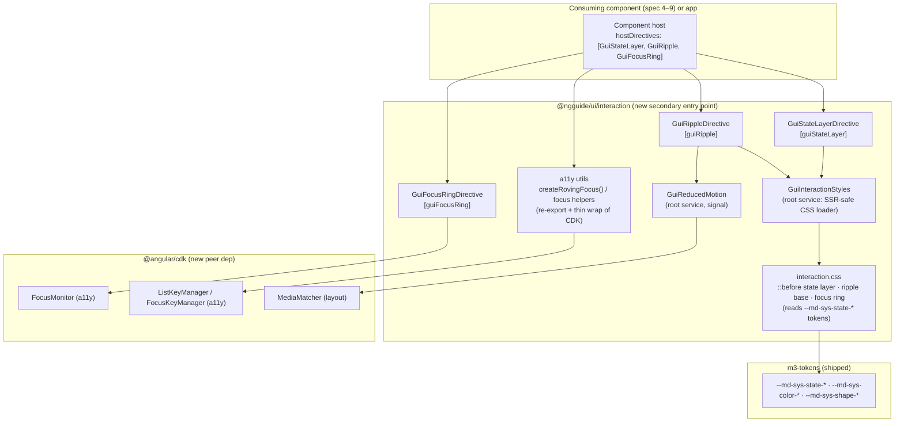
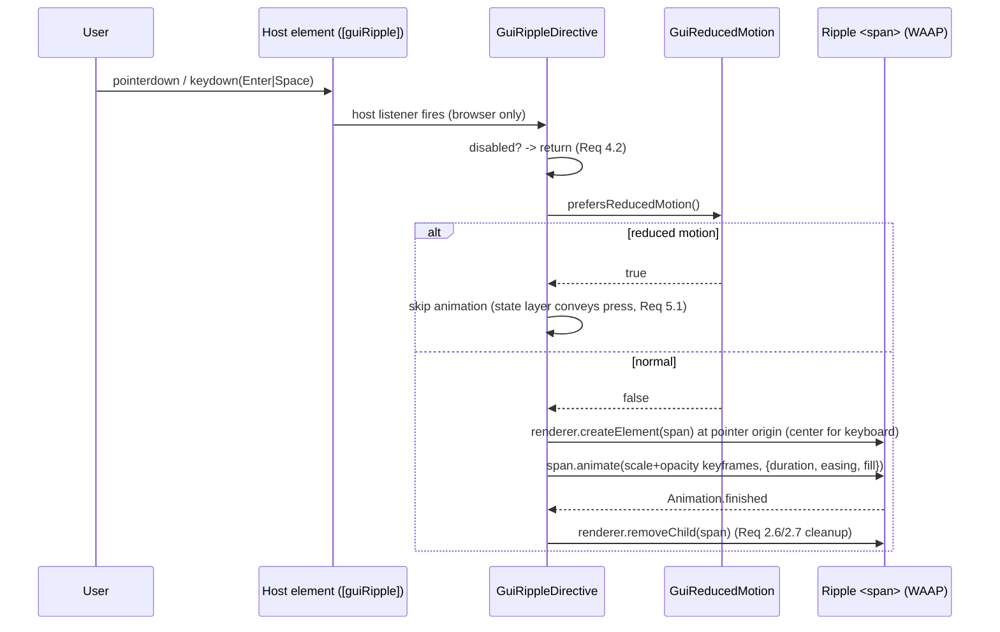

# Design Document: M3 Interaction Foundation

## Overview

`@ngguide/ui/interaction` is a new secondary entry point of `@ngguide/ui` that
ships the shared Material Design 3 interaction layer every component reuses:
three standalone attribute directives — **state layer**, **ripple**, **focus
ring** — plus generic accessibility utilities (focus management + roving
tabindex) and a reduced-motion utility. It contains **no concrete component**,
defines **no tokens**, and generates **no color scheme** — it consumes the
existing `--md-sys-*` contract from `m3-tokens`.

The directives are designed to be composed onto a component's host element via
Angular's `hostDirectives` API, so a component (e.g. a future button) presents a
single public selector while reusing the interaction behavior. The visual layers
are driven by CSS keyed off the existing `--md-sys-state-*` tokens (currently
defined in `libs/ui/src/styles/tokens/_state.css` but unused); JS handles only
what CSS cannot (pressed/dragged tracking, ripple geometry/animation, focus
origin, reduced-motion gating).

### Key Changes

1. New secondary entry point `libs/ui/interaction` (`@ngguide/ui/interaction`)
   wired through `tsconfig.base.json`, `libs/ui/project.json` test `include`,
   and a minimal `ng-package.json`.
2. Three directives — `[guiStateLayer]`, `[guiRipple]`, `[guiFocusRing]` — plus
   a shared SSR-safe interaction stylesheet loader, a reduced-motion utility, and
   re-exported roving-tabindex / focus-management helpers built on
   `@angular/cdk/a11y`.
3. New dependency on **`@angular/cdk@21.2.13`** (peer) — the repo's first CDK
   dependency. `FocusMonitor` (focus origin) and `ListKeyManager`/
   `FocusKeyManager` (roving tabindex) come from its `a11y` module;
   `MediaMatcher` (SSR-safe `matchMedia`) from its `layout` module.

### Decisions

| Problem Area | Chosen Variant | Why chosen | Reference |
|-------------|----------------|------------|-----------|
| 1. State-layer rendering | **A — CSS `::before` pseudo-element** | Lowest effort+risk; closest to current `button.css`; opacity straight from `--md-sys-state-*` tokens; the overlay is pure CSS keyed off `:hover`/`:focus-visible` + JS-set `data-*` for pressed/dragged | research.md §1 |
| 2. Ripple | **A — Web Animations API** | `Element.animate()` is Baseline Widely Available; returns an `Animation` handle for clean cancel/cleanup (Req 2.6/2.7); geometry math lives next to keyframes; SSR-gated via `afterNextRender` + client-only events | research.md §2 |
| 3. Focus visibility | **B — CDK `FocusMonitor`** | CDK already arrives with the a11y choice; reports `FocusOrigin` so it closes the programmatic-focus gap that `:focus-visible` leaves (roving/menu focus moves), Risk Low | research.md §3 |
| 4. a11y foundation | **B — `@angular/cdk/a11y` only** | **Switched from A during design.** Verified: `@angular/aria` exposes only full ARIA *patterns* (listbox/menu/tabs/…), which Req 6.5 defers to the component specs; the *generic* utilities Req 6 needs (focus mgmt + roving tabindex) live in `@angular/cdk/a11y` (`FocusKeyManager`/`ListKeyManager`). CDK is stable (not Developer Preview). `@angular/aria` peer-pins this exact CDK version, so component specs can add it later without conflict | research.md §4 |
| 5. Packaging & reactivity | **A — 3 directives + `hostDirectives`** | Granular (a component takes only what it needs); idiomatic Angular 21 host composition; each directive independently testable; reduced-motion/disabled handled by a shared root utility | research.md §5 |

> **Deviation from `vision.md`:** the vision names `@angular/aria` as the a11y
> foundation. This spec uses `@angular/cdk/a11y` instead, because `@angular/aria`'s
> surface is ARIA *patterns* (a component-spec concern per Req 6.5), while this
> foundation needs only the *generic* CDK primitives. `@angular/aria` (which
> peer-depends on the same CDK 21.2.13) is adopted by the component specs (4–9)
> when they wire concrete patterns. Recorded so the implementer does not "restore"
> `@angular/aria` here to match the vision text.

## Architecture

### Component Diagram



### Data Flow — ripple activation (the only non-trivial runtime flow)



### State layering (z-order on the host)

```
host content (text/icon)        z: auto / 2
  ├─ ripple <span> (transient)  z: 1   (above state layer, Req 2.3)
  └─ ::before state layer       z: 0   (below content, above background)
host background / box-shadow    (host's own paint; NOT clipped by overflow)
```

The host gets `position: relative` and `overflow: hidden` (clips `::before` and
ripple spans to the host's shape via `border-radius: inherit`). The host's own
`box-shadow` elevation is **not** clipped by its own `overflow` (an element's
box-shadow paints outside its border box), so elevated components keep their
shadow while ripples stay inside the shape.

## Components and Interfaces

### Entry point layout

```
libs/ui/interaction/
  ng-package.json                 # { "lib": { "entryFile": "src/index.ts" } }
  src/
    index.ts                      # public barrel
    state-layer.directive.ts      # GuiStateLayerDirective
    ripple.directive.ts           # GuiRippleDirective
    focus-ring.directive.ts       # GuiFocusRingDirective
    reduced-motion.ts             # GuiReducedMotion service + helper
    interaction-styles.ts         # GuiInteractionStyles (SSR-safe CSS loader)
    interaction.css.ts            # the CSS string injected by the loader
    a11y.ts                       # roving-tabindex / focus-management helpers (CDK-based)
    disabled.ts                   # isHostDisabled() shared helper
    *.spec.ts                     # specs (each listed in project.json include)
```

### `GuiStateLayerDirective`

Renders the M3 state-layer overlay as a host `::before` (Decision 1A). Hover and
focus are pure CSS; pressed and dragged are tracked in JS to set a `data-*`
attribute the CSS keys off; disabled suppresses the overlay.

```typescript
// Path: libs/ui/interaction/src/state-layer.directive.ts
import {
  Directive, ElementRef, Renderer2, booleanAttribute, computed, inject, input,
} from '@angular/core';

@Directive({
  selector: '[guiStateLayer]',
  host: {
    'class': 'gui-state-layer',                       // CSS hook for ::before
    '[attr.data-gui-state]': 'stateAttr()',           // 'pressed' | 'dragged' | null
    '[attr.data-gui-disabled]': 'isDisabled() || null',
    '(pointerenter)': 'onHover(true)',
    '(pointerleave)': 'onHover(false)',
    '(pointerdown)': 'onPressed(true)',
    '(pointerup)': 'onPressed(false)',
    '(pointercancel)': 'onPressed(false)',
  },
})
export class GuiStateLayerDirective {
  /** Explicit disabled flag; also reads native `disabled` / `aria-disabled` (Req 4.4). */
  readonly disabled = input(false, { transform: booleanAttribute });
  protected readonly isDisabled = computed(() => /* disabled() || host disabled/aria-disabled */);
  protected readonly stateAttr = computed<'pressed' | 'dragged' | null>(() => /* ... */);
  // dragged tracked via drag events when the host is draggable (Req 1.5)
}
```

Hover/focus/pressed/dragged opacities resolve in CSS from
`--md-sys-state-{hover,focus,pressed,dragged}-state-layer-opacity`. Combined
states (Req 1.8) are resolved by CSS specificity ordering in `interaction.css`
(focus+hover sums to the M3-prescribed combined opacity, not two stacked
overlays).

### `GuiRippleDirective`

Animates the M3 pressed ripple with the Web Animations API (Decision 2A),
browser-only, reduced-motion-gated, disabled-suppressed.

```typescript
// Path: libs/ui/interaction/src/ripple.directive.ts
import {
  Directive, ElementRef, Renderer2, booleanAttribute, inject, input,
} from '@angular/core';
import { GuiReducedMotion } from './reduced-motion';
import { GuiInteractionStyles } from './interaction-styles';

@Directive({
  selector: '[guiRipple]',
  host: {
    'class': 'gui-ripple-host',
    '(pointerdown)': 'launch($event)',
    '(keydown.enter)': 'launchCentered()',
    '(keydown.space)': 'launchCentered()',
  },
})
export class GuiRippleDirective {
  private readonly host = inject(ElementRef<HTMLElement>);
  private readonly renderer = inject(Renderer2);
  private readonly reducedMotion = inject(GuiReducedMotion);
  private readonly styles = inject(GuiInteractionStyles); // ensures interaction.css present
  readonly disabled = input(false, { transform: booleanAttribute });

  /** Pointer-origin ripple (Req 2.1). */
  launch(event: PointerEvent): void { /* compute offset from getBoundingClientRect; fade(x,y) */ }
  /** Keyboard activation → centered ripple (Req 2.2). */
  launchCentered(): void { /* fade(centerX, centerY) */ }

  // fade(): if isDisabled -> return (Req 4.2); if reducedMotion.prefersReducedMotion() -> return (Req 5.1);
  //   create span (renderer), position at (x,y), radius from host rect, append;
  //   const anim = span.animate([{transform:'scale(0)',opacity:τ},{transform:'scale(1)',opacity:0}],
  //     {duration: <md-sys-motion>, easing: <md-sys-motion-easing>, fill:'forwards'});
  //   anim.finished.then(() => renderer.removeChild(host, span));  // cleanup (Req 2.6/2.7)
}
```

Ripple color/opacity (Req 2.4) come from the host content color role +
`--md-sys-state-pressed-state-layer-opacity`. The ripple span is appended inside
the host and clipped by the host's `overflow: hidden` (Req 2.5). Multiple rapid
ripples each get their own `Animation` handle, so none gets stuck (Req 2.6).

### `GuiFocusRingDirective`

Shows the focus indicator only for keyboard focus using CDK `FocusMonitor`
(Decision 3B), closing the programmatic-focus gap.

```typescript
// Path: libs/ui/interaction/src/focus-ring.directive.ts
import { Directive, ElementRef, OnDestroy, inject } from '@angular/core';
import { FocusMonitor, FocusOrigin } from '@angular/cdk/a11y';

@Directive({
  selector: '[guiFocusRing]',
  host: { 'class': 'gui-focus-ring' },
})
export class GuiFocusRingDirective implements OnDestroy {
  private readonly host = inject(ElementRef<HTMLElement>);
  private readonly focusMonitor = inject(FocusMonitor); // providedIn:'root', SSR-safe
  private readonly el = this.host.nativeElement;

  constructor() {
    // monitor() returns empty observable on the server (Platform.isBrowser guard) — SSR-safe.
    this.focusMonitor.monitor(this.el).subscribe((origin: FocusOrigin) => {
      // show ring when origin === 'keyboard' (Req 3.1/3.2). FocusMonitor attributes
      // keyboard-driven programmatic focus (roving tabindex) to 'keyboard' via its
      // InputModalityDetector — this is what closes the gap. [VERIFY origin timing in test]
      this.el.classList.toggle('gui-focus-visible', origin === 'keyboard');
    });
  }
  ngOnDestroy(): void { this.focusMonitor.stopMonitoring(this.el); }
}
```

The ring visual is CSS (`.gui-focus-ring.gui-focus-visible`) styled from
`--md-sys-state-focus-indicator-{thickness,outer-offset}` and a color role
(Req 3.4); using `outline` keeps it visible against both schemes and unclipped by
the host's `overflow` (Req 3.5). FocusMonitor already removes its classes on blur
(Req 3.3). Disabled hosts are not focusable / `[aria-disabled]` suppresses the
ring in CSS (Req 4.3).

### `GuiReducedMotion` (reduced-motion utility, Req 5)

```typescript
// Path: libs/ui/interaction/src/reduced-motion.ts
import { Injectable, Signal, inject, signal } from '@angular/core';
import { MediaMatcher } from '@angular/cdk/layout'; // SSR-safe matchMedia wrapper

@Injectable({ providedIn: 'root' })
export class GuiReducedMotion {
  private readonly mql = inject(MediaMatcher).matchMedia('(prefers-reduced-motion: reduce)');
  private readonly _reduce = signal(this.mql.matches);
  /** Reactive preference (Req 5.3, 5.4). On server, MediaMatcher returns a no-op MQL → false. */
  readonly prefersReducedMotion: Signal<boolean> = this._reduce.asReadonly();
  constructor() { this.mql.addEventListener?.('change', (e) => this._reduce.set(e.matches)); }
}
```

### `GuiInteractionStyles` (SSR-safe CSS loader)

Mirrors the proven `M3StyleApplier` pattern (`libs/ui/theme/src/style-applier.ts`):
injects a single `<style data-gui-interaction>` into `<head>` once, adopting any
SSR-serialized copy on hydration so no duplicate appears (Req 7.4). Holds the
static `interaction.css` (state-layer `::before`, ripple base, focus ring) keyed
off `[guiStateLayer]`/`.gui-focus-ring`/etc. and reading `--md-sys-*` tokens.

```typescript
// Path: libs/ui/interaction/src/interaction-styles.ts
@Injectable({ providedIn: 'root' })
export class GuiInteractionStyles {
  private readonly doc = inject(DOCUMENT);
  private readonly renderer = inject(RendererFactory2).createRenderer(null, null);
  private injected = false;
  /** Idempotent; called by directives on init. Adopt-on-hydration like M3StyleApplier. */
  ensure(): void { /* if !injected: adopt existing [data-gui-interaction] or create one */ }
}
```

> Alternative offered to consumers: the same CSS is also published as an
> importable asset `@ngguide/ui/interaction/styles/interaction.css` (via an
> `assets` glob in `ng-package.json`) for apps that prefer a static import over
> runtime injection. The loader is the default so directives work with zero
> consumer setup.

### a11y utilities (Req 6) — `a11y.ts`

Thin, pattern-agnostic helpers over `@angular/cdk/a11y` (Decision 4B). These do
**not** bind to any ARIA pattern (Req 6.5).

```typescript
// Path: libs/ui/interaction/src/a11y.ts
import { FocusKeyManager, ListKeyManager, FocusableOption } from '@angular/cdk/a11y';

/** Re-export the generic CDK roving-tabindex engine (Req 6.2, 6.3). */
export { FocusKeyManager, ListKeyManager, type FocusableOption } from '@angular/cdk/a11y';

/**
 * Convenience factory that builds a roving-tabindex manager over a QueryList of
 * focusable items with M3/APG defaults (wrap-around on, type-ahead on). Generic —
 * the caller (a component spec) supplies the items and orientation (Req 6.1, 6.4).
 */
export function createRovingFocus<T extends FocusableOption>(/* items, opts */): FocusKeyManager<T> { /* ... */ }
```

### Composition by a consumer (Req 7.1, 7.2)

```typescript
// Illustrative — lives in a future component spec, NOT in this spec.
@Component({
  selector: 'button[gui-button]',
  hostDirectives: [GuiStateLayerDirective, GuiRippleDirective, GuiFocusRingDirective],
  // ...
})
export class ButtonComponent {}
```

### Public API (`index.ts`)

```typescript
// Path: libs/ui/interaction/src/index.ts
export { GuiStateLayerDirective } from './state-layer.directive';
export { GuiRippleDirective } from './ripple.directive';
export { GuiFocusRingDirective } from './focus-ring.directive';
export { GuiReducedMotion } from './reduced-motion';
export { FocusKeyManager, ListKeyManager, type FocusableOption, createRovingFocus } from './a11y';
// GuiInteractionStyles is an internal implementation detail (not exported).
```

## Data Models

This feature introduces directives/services, not data entities. The only
"models" are small enums/types:

```typescript
/** What the state-layer directive writes to data-gui-state. */
type GuiInteractionState = 'pressed' | 'dragged' | null;

/** Re-exported from @angular/cdk/a11y for consumers (Req 6). */
type FocusOrigin = 'touch' | 'mouse' | 'keyboard' | 'program' | null;
```

## Data Flow Completeness

No persisted fields/entities. The "flow" that must be complete is each
requirement → directive/util → CSS hook → token:

| Behavior | Directive/Util | DOM/CSS hook | Token(s) consumed | Req |
|----------|----------------|--------------|-------------------|-----|
| Hover/focus state layer | `GuiStateLayerDirective` (CSS `:hover`/`:focus-visible`) | `.gui-state-layer::before` | `--md-sys-state-hover/focus-state-layer-opacity` | 1.2, 1.3 |
| Pressed/dragged state layer | `GuiStateLayerDirective` (JS `data-gui-state`) | `[data-gui-state~='pressed'\|'dragged']::before` | `--md-sys-state-pressed/dragged-state-layer-opacity` | 1.4, 1.5 |
| State-layer color/no-layout | CSS | `::before` `background:currentColor; inset:0; border-radius:inherit` | color role | 1.7, 1.9 |
| Ripple animation | `GuiRippleDirective` (WAAP) | injected `<span class="gui-ripple">` | `--md-sys-state-pressed-*`, `--md-sys-motion-*` | 2.1–2.7 |
| Focus ring | `GuiFocusRingDirective` (FocusMonitor) | `.gui-focus-ring.gui-focus-visible` (outline) | `--md-sys-state-focus-indicator-*` | 3.1–3.5 |
| Disabled suppression | all three (`data-gui-disabled` / `:disabled`/`[aria-disabled]`) | CSS `display:none` on `::before`/ring; JS guard on ripple | N/A | 4.1–4.5 |
| Reduced motion | `GuiReducedMotion` (MediaMatcher) | JS gate in ripple; `@media` for transitions | N/A | 5.1–5.4 |
| Roving tabindex / focus mgmt | `a11y.ts` (CDK managers) | N/A (behavioral) | N/A | 6.1–6.5 |
| Composition / zoneless / SSR | `hostDirectives`, `afterNextRender`, `GuiInteractionStyles` adopt-on-hydration | `<style data-gui-interaction>` | N/A | 7.1–7.6 |

## Integration & Build Changes

| Change | File | Detail |
|---|---|---|
| Path alias | `tsconfig.base.json` | add `"@ngguide/ui/interaction": ["libs/ui/interaction/src/index.ts"]` |
| Entry point | `libs/ui/interaction/ng-package.json` | `{ "lib": { "entryFile": "src/index.ts" }, "assets": [{ "input": "src/styles", "output": "styles", "glob": "**/*.css" }] }` (asset optional) |
| Test discovery | `libs/ui/project.json` | add each `../interaction/src/*.spec.ts` to test `include` |
| Peer deps | `libs/ui/package.json` | add `@angular/cdk: "^21.2.0"` and `rxjs: "^7.4.0"` to `peerDependencies` (FocusMonitor returns `Observable`) |
| Install | root `package.json` | add `@angular/cdk@21.2.13` (matches `@angular/core` 21.2.9) as a dev/dependency so `web` + tests resolve it; confirm `rxjs` already present |
| ng-packagr allow-list | `libs/ui/ng-package.json` | `@angular/cdk` is a peer → **not** added to `allowedNonPeerDependencies` (only non-peer deps go there) |
| Vitest inlining | `libs/ui/vitest.config.ts` | **VERIFY**: if importing `@angular/cdk/a11y` fails to resolve under the test builder, add `@angular/cdk` to the four MCU-style arrays. CDK ships proper `fesm2022` (unlike MCU's extensionless imports), so this is likely unnecessary — confirm at the first directive spec |
| Selectors | eslint | directive selectors must be `type:'attribute'`, `prefix:'gui'`, `style:'camelCase'` → `[guiStateLayer]`, `[guiRipple]`, `[guiFocusRing]` (verified in `libs/ui/eslint.config.mjs`) |

## Error Handling

This is a presentational/behavioral layer; failures degrade gracefully rather
than surface user messages.

| Condition | Handling |
|-----------|----------|
| Server-side render (no real DOM) | `afterNextRender`/event handlers don't run on server; `FocusMonitor.monitor()` returns empty observable; `MediaMatcher` returns no-op MQL → `false`. No ripple/listener on server, so no hydration mismatch (Req 7.4) |
| No `document.head` (degraded host) | `GuiInteractionStyles.ensure()` returns silently (mirrors `M3StyleApplier`) |
| `Element.animate` unavailable (old/jsdom) | Guard `typeof el.animate === 'function'`; if absent, skip animation (state layer still conveys press) — same graceful path as reduced-motion |
| Host already `position: relative` / has its own `::before` | Directive only sets `position` when computed `static`; documents that hosts must not define a conflicting `::before` (the state layer owns it) |

## Testing Strategy

### Approach

Native Angular Vitest (`@nx/angular:unit-test`, jsdom, zoneless) for unit tests
of each directive/util via `TestBed.createComponent` on a tiny host fixture.
Because **jsdom has no layout and may not implement `Element.animate`/
`getBoundingClientRect` meaningfully**, ripple *geometry/visuals* and the actual
focus-ring/reduced-motion *appearance* are verified in a browser via the
`agent-browser` CLI against the demo app (the same approach used for
`m3-dynamic-color`). Each new spec file is added to `libs/ui/project.json`
`include`.

### Unit Tests (jsdom)

```typescript
describe('GuiRippleDirective', () => {
  it('does not animate when disabled', () => {
    // mock host.animate; activate; expect animate NOT called (Req 4.2)
  });
  it('skips animation when reduced motion is preferred', () => {
    // provide GuiReducedMotion stub returning true; activate; expect no <span> animated (Req 5.1)
  });
  it('creates and removes a ripple span on activation', async () => {
    // stub Element.prototype.animate -> {finished: Promise.resolve(), cancel(){}}; activate;
    // expect a .gui-ripple child appended, then removed after finished (Req 2.1, 2.7)
  });
});

describe('GuiFocusRingDirective', () => {
  it('adds gui-focus-visible only for keyboard origin', () => {
    // inject a FocusMonitor test double emitting 'mouse' then 'keyboard';
    // expect class absent then present (Req 3.1, 3.2)
  });
  it('stops monitoring on destroy', () => { /* expect stopMonitoring called (cleanup) */ });
});

describe('GuiStateLayerDirective', () => {
  it('sets data-gui-disabled and suppresses state when disabled', () => { /* Req 4.1 */ });
  it('toggles data-gui-state=pressed on pointerdown/up', () => { /* Req 1.4 */ });
});

describe('GuiReducedMotion', () => {
  it('reflects MediaMatcher matches and updates on change', () => {
    // provide a fake MediaMatcher with a controllable MQL (Req 5.3)
  });
});
```

### Browser / manual checks (agent-browser, via demo app)

- Ripple originates at click point; centered on keyboard activation; clipped to
  the host shape; fades out and leaves no residual node (Req 2.1, 2.2, 2.5, 2.7).
- Focus ring appears on Tab focus, not on mouse click; visible in light + dark
  (Req 3.1, 3.2, 3.5).
- Toggling OS reduced-motion removes the ripple animation while the state layer
  still shows the press (Req 5.1, 5.3).
- After SSR + hydration there is exactly one `<style data-gui-interaction>` and
  no duplicated ripple nodes (Req 7.4).

### Edge Cases

1. **Programmatic focus from roving tabindex** — must still show the ring;
   FocusMonitor should report `'keyboard'` for keyboard-driven `focus()`. Verify
   the origin value in a focused test; if it reports `'program'`, extend the
   ring condition to `origin === 'keyboard' || (origin === 'program' && lastInputWasKeyboard)`.
2. **Rapid repeated activation** — each ripple animates and cleans up
   independently; no stuck overlay (Req 2.6).
3. **Elevated host (box-shadow)** — `overflow:hidden` must clip ripple/`::before`
   but not the host's own elevation shadow (verified: own box-shadow isn't
   clipped by own overflow).
4. **`Element.animate` missing** (jsdom/old browser) — graceful skip.
5. **Disabled toggled at runtime** — enabling/disabling updates feedback without
   re-creating the element (signals/computed, Req 4.5).
6. **CDK resolution under the Vitest builder** — confirm `@angular/cdk/a11y`
   imports resolve; add to `vitest.config.ts` inlining arrays only if they don't.

## Open Implementation Questions (carried from research)

- Exact M3 ripple `duration`/`easing` token names to bind (`--md-sys-motion-*`):
  pick the M3 "pressed" motion tokens during implementation; confirm against the
  motion token file `libs/ui/src/styles/tokens/_motion.css`.
- Confirm `FocusOrigin` reported for keyboard-driven programmatic focus (Edge
  Case 1) — drives the final focus-ring condition.
- Whether `@angular/cdk` needs Vitest inlining (build/test resolution check).
