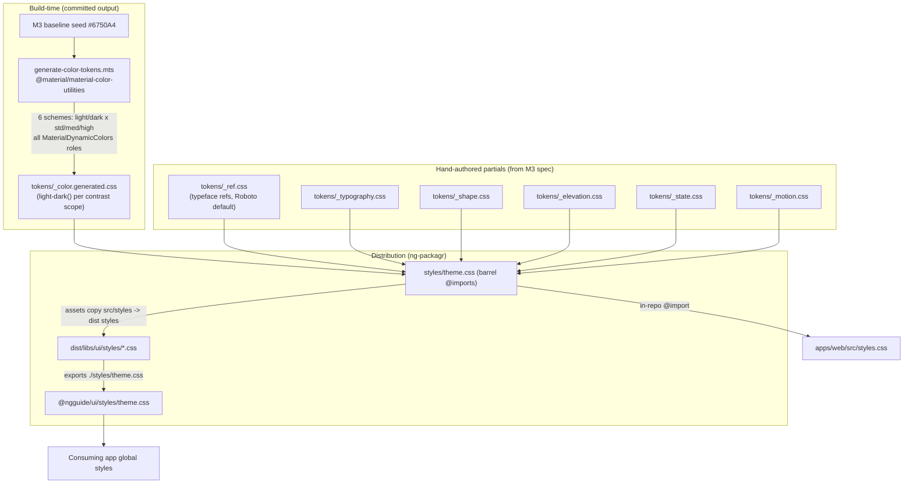
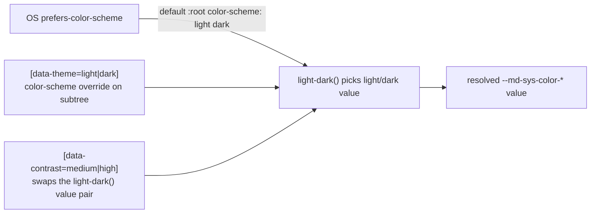

# Design Document: M3 Design Tokens

## Overview

This design delivers the complete Material Design 3 token foundation for `@ngguide/ui` as a published,
CSS-custom-property contract. Color-role values for the full light/dark × standard/medium/high matrix
are produced by a committed build-time generator using the TypeScript `@material/material-color-utilities`
(MCU) package, seeded from the M3 baseline source color. Non-color tokens (typography type scale, shape,
elevation, state, motion) are hand-authored from the M3 spec. The mode/contrast axes resolve with the
CSS-native `light-dark()` function plus `color-scheme` for OS-default + scoped manual override, and a
contrast attribute axis. The token CSS ships as a real library asset via ng-packagr so external
consumers import it by a stable subpath.

### Key Changes

1. Replace the partial, light-only `libs/ui/src/styles/theme.css` with a structured token set: a
   **generated** color partial (`light-dark()` values across three contrast scopes) plus hand-authored
   typography, shape, elevation, state, and motion partials, composed by a `theme.css` barrel.
2. Add a committed build-time color-token generator (`@material/material-color-utilities`, run via a new
   Nx `generate-tokens` target) that emits the color partial deterministically from the M3 baseline seed.
3. Ship the token CSS as a published ng-packagr **asset** with a manual `exports` subpath
   (`@ngguide/ui/styles/theme.css`), and switch `apps/web` to consume the composed barrel.
4. Add mode (`color-scheme`, default OS + forced `[data-theme]`) and contrast (`[data-contrast]`)
   scoping, preserving every token name currently used by button/fab (Req 12).

### Decisions

| Problem Area | Chosen Variant | Why chosen | Reference |
|-------------|----------------|------------|-----------|
| 1. Token value sourcing | **D: Hybrid** — generate color via TS `@material/material-color-utilities` (build-time, committed), hand-author non-color tokens | Removes the large/error-prone color-contrast matrix while keeping control over the small, stable non-color sets; shares the exact algorithm with the future `m3-dynamic-color` spec for static/dynamic consistency | research.md §1 |
| 2. Mode/contrast resolution | **A: `light-dark()` + `color-scheme`**, contrast as a second `[data-contrast]` axis | Minimal CSS, native OS auto-switch and scoped manual override with no runtime/Zone dependency; accepts a Baseline-2024 browser target | research.md §2 |
| 3. Distribution & contract | **A: Published CSS asset** (ng-packagr `assets` + manual `exports`) | Framework-agnostic single import, package stays CSS-only, satisfies the published-consumer contract (Req 11) | research.md §3 |
| 4. Typeface | **A: Roboto default ref tokens, ship no font** (overridable) | Lowest effort/risk, matches current setup, no bundling/licensing burden; meets Req 6 | research.md §4 |

**Accepted assumption (from Area 2/A):** the kit targets browsers with `light-dark()` support
(Baseline 2024: Chrome/Edge 123+, Firefox 120+, Safari 17.5+). Recorded as a constraint; closes the
open question on browser support. The generator-committed-file choice closes the codegen open question
(no build-pipeline coupling: the file is deterministic and checked in). SSR/FOUC is a non-issue — the
solution is pure CSS, no runtime injection.

## Architecture

### Token pipeline (build-time + composition)



### Mode + contrast resolution (runtime CSS, no JS)



## Components and Interfaces

### 1. Color-token generator (build-time, committed)

A Node ESM/TypeScript script that produces the color partial. Run on demand via a new Nx target; its
output is committed so the normal build/serve needs no codegen step.

```typescript
// Path: libs/ui/tooling/generate-color-tokens.mts

import {
  argbFromHex,
  hexFromArgb,
  Hct,
  SchemeTonalSpot,
  MaterialDynamicColors,
  DynamicScheme,
  DynamicColor,
} from '@material/material-color-utilities';

// M3 baseline source color (matches current --md-sys-color-primary #6750a4)
const M3_BASELINE_SEED = '#6750A4';

type ContrastLevel = { name: 'standard' | 'medium' | 'high'; value: 0 | 0.5 | 1 };

const CONTRAST_LEVELS: ContrastLevel[] = [
  { name: 'standard', value: 0 },
  { name: 'medium', value: 0.5 },
  { name: 'high', value: 1 },
];

// Build a scheme for a given mode + contrast.
function scheme(seedHex: string, isDark: boolean, contrast: number): DynamicScheme {
  return new SchemeTonalSpot(Hct.fromInt(argbFromHex(seedHex)), isDark, contrast);
}

// The full set of M3 color roles, enumerated from MaterialDynamicColors so coverage is complete.
// Each entry maps a camelCase role -> kebab-case --md-sys-color-* token name.
interface ColorRole {
  token: string;          // e.g. "primary", "on-primary", "surface-container-low"
  dynamicColor: DynamicColor;
}

function allRoles(): ColorRole[]; // enumerate MaterialDynamicColors.* role accessors

// Resolve one role to a hex for a given scheme.
function roleHex(role: ColorRole, s: DynamicScheme): string {
  return hexFromArgb(role.dynamicColor.getArgb(s));
}

// Emit CSS: one scope per contrast level; each color token uses light-dark(lightHex, darkHex).
function emitCss(seedHex: string): string;

// Writes libs/ui/src/styles/tokens/_color.generated.css
function main(): void;
```

Generated output shape (`libs/ui/src/styles/tokens/_color.generated.css`):

```css
/* GENERATED by tooling/generate-color-tokens.mts — do not edit by hand. Seed: #6750A4 */
:root,
[data-contrast='standard'] {
  color-scheme: light dark;
  --md-sys-color-primary: light-dark(#6750a4, #d0bcff);
  --md-sys-color-on-primary: light-dark(#ffffff, #381e72);
  /* ...all roles... */
}
[data-contrast='medium'] {
  --md-sys-color-primary: light-dark(#5e4790, #d6c4fe);
  /* ...all roles... */
}
[data-contrast='high'] {
  --md-sys-color-primary: light-dark(#372074, #eaddff);
  /* ...all roles... */
}
```

### 2. Mode override (hand-authored, in `_color.generated.css` header or a small `_scheme.css`)

```css
/* Default :root follows OS via "color-scheme: light dark" (emitted above). */
/* Forced mode, scoped to any subtree: */
[data-theme='light'] { color-scheme: light; }
[data-theme='dark']  { color-scheme: dark; }
```

`light-dark()` returns the light or dark value purely from the resolved `color-scheme`, so forcing a
mode on any element overrides the OS preference for that subtree (Req 4.3, 4.4) with no JavaScript.

### 3. Hand-authored token partials

```text
libs/ui/src/styles/tokens/_ref.css         # --md-ref-typeface-*  (Roboto default, overridable)
libs/ui/src/styles/tokens/_typography.css  # --md-sys-typescale-*  (full type scale)
libs/ui/src/styles/tokens/_shape.css       # --md-sys-shape-corner-*
libs/ui/src/styles/tokens/_elevation.css   # --md-sys-elevation-level0..5
libs/ui/src/styles/tokens/_state.css       # --md-sys-state-*  (focus indicator + state-layer opacities)
libs/ui/src/styles/tokens/_motion.css      # --md-sys-motion-duration-*, --md-sys-motion-easing-*
```

### 4. Barrel (`libs/ui/src/styles/theme.css`)

```css
@import './tokens/_ref.css';
@import './tokens/_color.generated.css';
@import './tokens/_typography.css';
@import './tokens/_shape.css';
@import './tokens/_elevation.css';
@import './tokens/_state.css';
@import './tokens/_motion.css';
```

### 5. Packaging (`libs/ui/ng-package.json`)

```jsonc
{
  "$schema": "../../node_modules/ng-packagr/ng-package.schema.json",
  "dest": "../../dist/libs/ui",
  "lib": { "entryFile": "src/index.ts" },
  "assets": [
    { "input": "src/styles", "output": "styles", "glob": "**/*.css" }
  ],
  "exports": {
    "./styles/theme.css": { "style": "./styles/theme.css", "default": "./styles/theme.css" }
  }
}
```

ng-packagr copies `src/styles/**/*.css` to `dist/libs/ui/styles/**` and merges the manual `exports`
entry into the generated `dist/libs/ui/package.json`, making `@ngguide/ui/styles/theme.css` importable
by external consumers. Relative `@import`s inside the barrel resolve within the shipped `styles/` dir.

### 6. Nx target (`libs/ui/project.json`)

```jsonc
"generate-tokens": {
  "executor": "nx:run-commands",
  "options": {
    "command": "node --import @swc-node/register/esm-register libs/ui/tooling/generate-color-tokens.mts"
  }
}
```

The output file is committed; this target only regenerates it (e.g. when the seed or MCU version
changes). `build`/`serve` do NOT depend on it, keeping the normal pipeline codegen-free.

### 7. App consumption (`apps/web/src/styles.css`)

Unchanged mechanism, expanded source: keeps the relative `@import` of the barrel
(`../../../libs/ui/src/styles/theme.css`), which now pulls in all partials including the generated
color file. External consumers instead use `@import '@ngguide/ui/styles/theme.css';`.

## Data Models

### Color role tokens (generated)

Every `MaterialDynamicColors` role is emitted as `--md-sys-color-<kebab-role>`. The set is a strict
superset of the names button (19) and fab (14) already use (Req 12). Representative roles:

| camelCase role (MCU) | Token name |
|---|---|
| primary / onPrimary | `--md-sys-color-primary` / `--md-sys-color-on-primary` |
| primaryContainer / onPrimaryContainer | `--md-sys-color-primary-container` / `-on-primary-container` |
| secondary / tertiary (+ on/container) | `--md-sys-color-secondary` … `-on-tertiary-container` |
| surface / onSurface / onSurfaceVariant | `--md-sys-color-surface` / `-on-surface` / `-on-surface-variant` |
| surfaceContainerLowest…Highest | `--md-sys-color-surface-container-lowest` … `-highest` |
| outline / outlineVariant | `--md-sys-color-outline` / `-outline-variant` |
| error / onError / errorContainer / onErrorContainer | `--md-sys-color-error` … `-on-error-container` |
| inverseSurface / inverseOnSurface / inversePrimary | `--md-sys-color-inverse-*` |
| shadow / scrim | `--md-sys-color-shadow` / `-scrim` |

### Typography type scale tokens (hand-authored)

`--md-sys-typescale-<role>-<size>-<prop>` for role ∈ {display, headline, title, body, label},
size ∈ {large, medium, small}, prop ∈ {font, weight, size, line-height, tracking}. Font/weight resolve
to `--md-ref-typeface-*`.

### Other token families

| Family | Token pattern | Source |
|---|---|---|
| Typeface refs | `--md-ref-typeface-{plain,brand,weight-regular,weight-medium}` | Hand-authored (Roboto default) |
| Shape | `--md-sys-shape-corner-{none,extra-small,small,medium,large,large-increased,extra-large,full}` | Hand-authored |
| Elevation | `--md-sys-elevation-level{0..5}` | Hand-authored (color-mix on shadow) |
| State | `--md-sys-state-{hover,focus,pressed,dragged}-state-layer-opacity`, `--md-sys-state-focus-indicator-{thickness,outer-offset}` | Hand-authored |
| Motion | `--md-sys-motion-duration-*`, `--md-sys-motion-easing-*` | Hand-authored |

## Data Flow Completeness

| Token family | Source of values | File (repo) | Shipped to dist | Consumed by |
|---|---|---|---|---|
| Color roles | MCU generator (committed) | `src/styles/tokens/_color.generated.css` | `dist/libs/ui/styles/tokens/_color.generated.css` | barrel → components, apps |
| Mode override | Hand-authored | `_color.generated.css` header (or `_scheme.css`) | same | components, apps |
| Typeface refs | Hand-authored | `src/styles/tokens/_ref.css` | dist styles | typography tokens, components |
| Type scale | Hand-authored | `src/styles/tokens/_typography.css` | dist styles | components, apps |
| Shape | Hand-authored | `src/styles/tokens/_shape.css` | dist styles | components |
| Elevation | Hand-authored | `src/styles/tokens/_elevation.css` | dist styles | components |
| State | Hand-authored | `src/styles/tokens/_state.css` | dist styles | components (state layers/focus) |
| Motion | Hand-authored | `src/styles/tokens/_motion.css` | dist styles | components |
| Barrel | composition | `src/styles/theme.css` | `dist/libs/ui/styles/theme.css` (exported) | `@ngguide/ui/styles/theme.css`, apps/web |
| Subpath export | ng-packagr merge | `libs/ui/ng-package.json` `exports` | `dist/libs/ui/package.json` `exports` | external consumers |

## Error Handling

| Error | Handling |
|-------|----------|
| Generator run fails / MCU API mismatch | `generate-tokens` target exits non-zero with the error; committed file remains valid (build unaffected since build doesn't depend on it) |
| Generated file missing a role used by a component | Caught by the token-coverage test (below) which asserts every button/fab token name is present |
| Consumer forgets to import `@ngguide/ui/styles/theme.css` | Components render unstyled colors (custom properties undefined) — documented in the token-contract docs as a required import |
| Roboto not loaded by consumer | Text falls back to the generic family in the `--md-ref-typeface-*` stack (e.g. `sans-serif`) — documented |
| Browser without `light-dark()` | Out of support per the recorded Baseline-2024 constraint; documented |

## Testing Strategy

### Approach

Pure CSS tokens aren't exercised by component logic, so tests focus on (a) the generator output being
complete and well-formed, and (b) no regression in the existing component specs. Tests run on the
native Angular Vitest runner. A new spec for the generator/token coverage must be added to the `ui`
test target `include` array (per CLAUDE.md, secondary/non-sourceRoot specs aren't auto-discovered).

### Unit Tests

```typescript
// Path: libs/ui/tooling/generate-color-tokens.spec.ts (added to ui test target `include`)
import { readFileSync } from 'node:fs';
import { join } from 'node:path';

describe('generated color tokens', () => {
  const css = readFileSync(
    join(__dirname, '../src/styles/tokens/_color.generated.css'),
    'utf8',
  );

  it('defines all three contrast scopes', () => {
    expect(css).toContain("[data-contrast='standard']");
    expect(css).toContain("[data-contrast='medium']");
    expect(css).toContain("[data-contrast='high']");
  });

  it('uses light-dark() for color roles and sets color-scheme', () => {
    expect(css).toContain('color-scheme: light dark');
    expect(css).toMatch(/--md-sys-color-primary:\s*light-dark\(/);
  });

  it('preserves every token name the shipped components rely on (Req 12)', () => {
    const required = [
      '--md-sys-color-primary', '--md-sys-color-on-primary',
      '--md-sys-color-secondary', '--md-sys-color-on-secondary',
      '--md-sys-color-secondary-container', '--md-sys-color-on-secondary-container',
      '--md-sys-color-tertiary', '--md-sys-color-on-tertiary',
      '--md-sys-color-primary-container', '--md-sys-color-on-primary-container',
      '--md-sys-color-on-surface', '--md-sys-color-on-surface-variant',
      '--md-sys-color-surface-container-low', '--md-sys-color-outline-variant',
      '--md-sys-color-shadow',
    ];
    for (const token of required) expect(css).toContain(token);
  });
});
```

### Edge Cases

1. Role name kebab-casing (e.g. `surfaceContainerLowest` → `--md-sys-color-surface-container-lowest`) —
   verified by asserting specific kebab token names appear.
2. Forced theme on a nested subtree differing from the page — covered by design (scoped `color-scheme`);
   can be smoke-verified manually in `apps/web`.
3. Existing button/fab/icon specs continue to pass unchanged (no token names removed/renamed).
4. `apps/web` must still build/serve after the barrel expansion — verified by `nx build web` / serve.
