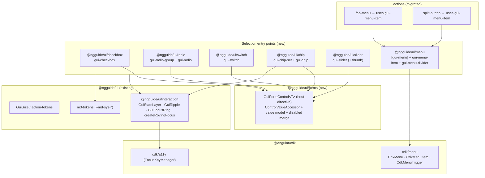
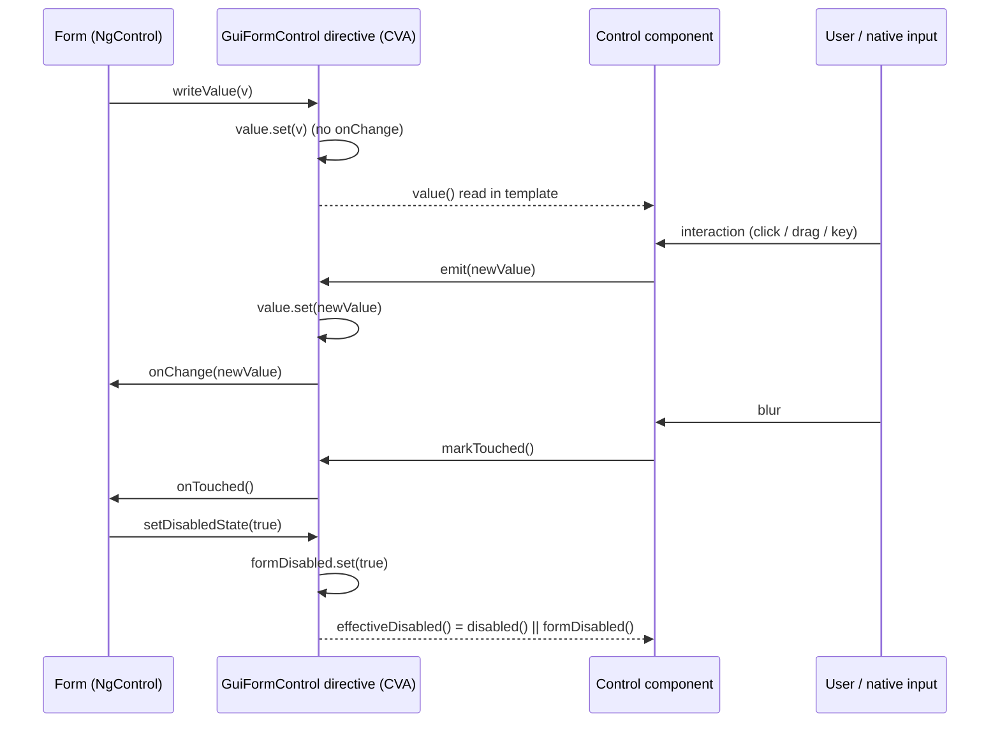

# Design Document: Selection components

## Overview

This design implements the M3 **Selection** family as new secondary entry points of `@ngguide/ui` —
checkbox, radio, switch, chips, slider, menu — plus a shared **forms** primitive and the migration of
the `actions` FAB menu / split button onto a shared menu surface. Every control reuses the existing
interaction foundation (`@ngguide/ui/interaction`: state layer, ripple, focus ring, `createRovingFocus`)
and the M3 token contract (`--md-sys-*`), and follows the established standalone / OnPush / signal /
attribute-or-element-selector conventions.

### Key Changes

1. **New `@ngguide/ui/forms` entry** — a single `GuiFormControl<T>` host-directive that implements
   `ControlValueAccessor` once (value↔signal bridge, two-signal disabled merge, touched-on-blur,
   no-`onChange`-in-`writeValue`) and is composed onto every selection control via `hostDirectives`.
2. **Six new control entry points** — `@ngguide/ui/{checkbox,radio,switch,chip,slider,menu}`.
3. **Toggles built as wrapper elements over a native `<input>`** — `gui-checkbox` / `gui-radio` /
   `gui-switch` render a hidden native input as the a11y/keyboard engine and draw the M3 visuals in CSS;
   the shared CVA lives on the custom host (avoids a collision with Angular's built-in native accessors).
4. **Chips as an M3 grid** — `gui-chip-set` (`role="grid"` → `role="row"`) of `gui-chip` cells
   (`role="gridcell"`), 1-D roving + Delete/Backspace removal, per the M3 chips accessibility spec.
5. **Slider built from scratch** — custom track + thumb(s) on raw pointer events, `role="slider"` per
   thumb, full keyboard, continuous/discrete + single/range with a no-cross constraint and value indicator.
6. **Shared menu as a directive layer over `@angular/cdk/menu`** — `[gui-menu]` + `gui-menu-item` +
   `gui-menu-divider`, consumed through the consumer-`<ng-template>` pattern; `actions` FAB menu / split
   button migrate onto it. `gui-fab-menu-item` becomes a thin alias of `gui-menu-item`.

### Decisions

| Problem Area | Chosen Variant | Why chosen | Reference |
|---|---|---|---|
| 1. Forms ⟷ signals | **B — Shared CVA base (host-directive)** | Mirrors the kit's `hostDirectives` composition; centralizes the disabled-merge + double-emit discipline across 6 controls; stable (non-experimental) API, unlike Signal Forms (C) which also can't serve `ngModel`/`formControl` (R9.3). | research.md §1 |
| 2. Toggles DOM | **A — Native hidden `<input>` + CSS** | Lowest effort/risk; inherits roles, Space, focus, form participation, native `indeterminate`→`mixed`, and the full APG radio-group keyboard model, vs. re-implementing all of it in custom DOM (B). | research.md §2 |
| 3. Chips ARIA | **A — Grid (`gridcell`)** | The project's binding constraint is strict-M3 fidelity, and the live M3 accessibility spec gives Role (Web) = `gridcell`. Toolbar (B) is material-web's implementation, not the M3 spec. | research.md §3 |
| 4. Slider engine | **A — Custom + raw pointer events** | Zero dependency coupling; full control over M3 visuals; cleanest enforcement of the range no-cross constraint; avoids off-label `CdkDrag` (B) and native range's inability to do range/value-indicator consistently (C). | research.md §4 |
| 5. Menu surface | **A — Wrap `@angular/cdk/menu`** | Reuses the stack `actions` already ships; CDK provides roving, typeahead, disabled-skip, submenu, focus-return, overlay; migration becomes a swap rather than a rewrite (vs bespoke overlay B). | research.md §5 |

## Architecture

### Component Diagram



### Data Flow — form binding (reactive or template-driven)



### Data Flow — slider pointer interaction

```mermaid
sequenceDiagram
    participant U as User
    participant T as gui-slider (track)
    participant H as Thumb (role=slider)
    participant S as value signal / CVA

    U->>T: pointerdown on track/thumb
    T->>T: setPointerCapture; pick nearest thumb
    U->>T: pointermove
    T->>T: px → value (clamp to min/max/step; clamp vs other thumb)
    T->>S: value.set(...) ; show value indicator
    T->>H: aria-valuenow / aria-valuetext update
    U->>T: pointerup
    T->>S: emit final value (onChange)
```

## Components and Interfaces

### `@ngguide/ui/forms` — `GuiFormControl<T>` host-directive

The single CVA implementation. Provided on the **custom host element** of each control (never on a bare
native input — that would collide with Angular's built-in `CheckboxControlValueAccessor` /
`RadioControlValueAccessor`, which also provide `NG_VALUE_ACCESSOR` for native form inputs).

```typescript
// Path: libs/ui/forms/src/form-control.directive.ts
import {
  Directive, computed, forwardRef, input, model, signal, booleanAttribute,
} from '@angular/core';
import { ControlValueAccessor, NG_VALUE_ACCESSOR } from '@angular/forms';

@Directive({
  selector: '[guiFormControl]',
  exportAs: 'guiFormControl',
  providers: [
    { provide: NG_VALUE_ACCESSOR, useExisting: forwardRef(() => GuiFormControl), multi: true },
  ],
})
export class GuiFormControl<T = unknown> implements ControlValueAccessor {
  /** Canonical value. Two-way for non-forms consumers; bridged to the form by the CVA. */
  readonly value = model<T | null>(null);
  /** Public/standalone disabled. Merged with the form-driven disabled below. */
  readonly disabled = input(false, { transform: booleanAttribute });

  /** Form-driven disabled, written only by setDisabledState (input() is read-only). */
  private readonly formDisabled = signal(false);
  /** What components render against. */
  readonly effectiveDisabled = computed(() => this.disabled() || this.formDisabled());
  /** Touched flag a control sets on blur; exposed for error styling. */
  readonly touched = signal(false);

  private onChange: (v: T | null) => void = () => {};
  private onTouched: () => void = () => {};

  // --- ControlValueAccessor ---
  writeValue(v: T | null): void { this.value.set(v); }          // NO onChange here (avoids double-emit)
  registerOnChange(fn: (v: T | null) => void): void { this.onChange = fn; }
  registerOnTouched(fn: () => void): void { this.onTouched = fn; }
  setDisabledState(isDisabled: boolean): void { this.formDisabled.set(isDisabled); }

  // --- Called by the host control on user interaction ---
  /** Set value from a user gesture and notify the form. */
  emit(v: T | null): void { this.value.set(v); this.onChange(v); }
  /** Mark touched from a real blur. */
  markTouched(): void { if (!this.touched()) { this.touched.set(true); this.onTouched(); } }
}
```

Controls compose it with the **object form** of `hostDirectives` so the consumer-facing `value`/`disabled`
flow straight through to the directive, while the component injects the directive instance to read
`effectiveDisabled()` / `value()` for rendering:

```typescript
hostDirectives: [
  { directive: GuiFormControl, inputs: ['value', 'disabled'], outputs: ['valueChange'] },
  GuiStateLayerDirective, GuiRippleDirective, GuiFocusRingDirective,
],
```

For boolean toggles the input is aliased to the M3 name: `inputs: ['value: checked', 'disabled']`.

### `@ngguide/ui/checkbox` — `gui-checkbox`

Wrapper **element** component (`gui-checkbox`) that renders a hidden native `<input type="checkbox">`
(the a11y/keyboard engine: role, Space, focus, `indeterminate`→`mixed`) and draws the M3 box + checkmark/
dash in CSS. The shared CVA carries the boolean value as `checked`.

```typescript
// Path: libs/ui/checkbox/src/checkbox.ts
@Component({
  selector: 'gui-checkbox',
  exportAs: 'guiCheckbox',
  template: `
    <input #native type="checkbox"
      [checked]="control.value() === true"
      [indeterminate]="indeterminate()"
      [attr.aria-checked]="indeterminate() ? 'mixed' : (control.value() === true)"
      [disabled]="control.effectiveDisabled()"
      (change)="onToggle(native.checked)" (blur)="control.markTouched()" />
    <span class="gui-checkbox-box" aria-hidden="true"></span>
    <span class="gui-checkbox-label"><ng-content /></span>`,
  hostDirectives: [{ directive: GuiFormControl, inputs: ['value: checked', 'disabled'], outputs: ['valueChange: checkedChange'] }],
  host: { '[attr.data-error]': 'error() ? "" : null', '[class.gui-disabled]': 'control.effectiveDisabled()' },
  changeDetection: ChangeDetectionStrategy.OnPush,
})
export class CheckboxComponent {
  protected readonly control = inject(GuiFormControl<boolean>);
  readonly indeterminate = input(false, { transform: booleanAttribute });
  readonly error = input(false, { transform: booleanAttribute });
  protected onToggle(checked: boolean) { this.control.emit(checked); } // indeterminate→checked handled by native
}
```

`indeterminate` and `checked` are kept mutually exclusive in the a11y tree (set the native property, not
both) per angular/components #26709. The interaction directives draw hover/focus/pressed state layers.

### `@ngguide/ui/switch` — `gui-switch`

Identical wrapper pattern over `<input type="checkbox" role="switch">` (binary only — no `mixed`).
Renders M3 track (32×52dp, 2dp outline) + handle that morphs **16dp → 24dp selected / with-icon → 28dp
pressed** in CSS keyed off `:checked` and `data-gui-state~="pressed"`. Optional handle icon slots
(`[guiSwitchIcon]`, `[guiSwitchSelectedIcon]`). APG: the label must not change with state.

### `@ngguide/ui/radio` — `gui-radio-group` + `gui-radio`

Group/child coordination mirrors `SegmentedButtonGroupComponent`. The **group** carries the shared CVA
(its value is the selected option) and `role="radiogroup"`; each **radio** wraps a native
`<input type="radio">` sharing a generated `name` so the browser provides the APG radio-group keyboard
model (single tab stop, arrow-select) and form-free mutual exclusion; the group's CVA bridges the
selected value to Angular forms.

```typescript
// Path: libs/ui/radio/src/radio-group.ts
@Component({
  selector: 'gui-radio-group', exportAs: 'guiRadioGroup',
  template: `<ng-content />`,
  hostDirectives: [{ directive: GuiFormControl, inputs: ['value', 'disabled'], outputs: ['valueChange'] }],
  host: { 'role': 'radiogroup' },
  changeDetection: ChangeDetectionStrategy.OnPush,
})
export class RadioGroupComponent {
  readonly control = inject(GuiFormControl<string | null>);
  readonly name = `gui-radio-${nextId()}`;
  select(v: string) { this.control.emit(v); }
  isSelected(v: string) { return this.control.value() === v; }
}
```

```typescript
// Path: libs/ui/radio/src/radio.ts
@Component({
  selector: 'gui-radio', exportAs: 'guiRadio',
  template: `
    <input type="radio" [name]="group.name" [value]="value()"
      [checked]="group.isSelected(value())"
      [disabled]="group.control.effectiveDisabled() || disabled()"
      (change)="group.select(value())" (blur)="group.control.markTouched()" />
    <span class="gui-radio-circle" aria-hidden="true"></span>
    <span class="gui-radio-label"><ng-content /></span>`,
  hostDirectives: [GuiStateLayerDirective, GuiRippleDirective, GuiFocusRingDirective],
  host: { '[attr.data-error]': 'error() ? "" : null' },
  changeDetection: ChangeDetectionStrategy.OnPush,
})
export class RadioComponent {
  protected readonly group = inject(RadioGroupComponent);
  readonly value = input.required<string>();
  readonly disabled = input(false, { transform: booleanAttribute });
  readonly error = input(false, { transform: booleanAttribute });
}
```

### `@ngguide/ui/chip` — `gui-chip-set` + `gui-chip`

Strict-M3 grid semantics. `gui-chip-set` is `role="grid"` containing one `role="row"`; each `gui-chip`
is `role="gridcell"`. The set owns a single tab stop and 1-D horizontal roving across chips via
`createRovingFocus({ orientation: 'horizontal' })`; M3's keyboard table needs no intra-cell arrow nav —
Backspace/Delete on a focused input chip emits removal, and the trailing remove control stays
pointer-clickable and exposed as a `button` inside the cell. Filter chips toggle selection + leading
checkmark. For multi-select filter sets the set may carry the shared CVA (value = `string[]`); assist /
suggestion chips are pure actions.

```typescript
// Path: libs/ui/chip/src/chip-set.ts
@Component({
  selector: 'gui-chip-set', exportAs: 'guiChipSet',
  template: `<div role="row" class="gui-chip-row"><ng-content /></div>`,
  hostDirectives: [{ directive: GuiFormControl, inputs: ['value', 'disabled'], outputs: ['valueChange'] }],
  host: { 'role': 'grid' },
  changeDetection: ChangeDetectionStrategy.OnPush,
})
export class ChipSetComponent {
  readonly control = inject(GuiFormControl<string | string[] | null>);
  readonly select = input<'none' | 'single' | 'multiple'>('none');
  private readonly chips = contentChildren(forwardRef(() => ChipComponent));
  // ngAfterViewInit: createRovingFocus(this.chips, { orientation: 'horizontal' }); host keydown → manager.onKeydown
  isSelected(v: string): boolean { /* per select mode */ return false; }
  toggle(v: string): void { /* update value model via control.emit, per select mode */ }
}
```

```typescript
// Path: libs/ui/chip/src/chip.ts
export type GuiChipType = 'assist' | 'filter' | 'input' | 'suggestion';

@Component({
  selector: 'gui-chip', exportAs: 'guiChip',
  template: `
    <span class="gui-chip-leading" aria-hidden="true"><ng-content select="[guiChipLeading]" /></span>
    <button #primary class="gui-chip-primary" type="button"
      [attr.role]="set.select() === 'none' ? 'button' : 'checkbox'"
      [attr.aria-checked]="set.select() === 'none' ? null : selected()"
      [disabled]="disabled()" (click)="onPrimary()">
      <span class="gui-chip-label"><ng-content /></span>
    </button>
    @if (removable()) {
      <button class="gui-chip-remove" type="button"
        [attr.aria-label]="'Remove ' + label()" (click)="remove.emit()"><ng-content select="[guiChipRemove]" /></button>
    }`,
  hostDirectives: [GuiStateLayerDirective, GuiRippleDirective, GuiFocusRingDirective],
  host: {
    'role': 'gridcell', '[attr.tabindex]': '-1',
    '[attr.data-type]': 'type()', '[attr.data-selected]': 'selected() ? "" : null',
    '[attr.data-elevated]': 'elevated() ? "" : null',
    '(keydown.delete)': 'maybeRemove($event)', '(keydown.backspace)': 'maybeRemove($event)',
  },
  changeDetection: ChangeDetectionStrategy.OnPush,
})
export class ChipComponent implements FocusableOption {
  protected readonly set = inject(ChipSetComponent);
  readonly type = input<GuiChipType>('assist');
  readonly value = input<string>('');
  readonly label = input<string>('');
  readonly removable = input(false, { transform: booleanAttribute });
  readonly elevated = input(false, { transform: booleanAttribute });
  readonly disabled = input(false, { transform: booleanAttribute });
  readonly remove = output<void>();
  protected readonly selected = computed(() => this.set.isSelected(this.value()));
  focus() { /* focus the primary button */ }
  protected onPrimary() { if (this.type() === 'filter') this.set.toggle(this.value()); }
  protected maybeRemove(e: Event) { if (this.removable()) { e.preventDefault(); this.remove.emit(); } }
}
```

Removal emits `remove` (R5.4: the consumer owns deletion); the set moves roving focus to an adjacent
chip after the content children change (R6.3).

### `@ngguide/ui/slider` — `gui-slider`

Custom track + thumb(s), raw pointer events with `setPointerCapture`. `role="slider"` per thumb with
`aria-valuenow`/`aria-valuemin`/`aria-valuemax`/`aria-valuetext`. Single value = `number`; range =
`[number, number]` with each thumb's effective min/max clamped to the other (no-cross). 5-size scale maps
to `GuiSize` (track 16/24/40/56/96dp; handle 44/44/52/68/108dp × 4dp; track shape 8/8/12/16/28dp). The
handle shrinks and the value indicator (label container 44×48dp) appears on press/drag.

```typescript
// Path: libs/ui/slider/src/slider.ts
@Component({
  selector: 'gui-slider', exportAs: 'guiSlider',
  templateUrl: './slider.html',
  hostDirectives: [{ directive: GuiFormControl, inputs: ['value', 'disabled'], outputs: ['valueChange'] }],
  host: { '[attr.data-size]': 'size()', '[attr.data-discrete]': 'discrete() ? "" : null', '[attr.data-range]': 'range() ? "" : null' },
  changeDetection: ChangeDetectionStrategy.OnPush,
})
export class SliderComponent {
  readonly control = inject(GuiFormControl<number | [number, number]>);
  readonly min = input(0); readonly max = input(100); readonly step = input(1);
  readonly size = input<GuiSize>('md');
  readonly discrete = input(false, { transform: booleanAttribute });
  readonly range = input(false, { transform: booleanAttribute });
  // pointer + keyboard handlers map gestures → clamped/snapped value(s) → control.emit(...)
}
```

Each thumb is a focusable element (`tabindex=0`) handling Arrow (±step), Home/End (min/max), and
Space+Arrow (±interval/stop) per the M3 slider a11y page. Discrete mode renders stop indicators and snaps
to `step`. A stop indicator marks the inactive-track end for ≥3:1 contrast.

### `@ngguide/ui/menu` — `[gui-menu]` + `gui-menu-item` + `gui-menu-divider`

A **styling/structure layer over `@angular/cdk/menu`**, NOT an `<ng-content>` wrapper. `[gui-menu]` is a
directive applied to the consumer's `<div cdkMenu>` (adds M3 surface styling); `gui-menu-item` composes
`CdkMenuItem` via `hostDirectives` (like the existing `fab-menu-item`); `gui-menu-divider` is
`role="separator"`. Menus are authored inside a consumer `<ng-template>` and opened with `cdkMenuTriggerFor`
— this keeps `CdkMenuItem`'s DI resolution of `CdkMenu` correct (a projected `cdkMenuItem` would resolve
DI from its declaration context, not the rendered `cdkMenu`, which is exactly the trap the `actions` spec
hit). Cascading submenus = a `gui-menu-item` that is also `[cdkMenuTriggerFor]` a nested `<ng-template [gui-menu] cdkMenu>`;
`CdkTargetMenuAim` smooths hover. Disabled items via `cdkMenuItemDisabled` (CDK's `FocusKeyManager` skips
them). Leading/trailing slots via named `<ng-content>`.

```typescript
// Path: libs/ui/menu/src/menu.ts
@Directive({ selector: '[gui-menu]', exportAs: 'guiMenu' })
export class MenuDirective {}  // M3 surface styling + role hooks; CdkMenu provides the menu role/behavior

// Path: libs/ui/menu/src/menu-item.ts
@Component({
  selector: 'button[gui-menu-item], a[gui-menu-item]',  // eslint-disable-next-line @angular-eslint/component-selector
  template: `
    <span class="gui-menu-item-leading"><ng-content select="[guiMenuItemLeading]" /></span>
    <span class="gui-menu-item-label"><ng-content /></span>
    <span class="gui-menu-item-trailing"><ng-content select="[guiMenuItemTrailing]" /></span>`,
  styleUrl: './menu.css',
  hostDirectives: [CdkMenuItem, GuiStateLayerDirective, GuiRippleDirective, GuiFocusRingDirective],
  exportAs: 'guiMenuItem',
  changeDetection: ChangeDetectionStrategy.OnPush,
})
export class MenuItemComponent {}

// Path: libs/ui/menu/src/menu-divider.ts
@Component({ selector: 'gui-menu-divider', template: '', host: { 'role': 'separator' }, changeDetection: ChangeDetectionStrategy.OnPush })
export class MenuDividerComponent {}
```

### `actions` migration (Superseded Behaviors)

- `libs/ui/fab-menu/src/fab-menu-item.ts` → re-export `MenuItemComponent as FabMenuItemComponent`
  (selector `button[gui-fab-menu-item]` kept for back-compat, or aliased). FAB-menu template unchanged
  (still a consumer `<ng-template>` + `cdkMenuTriggerFor`).
- `libs/ui/split-button` demo/menus → author items with `gui-menu-item` instead of bare `cdkMenuItem`.
- Public selectors/inputs of `fab-menu` and `split-button` stay stable; this is an additive swap that
  consolidates onto the single `@ngguide/ui/menu` implementation (R8.7). The migration is its own
  shippable group in `tasks.md` so `actions` keeps working until it lands.

## Data Models

```typescript
// @ngguide/ui/chip
export type GuiChipType = 'assist' | 'filter' | 'input' | 'suggestion';
export type GuiChipSelect = 'none' | 'single' | 'multiple';

// Control value shapes carried by GuiFormControl<T>
// checkbox/switch: boolean | null
// radio-group:     string | null
// chip-set:        string | string[] | null   (per select mode)
// slider:          number | [number, number]
```

### Token maps (analogous to `GUI_BUTTON_SHAPES` in `libs/ui/src/lib/action-tokens.ts`)

```typescript
// Path: libs/ui/slider/src/slider-tokens.ts  (per-size M3 slider dp)
export interface GuiSliderSizeSet { trackHeight: string; handleHeight: string; trackShape: string; insetIcon: string | null; }
export const GUI_SLIDER_SIZES: Record<GuiSize, GuiSliderSizeSet> = {
  xs: { trackHeight: '16px', handleHeight: '44px', trackShape: '8px',  insetIcon: null },
  sm: { trackHeight: '24px', handleHeight: '44px', trackShape: '8px',  insetIcon: null },
  md: { trackHeight: '40px', handleHeight: '52px', trackShape: '12px', insetIcon: '24px' },
  lg: { trackHeight: '56px', handleHeight: '68px', trackShape: '16px', insetIcon: '24px' },
  xl: { trackHeight: '96px', handleHeight: '108px', trackShape: '28px', insetIcon: '32px' },
};
```

Switch dp (track 32×52dp / 2dp outline; handle 16/24/28dp; state layer 40/48dp; icon 16dp) are expressed
directly in `switch.css` keyed off `:checked` / `data-gui-state`, matching the icon-button CSS approach.

## Data Flow Completeness

Every control's value flows through one path: **consumer binding → `GuiFormControl` (model + CVA) →
component template/native element → user gesture → `GuiFormControl.emit` → form `onChange` / `valueChange`**.
There is no schema/DB/API layer (this is a UI library).

| Field/Entity | Value signal | Forms (CVA) | Native/DOM element | ARIA exposure | UI render |
|---|---|---|---|---|---|
| checkbox `checked` | `GuiFormControl.value` (bool) | `forms/form-control.directive.ts` | `checkbox/…/checkbox.ts` `<input type=checkbox>` | `aria-checked` (true/false/mixed) | `checkbox.css` box+check/dash |
| switch `checked` | `GuiFormControl.value` (bool) | same | `switch.ts` `<input role=switch>` | `aria-checked` | `switch.css` track+handle morph |
| radio selected | group `GuiFormControl.value` (string) | same (on group) | `radio.ts` `<input type=radio name>` | `radiogroup`/`radio` + `aria-checked` | `radio.css` ring+dot |
| chip-set value | set `GuiFormControl.value` (string\|string[]) | same (on set) | `chip.ts` `role=gridcell` | `grid`/`row`/`gridcell`, `aria-checked` (filter) | `chip.css` per type + elevated |
| chip removal | `remove` output (no value) | N/A | `chip.ts` trailing `button` | remove `button` `aria-label` | `chip.css` trailing icon |
| slider value | `GuiFormControl.value` (number\|tuple) | same | `slider.ts` thumb `role=slider` | `aria-valuenow/min/max/text` | `slider.html`+`.css` track/thumb/indicator |
| disabled (all) | `disabled` input + `formDisabled` | `setDisabledState` → merge | host `[disabled]`/`aria-disabled` | per-pattern disabled | `.gui-disabled` token treatment |
| menu items | N/A (action/trigger) | N/A | `menu-item.ts` `CdkMenuItem` | `menu`/`menuitem`/`separator` | `menu.css` M3 surface |

## Error Handling

| Condition | Behaviour |
|---|---|
| Form marks control required/invalid | Control reflects M3 error appearance via `[attr.data-error]` (checkbox/radio/switch expose `error`); driven by host `ng-invalid`/`ng-touched` classes the forms module already applies (R9.4) |
| Chip set with a non-chip child / wrong count | `console.warn` from an `effect()` (mirrors the segmented-button group warning) — non-fatal |
| Slider `min >= max` or `step <= 0` | Clamp to a safe range and `console.warn`; never throw |
| Range thumbs cross | Prevented in the clamp math (start ≤ end); never emitted (R7.5) |
| Disabled control receives interaction | No-op; `effectiveDisabled()` gates pointer/keyboard and suppresses the state layer (interaction foundation already suppresses for disabled hosts) |
| CDK menu open under jsdom/zoneless | Unit tests assert closed-state attributes and validate open behaviour in the browser test plan (existing fab-menu/split-button caveat) |

## Testing Strategy

### Approach

Native Angular Vitest (`@nx/angular:unit-test`, jsdom, zoneless). One spec per entry point, registered in
`libs/ui/project.json` `test.include`. Host-component harness + `TestBed.createComponent`, asserting DOM
attributes / roles / signal values (the segmented-button + fab-menu spec style). Computed-style and overlay
positioning are validated in the manual/browser test plan, not jsdom (the lesson from `actions`).

### Unit Tests (representative)

```typescript
describe('CheckboxComponent', () => {
  it('toggles checked + reflects aria-checked', () => {
    const f = TestBed.createComponent(Host); f.detectChanges();
    const input = f.nativeElement.querySelector('input[type=checkbox]') as HTMLInputElement;
    input.click(); f.detectChanges();
    expect(f.componentInstance.checked()).toBe(true);
    expect(input.getAttribute('aria-checked')).toBe('true');
  });
  it('indeterminate reports aria-checked="mixed"', () => { /* set indeterminate input */ });
  it('participates in reactive forms (formControl writeValue/disable)', () => { /* bind FormControl */ });
});

describe('SliderComponent', () => {
  it('arrow keys move value by step and clamp to min/max', () => { /* dispatch keydown */ });
  it('range thumbs never cross', () => { /* drive start past end; assert start <= end */ });
});

describe('ChipSetComponent (grid)', () => {
  it('exposes role=grid/row/gridcell', () => { /* query roles */ });
  it('Delete on a removable chip emits remove', () => { /* keydown.delete */ });
});

describe('MenuItemComponent', () => {
  it('composes CdkMenuItem and renders leading/trailing slots', () => { /* directive present, slots project */ });
});
```

### Edge Cases

1. **Checkbox checked + indeterminate** — keep mutually exclusive; assert `aria-checked="mixed"` wins only
   when indeterminate is set (angular/components #26709).
2. **Radio group with a disabled option** — disabled radio is skipped by native arrow navigation; group
   value unaffected.
3. **Slider step not evenly dividing range** — last reachable value is the max; snapping never exceeds bounds.
4. **Chip removed while focused** — roving focus moves to an adjacent chip; focus never lost (R6.3).
5. **Form `setDisabledState(true)` while `disabled` input is false** — `effectiveDisabled()` is true; the
   merge resolves the input()/CVA conflict (#53889).
6. **Menu projected item DI** — items authored inside the consumer `<ng-template [gui-menu] cdkMenu>` resolve
   `CdkMenu`; a `<ng-content>`-projected item would not (documented, avoided by the directive-layer design).

## Notes / Deviations

- **Moderate (avoided, not introduced): menu projection DI.** The shared menu is a directive layer
  consumed via the consumer-`<ng-template>` pattern rather than an `<ng-content>` container, specifically
  because `@angular/cdk/menu`'s `CdkMenuItem` resolves `CdkMenu` from the declaration injector. This repeats
  the resolution `actions` already adopted; it shapes the public API (consumers author the `<div [gui-menu] cdkMenu>`).
- **Minor: toggles are element wrappers, not attribute selectors on `<input>`.** A bare
  `input[type=checkbox]` carrying our `NG_VALUE_ACCESSOR` would collide with Angular's built-in
  `CheckboxControlValueAccessor`/`RadioControlValueAccessor`. Wrapping in `gui-checkbox`/`gui-switch`/
  `gui-radio` (with the native input inside) keeps one uniform CVA across the whole family and avoids the
  collision. This is a conscious divergence from the `button[gui-button]` attribute-selector convention,
  justified by the forms-integration decision (Area 1B).
- **New peer dependency.** `@angular/forms` must be added to `libs/ui/package.json` `peerDependencies`
  (`^21.0.0`); it is currently absent.
- **Open questions carried from research:** the zoneless CDK-menu anchoring smoke test (#28984 fixed
  upstream; #30145/#26856 to verify in the demo) and per-control resting dp (pull from live M3 specs during
  implementation, as in `actions`).
