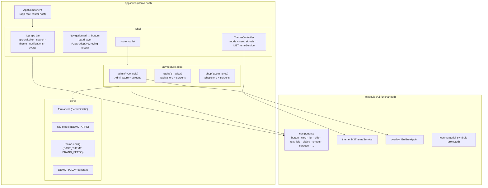
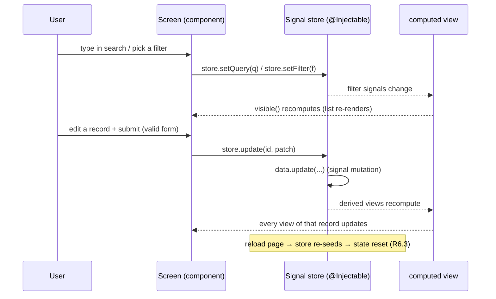

# Design Document: Showcase Apps

## Overview

Replace the flat, single-screen component playground (`apps/web/src/app/app.component.*`) with
three lazily-loaded sample applications — **Console** (admin), **Tracker** (tasks), **Commerce**
(shop) — mounted under one shared **Shell** (top app bar + adaptive navigation + runtime theme
controls). The three apps together use the entire `@ngguide/ui` catalog at least once, are
interactive within a session on in-memory signal stores, demonstrate light/dark + brand-seed
theming, adapt across compact/expanded viewports via CSS, and show empty/loading/error states.

Everything lives in `apps/web` (the unpublished demo host). The published library is **not**
modified by this feature.

### Key Changes

1. `AppComponent` becomes a thin router host (`<router-outlet/>`); the 1305-line flat template and
   its CSS are deleted. The previous kitchen-sink playground is **removed** (Superseded Behaviors).
2. A `Shell` layout component provides M3 chrome (top app bar, navigation rail ↔ bottom bar/drawer)
   hand-built from `@ngguide/ui` primitives + `--md-sys-*` tokens, plus the runtime theme controls.
3. Lazy feature routes `admin` / `tasks` / `shop`, each a self-contained folder with a plain-signal
   store, screens (list / detail / forms / settings-style surfaces), and deterministic mock data.
4. Iconography switches to **Material Symbols** (ligature font) projected into `gui-icon`, scoped by
   a `.sym` class so overlay-rendered icons are covered too.
5. Dashboard analytics rendered as KPI cards + `gui-progress` for ratios + small inline SVG
   sparklines for trends (no chart library).
6. A **component coverage manifest** maps every entry point to a concrete in-context usage; the
   `web` test target keeps ≥1 spec (the gutted `app.component.spec.ts` is updated, store specs added).

### Decisions

| Problem Area | Chosen Variant | Why chosen | Reference |
|-------------|----------------|------------|-----------|
| 1. Host architecture & routing | **A — Shared shell + lazy routes** | One consistent chrome + single theming surface; only option keeping sections individually addressable (R1.4) with code-splitting; builds on the existing empty `provideRouter`. | research.md §1 |
| 2. Nav chrome & adaptivity | **A — Hand-rolled chrome + CSS adaptivity** | No new deps, styling strictly from M3 tokens; CSS-only rail↔bar morph is SSR-safe with no hydration shift; avoids 2C's scope blow-up and 2B's SSR-guard complexity. | research.md §2 |
| 3. Mock data & state | **A — Signal stores + computed** | Matches the kit's signal-first/zoneless house style; reset-on-reload is automatic (R6.3); `computed` gives reactive filter/sort/search for free; lowest risk. | research.md §3 |
| 4. Dashboard visualizations | **C — Hybrid KPI + progress + SVG** | Covers ratios *and* trends while reusing `gui-progress` (aids coverage); B can't show trends, A drops progress reuse; risk Low. | research.md §4 |
| 5. Iconography | **A — Material Symbols font** | The M3 icon system itself (on-spec), large set, trivial ligature authoring, lowest effort; overlay scoping via class is a cheap mitigation. | research.md §5 |
| 6. Coverage assurance | **A — Manifest + checklist** | Simple, transparent, reuses the test-plan flow; the manifest already exists from research; drift risk acceptable for a demo and closed by the test-plan pass. | research.md §6 |

#### Scoped clarification on Decision 2 (recorded for transparency)

The responsive **layout/nav morph is CSS-only** (Decision 2A). One discrete, non-layout choice — whether
the **filters** affordance opens as a **bottom sheet** (compact) or a **side sheet** (expanded) — reads
the library's `GuiBreakpoint` (`@ngguide/ui/overlay`). This is a *component-selection* decision on a
button click, not continuous layout morphing, and is SSR-guarded (defaults to the expanded/side-sheet
branch on the server) so it never causes a hydration shift. It does not change the CSS-only layout
decision and is the only programmatic breakpoint read in the design. It also gives `@ngguide/ui/overlay`
a direct, idiomatic consumer for coverage (R2.1).

## Architecture

### Component diagram



### Data flow (in-session interaction, e.g. filter + edit)



## Components and Interfaces

### Root & routing

```typescript
// apps/web/src/app/app.component.ts  (gutted → thin router host; selector preserved)
@Component({
  selector: 'app-root',
  imports: [RouterOutlet],
  template: '<router-outlet />',
  changeDetection: ChangeDetectionStrategy.OnPush,
})
export class AppComponent {}
```

```typescript
// apps/web/src/app/app.routes.ts
export const appRoutes: Route[] = [
  {
    path: '',
    loadComponent: () => import('./shell/shell.component').then((m) => m.ShellComponent),
    children: [
      { path: '', pathMatch: 'full', redirectTo: 'admin' },
      { path: 'admin', loadChildren: () => import('./admin/admin.routes').then((m) => m.adminRoutes) },
      { path: 'tasks', loadChildren: () => import('./tasks/tasks.routes').then((m) => m.tasksRoutes) },
      { path: 'shop',  loadChildren: () => import('./shop/shop.routes').then((m) => m.shopRoutes) },
    ],
  },
];
```

`app.config.ts` (zoneless + `provideRouter` + `provideM3Theme`) and `app.config.server.ts` are
unchanged. `main.ts`, `index.html` (`<app-root>`) unchanged. Lazy loading confirmed via
`loadComponent`/`loadChildren` on standalone routes [ng-lazy-routes].

### Shell

The Shell is the persistent layout: it stays mounted while child routes swap in the outlet, so
theme signals persist across in-session navigation (R7.3). It derives the active app/section from
the router URL.

```typescript
// apps/web/src/app/shell/shell.component.ts
@Component({
  selector: 'app-shell',
  changeDetection: ChangeDetectionStrategy.OnPush,
  imports: [
    RouterOutlet, RouterLink, RouterLinkActive,
    IconComponent, IconButtonComponent, ButtonComponent, GuiBadge,
    TextFieldComponent, TextFieldInputDirective, TextFieldLeadingDirective,
    SwitchComponent, MenuDirective, MenuItemComponent, MenuDividerComponent,
    CdkMenuTrigger, GuiTooltip, GuiDivider,
    /* interaction directives for custom nav items */
    GuiStateLayerDirective, GuiRippleDirective, GuiFocusRingDirective,
  ],
  templateUrl: './shell.component.html',
  styleUrl: './shell.component.css',
  host: { class: 'app-shell' },
})
export class ShellComponent {
  private readonly router = inject(Router);
  protected readonly theme = inject(ThemeController);

  /** Active URL as a signal (NavigationEnd → url). */
  private readonly url = toSignal(
    this.router.events.pipe(
      filter((e): e is NavigationEnd => e instanceof NavigationEnd),
      map(() => this.router.url),
    ),
    { initialValue: this.router.url },
  );

  protected readonly apps = DEMO_APPS;
  protected readonly activeApp = computed(() =>
    DEMO_APPS.find((a) => this.url().startsWith(a.basePath)) ?? DEMO_APPS[0],
  );
  protected readonly activeSection = computed(() =>
    this.activeApp().nav.find((n) => this.url().startsWith(n.path)),
  );

  /** Decorative global search bound to a signal (drives nothing global; per-screen search is local). */
  protected readonly query = signal('');
}
```

```typescript
// apps/web/src/app/shell/nav.ts
export interface NavItem { label: string; icon: string; path: string; }   // icon = Material Symbols ligature
export interface DemoApp {
  id: 'admin' | 'tasks' | 'shop';
  label: string; subtitle: string; icon: string; basePath: string; nav: NavItem[];
}
export const DEMO_APPS: readonly DemoApp[] = [ /* Console / Tracker / Commerce + their sections */ ];
```

```typescript
// apps/web/src/app/shell/theme-controller.ts
@Injectable({ providedIn: 'root' })
export class ThemeController {
  private readonly theme = inject(M3ThemeService);
  readonly mode = signal<M3Mode>('auto');         // 'light' | 'dark' | 'auto'
  readonly seed = signal<string>(DEFAULT_SEED);
  readonly seeds = BRAND_SEEDS;

  setMode(mode: M3Mode): void { this.mode.set(mode); this.apply(); }
  toggleDark(): void { this.setMode(this.mode() === 'dark' ? 'light' : 'dark'); }
  setSeed(seed: string): void { this.seed.set(seed); this.apply(); }

  private apply(): void {
    this.theme.setTheme({ ...BASE_THEME, sourceColor: this.seed(), mode: this.mode() });
  }
}
```

`M3ThemeService.setTheme(config: M3ThemeConfig)` and `M3Mode = 'light'|'dark'|'auto'` confirmed
(`libs/ui/theme/src/theme.service.ts:26`, `types.ts:25`). Re-theming updates a single managed
`<style data-m3-dynamic>` and is SSR-safe (`style-applier.ts`).

**Adaptive chrome (CSS-only).** The shell host declares a containment context
(`container-type: inline-size`); a `@container` query at the expanded breakpoint shows the vertical
navigation rail and hides the compact bottom bar / drawer trigger, and vice-versa
[container-queries]. The navigation rail items are custom anchors carrying `guiStateLayer`,
`guiRipple`, `guiFocusRing` (covers `@ngguide/ui/interaction`) with a roving tab stop via
`createRovingFocus`; the active item is marked with `routerLinkActive` and an M3
secondary-container pill.

### core/

```typescript
// apps/web/src/app/core/formatters.ts  — deterministic, SSR-safe (no Date.now/Math.random/argless Date)
export function formatCurrency(value: number): string { /* manual grouping, "$1,234.50" */ }
export function formatNumber(value: number): string { /* "1,234" */ }
export function formatDate(d: Date): string { /* "Jun 4, 2026" using getFullYear/getMonth/getDate */ }
export function formatRelative(from: Date, to: Date): string { /* "3d ago" relative to DEMO_TODAY */ }
export function initials(name: string): string { /* "AB" */ }

// apps/web/src/app/core/demo-date.ts
export const DEMO_TODAY = new Date(2026, 5, 4); // fixed reference instant for deterministic "relative" labels

// apps/web/src/app/core/theme-config.ts
export const BASE_THEME: Omit<M3ThemeConfig, 'sourceColor' | 'mode'> = {
  variant: 'tonal-spot', contrast: 'standard',
  customColors: [{ name: 'brand-success', value: '#2e7d32' }, { name: 'brand-warning', value: '#f9a825' }],
};
export const BRAND_SEEDS = [ { name: 'Indigo', value: '#6750A4' }, /* Ocean, Crimson, Forest, Amber */ ] as const;
export const DEFAULT_SEED = BRAND_SEEDS[0].value;
```

### Signal store pattern (Decision 3A — plain Angular signals, NO @ngrx)

Each feature owns one `@Injectable` store using `signal()`/`computed()`. State is seeded
synchronously from deterministic fixtures at construction, so a page reload re-seeds and resets
state (R6.3). No Observables, no `@ngrx/signals` (not a dependency).

```typescript
// apps/web/src/app/admin/admin.store.ts  (shape; tasks/shop analogous)
@Injectable()   // provided at the feature route, re-created per app entry
export class AdminStore {
  private readonly data = signal<User[]>(seedUsers());        // deterministic fixtures
  readonly query = signal('');
  readonly role = signal<UserRole | 'all'>('all');
  readonly sort = signal<UserSort>('name-asc');
  readonly loading = signal(false);                            // initial false → SSR shows content

  /** Reactive search + filter + sort (R6.1). */
  readonly visible = computed<User[]>(() => {
    const q = this.query().trim().toLocaleLowerCase();
    return this.data()
      .filter((u) => this.role() === 'all' || u.role === this.role())
      .filter((u) => !q || u.name.toLocaleLowerCase().includes(q) || u.email.toLocaleLowerCase().includes(q))
      .sort(comparatorFor(this.sort()));
  });
  readonly isEmpty = computed(() => this.visible().length === 0);   // empty state (R9.1)

  add(u: User): void { this.data.update((xs) => [u, ...xs]); }
  update(id: string, patch: Partial<User>): void {
    this.data.update((xs) => xs.map((u) => (u.id === id ? { ...u, ...patch } : u)));
  }
  remove(id: string): void { this.data.update((xs) => xs.filter((u) => u.id !== id)); }
  byId(id: string): User | undefined { return this.data().find((u) => u.id === id); }
}
```

Stores are provided on the feature's parent route (`providers: [AdminStore]`) so each app's state is
scoped and disposed with the route; cross-screen reactivity within an app is automatic via signals.

### Feature apps (screens)

Each app's routes file (`*.routes.ts`) provides its store and lazily loads its screens.

- **Console** (`/admin`): `dashboard` (KPI cards + progress + SVG sparklines + activity list),
  `users` (search/filter/sort list with row menus; bulk-select), `users/:id` (detail + edit form),
  `users/new` (create form), `settings` (switch/radio/slider/segmented preference surface incl. the
  dark-mode + brand controls echoed). FAB-menu "create".
- **Tracker** (`/tasks`): `board` (status columns; status change moves a card — see Open question on
  drag), `list` (filterable table with chips for labels/assignees), task **detail** opens in a side
  sheet (expanded) / bottom sheet (compact) without leaving the board (R4.3), `new`/edit task form
  (title/description/status/assignees/due date+time/labels) with validation. FAB "new task".
- **Commerce** (`/shop`): `orders` (list with status chips + totals; order detail with line items +
  computed total), `products` (gallery using `gui-carousel` featured strip + card grid; product
  edit form), `customers` (list + customer detail). Split-button "Publish".

### Visualizations (Decision 4C)

- **KPI card:** `gui-card` with a headline number (`formatNumber`/`formatCurrency`), a delta, and a
  `gui-circular-progress` or `gui-linear-progress` for a ratio (e.g. goal attainment).
- **Sparkline:** a small inline `<svg>` polyline computed from a fixed `number[]`, stroked with
  `var(--md-sys-color-primary)`; given `role="img"` + `aria-label` summarizing the trend.

### Iconography (Decision 5A — Material Symbols)

`styles.css` adds the Material Symbols font and a `.sym` class; icons are authored as
`<gui-icon class="sym">dashboard</gui-icon>` (ligature). The class (not an ancestor selector)
ensures dialog/side-sheet/menu icons rendered in the CDK overlay are styled too. `gui-icon` projects
content and sizes via `--gui-comp-icon-size` (`libs/ui/icon/src/icon.ts`).

```css
/* apps/web/src/styles.css (added) */
@import url('https://fonts.googleapis.com/css2?family=Material+Symbols+Outlined:opsz,wght,FILL,GRAD@20..48,100..700,0..1,-50..200&display=block');
/* ... after the existing theme import ... */
.sym {
  font-family: 'Material Symbols Outlined';
  font-weight: normal; font-style: normal; line-height: 1;
  font-size: var(--gui-comp-icon-size, 24px);
  display: inline-flex; align-items: center; justify-content: center;
  font-variation-settings: 'FILL' 0, 'wght' 400, 'GRAD' 0, 'opsz' 24;
  -webkit-font-smoothing: antialiased;
}
```

## Data Models

```typescript
// core/models — Console
type UserRole = 'admin' | 'editor' | 'viewer';
type UserStatus = 'active' | 'invited' | 'suspended';
interface User { id: string; name: string; email: string; role: UserRole; status: UserStatus;
  joinedAt: Date; lastActiveAt: Date; avatarHue: number; }
interface Metric { key: string; label: string; value: number; deltaPct: number;
  format: 'number' | 'currency' | 'percent'; spark: number[]; }
interface ActivityEntry { id: string; actor: string; action: string; at: Date; }

// Tracker
type TaskStatus = 'todo' | 'in-progress' | 'review' | 'done';
type TaskPriority = 'low' | 'medium' | 'high';
interface Member { id: string; name: string; avatarHue: number; }
interface Label { id: string; name: string; hue: number; }
interface Task { id: string; title: string; description: string; status: TaskStatus;
  priority: TaskPriority; assigneeIds: string[]; labelIds: string[];
  dueAt: Date | null; dueTime: GuiTime | null; }

// Commerce
type ProductStatus = 'active' | 'draft';
type OrderStatus = 'pending' | 'paid' | 'shipped' | 'refunded';
interface Product { id: string; name: string; category: string; price: number;
  stock: number; status: ProductStatus; imageHue: number; }   // imageHue → CSS-gradient placeholder (no network)
interface OrderLine { productId: string; qty: number; unitPrice: number; }
interface Order { id: string; number: string; customerId: string; status: OrderStatus;
  placedAt: Date; lines: OrderLine[]; }                         // total = computed Σ qty*unitPrice
interface Customer { id: string; name: string; email: string; }
```

`GuiTime = { hours: number; minutes: number }` and `GuiDateRange = { start: Date|null; end: Date|null }`
are imported from `@ngguide/ui/datetime` (`libs/ui/datetime/src/models.ts`). Product imagery (R5.3) is a
deterministic CSS gradient derived from `imageHue` — no external network request, SSR-safe.

## Data Flow Completeness

No backend exists; the data flow is fixture → signal store → computed view → component. The table maps
each entity through the in-memory layers (DB/migration/API columns are N/A by design).

| Entity | Type def | Seed fixture | Store signal + computed | Mutations | UI components |
|--------|----------|--------------|--------------------------|-----------|---------------|
| User | `core/models` | `admin/fixtures.ts` `seedUsers()` | `AdminStore.data` / `visible` | `add/update/remove` | dashboard, users list, user detail, user form |
| Metric / Activity | `core/models` | `admin/fixtures.ts` | `AdminStore` (static) | N/A (read-only) | dashboard KPI cards, sparklines, activity list |
| Task | `core/models` | `tasks/fixtures.ts` `seedTasks()` | `TasksStore.tasks` / `byStatus`, `visibleList` | `add/update/remove/moveStatus` | board, list, task detail sheet, task form |
| Member / Label | `core/models` | `tasks/fixtures.ts` | `TasksStore` | (assign via task update) | assignee/label chips, filters, form selectors |
| Product | `core/models` | `shop/fixtures.ts` `seedProducts()` | `ShopStore.products` / `visible` | `add/update/remove` | products gallery + grid, product form |
| Order (+lines, total) | `core/models` | `shop/fixtures.ts` `seedOrders()` | `ShopStore.orders` / `visible`, `totalOf()` | `update` (status) | orders list, order detail |
| Customer | `core/models` | `shop/fixtures.ts` | `ShopStore.customers` | (read) | customers list, customer detail |

Every entity is defined, seeded deterministically, exposed through a store signal + at least one
`computed` view, mutated where the requirements need CRUD, and rendered in ≥1 component. No layer is
skipped.

## Component coverage manifest (Decision 6A — R2.1, R2.4)

Every published entry point gets a concrete in-context home. User-facing components are used directly;
infrastructure entry points (`forms`, `overlay`, `datetime`, root) are consumed via their public
exports. This table is the verifiable checklist for the test-plan.

| Entry point | Primary home(s) |
|---|---|
| `@ngguide/ui` (GuiSize) | sizing across buttons/icon-buttons/sliders (type import) |
| `button` | actions everywhere (forms, dialogs, app bar) |
| `icon-button` | app bar actions, list row actions, text-field trailing |
| `fab` | Tracker "new task", Commerce "new product" |
| `fab-menu` | Console/Commerce "create" multi-action FAB |
| `button-group` | Console dashboard range toggle |
| `split-button` | Commerce "Publish" (primary + menu) |
| `segmented-button` | Tracker board/list toggle; Commerce grid/list toggle |
| `checkbox` | bulk-select rows; form booleans; settings |
| `radio` | Console user role; settings (contrast) |
| `switch` | shell dark-mode toggle; settings; Tracker "only my tasks" |
| `slider` | Commerce price-range filter (range); settings density |
| `chip` | Tracker labels/assignee/status filter; Commerce order-status filter |
| `text-field` | all forms + search fields (filled/outlined, leading/trailing, error, multiline, prefix/suffix) |
| `date-picker` | Console join-date filter; Tracker due date; Commerce order-date range (`date-range-picker`) |
| `time-picker` | Tracker task due time |
| `datetime` | `GuiTime`/`GuiDateRange` types via the pickers |
| `forms` | `GuiFormControl` via reactive forms on all selection/picker components |
| `card` | KPI cards, task cards, product cards, detail panels |
| `divider` | list/section separators everywhere |
| `list` | Console users, Commerce customers, settings rows, sheet contents (action + listbox modes) |
| `dialog` | confirm-delete (all apps), full-screen edit on compact |
| `bottom-sheet` | filters/quick-actions on compact; "share"/"quick actions" sheet |
| `side-sheet` | task/order detail + filters on expanded |
| `carousel` | Commerce featured products (multi-browse/hero/uncontained/full-screen) |
| `badge` | app bar notifications; cart/unread counts; assignee overflow |
| `progress` | dashboard ratios (linear/circular); loading bars |
| `loading-indicator` | loading states (R9.2) |
| `snackbar` | save/delete-undo/error-retry feedback (R9.4) |
| `tooltip` | icon-button tooltips; one rich tooltip (info affordance) |
| `menu` | app bar overflow / app switcher; row context menus |
| `icon` | every icon (Material Symbols) |
| `interaction` | custom nav-rail items (`guiStateLayer`/`guiRipple`/`guiFocusRing` + `createRovingFocus`) |
| `overlay` | `GuiBreakpoint` to choose bottom-sheet vs side-sheet for filters; transitively under dialog/sheets/pickers |
| `theme` | `M3ThemeService` for dark/brand controls in the shell |

## Error Handling

The demo has no network; "errors" are demonstrated states (R9), not real faults.

| Situation | User-visible handling |
|---|---|
| Empty search / filter result (R9.1) | Explicit empty state: centered `gui-icon` + message + a "Clear filters" `gui-button` (driven by `store.isEmpty`) |
| Content loading (R9.2) | `gui-loading-indicator` / `gui-linear-progress`; triggered by an explicit "Reload" action (client-only; SSR renders the loaded state to stay deterministic) |
| Invalid form input (R9.3) | `gui-text-field` `error`/`errorText`; submit disabled until valid (Angular reactive validators); inline messages |
| Recoverable action error (R9.4) | A "Sync" action fails the first time and shows a retry path: a `snackbar` with a `Retry` action (and/or an inline error banner with a `gui-button`); retry succeeds |
| Destructive action (delete) | `dialog` confirm before mutating the store |

## Testing Strategy

### Approach

Stores hold the testable logic (filter/sort/search/CRUD) as pure signal computations — unit-test those
directly (fast, zoneless, no DOM). Add light component specs for the shell (active-route derivation,
router-outlet present) and keep the `web` test target green. The coverage manifest is verified manually
during `spec:test-plan` (Decision 6A). `web` discovers specs by glob `src/**/*.spec.ts`
(`apps/web/tsconfig.spec.json`); `apps/web/vitest.config.ts` (inlines `@material/material-color-utilities`)
is retained.

### Unit tests

```typescript
// admin.store.spec.ts (pattern for each store)
describe('AdminStore', () => {
  it('filters by query across name and email (R6.1)', () => {
    const s = TestBed.configureTestingModule({ providers: [AdminStore] }).inject(AdminStore);
    s.query.set('ada'); expect(s.visible().every(u => /ada/i.test(u.name + u.email))).toBe(true);
  });
  it('add/update/remove reflect in visible() (R6.2)', () => { /* ... */ });
  it('isEmpty is true when no rows match (R9.1)', () => { /* ... */ });
});

// formatters.spec.ts — deterministic currency/date/number
// shell.component.spec.ts — activeApp() resolves from url; renders <router-outlet>
```

### Spec changes to keep CI green

`apps/web/src/app/app.component.spec.ts`: replace the `[gui-button]` assertion (the flat template is
gone) with a `router-outlet` presence assertion against the gutted `AppComponent`. The old
`interaction-demo.component.ts` (only used by the removed kitchen-sink) is deleted; its `interaction`
coverage moves to the shell nav.

### Edge cases

1. **SSR determinism** — fixtures use fixed dates (`new Date(2026, m, d)`) and stable string ids; no
   `Date.now()`/`Math.random()`/argless `new Date()` in render/module scope → no hydration mismatch.
2. **Theme persistence across navigation** — `ThemeController` is root-provided and the shell stays
   mounted, so mode/seed survive route changes within a session (R7.3); reload resets to defaults.
3. **Compact filter surface** — the `GuiBreakpoint` read defaults to the expanded/side-sheet branch on
   the server, so first paint matches hydration.
4. **Coverage drift** — adding/removing a screen must update the coverage manifest; the test-plan
   re-checks every entry point.

## Sources

- [ng-lazy-routes] https://angular.dev/guide/routing/loading-strategies — fetched 2026-06-04 (context7: /websites/angular_dev)
- [container-queries] https://developer.mozilla.org/en-US/docs/Web/CSS/CSS_containment/Container_queries — fetched 2026-06-04
- [material-symbols] https://developers.google.com/fonts/docs/material_symbols — fetched 2026-06-04

Codebase APIs validated against source during design: theme (`libs/ui/theme/src/theme.service.ts:26`,
`types.ts:25`), service-driven containment (`dialog.service.ts:28`, `bottom-sheet.service.ts:28`,
`side-sheet.service.ts:25`, `snackbar.service.ts:94`), reactive forms / `GuiFormControl` CVA
(`libs/ui/forms/src/form-control.directive.ts`), `GuiDateRange`/`GuiTime` (`libs/ui/datetime/src/models.ts`),
list/chip/carousel inputs, and the `web` test target (`apps/web/project.json`, `tsconfig.spec.json`,
`vitest.config.ts`).

## Open Questions (deferred to tasks/implementation)

- **Board status change (R4.2):** drag-and-drop via `@angular/cdk/drag-drop` (already a dependency) vs a
  status control/menu. Recommend confirming during `spec:tasks`; drag adds polish and exercises CDK, a
  menu/segmented control is simpler and equally satisfies R4.2.
