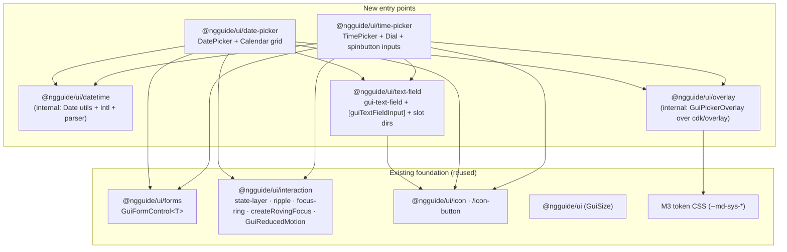
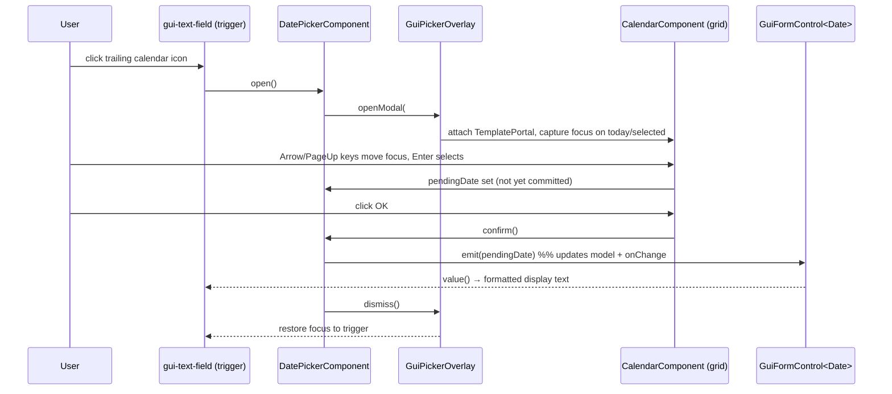

# Design Document: Text inputs (text fields, date pickers, time pickers)

## Overview

This design implements the M3 **Text inputs** category as new `@ngguide/ui/*` secondary entry points:
a presentational **text-field** wrapper, **date-picker** (docked · modal · modal-input · range), and
**time-picker** (dial · input, 12h/24h). Two internal support entry points back the pickers: a pure
**datetime** utility module (native `Date` math + `Intl` localization) and an **overlay** helper (a thin
service over `@angular/cdk/overlay` for docked panels and focus-trapped modal dialogs). Pickers integrate
with Angular forms through the shared `GuiFormControl` host-directive; the text-field is purely
presentational and lets the consumer's projected native `<input>` own forms.

Everything traces to the M3 spec (text-field container 56dp; dial 256dp / handle 48dp / center 8dp /
track 2dp; date-range is modal/modal-input only) and the WAI-ARIA APG (grid calendar, modal dialog,
spinbutton time inputs).

### Key Changes

1. **Five new entry points**: `@ngguide/ui/text-field`, `@ngguide/ui/date-picker`,
   `@ngguide/ui/time-picker`, plus internal `@ngguide/ui/datetime` (date/Intl utils) and
   `@ngguide/ui/overlay` (CDK-overlay helper). All wired through `tsconfig.base.json`, the component
   `ng-package.json` + barrels, and the `ui` test `include` list. No new runtime dependency (`@angular/cdk`
   and `@angular/forms` are already peers).
2. **Presentational text-field wrapper** (`<gui-text-field>`) that projects the consumer's `<input>`/
   `<textarea>` (marked with `[guiTextFieldInput]`) and draws the M3 filled/outlined chrome — floating
   label, supporting/error text, character counter, prefix/suffix, leading/trailing icon slots — by
   observing the projected input. Forms flow through the consumer's input; **no `GuiFormControl` on the
   text-field** (logged deviation).
3. **Imperative overlay helper** that opens docked panels (`FlexibleConnectedPositionStrategy` +
   reposition scroll) and modal dialogs (`GlobalPositionStrategy` + block scroll + backdrop +
   `ConfigurableFocusTrapFactory`), handling Escape / outside-click / backdrop dismissal and focus
   restoration to the trigger.
4. **Date & time pickers** that compose `GuiFormControl<T>` (T = `Date`, `GuiDateRange`, or `GuiTime`),
   render an APG grid calendar / SVG clock dial, and use the datetime utils for all math, parsing, and
   localized formatting.
5. **New shipped global stylesheet** `libs/ui/src/styles/overlay.css` carrying the CDK overlay container/
   backdrop structural rules themed with the M3 scrim token, imported from `theme.css` so both the package
   and the demo app pick it up (the CDK prebuilt CSS is currently imported nowhere).

### Decisions

| Problem Area | Chosen Variant | Why chosen | Reference |
|---|---|---|---|
| 1. Text-field architecture | **B — wrapper projects consumer `<input>`** | Consumer keeps full native-input ownership (native attrs, validators, their own value accessor); wrapper is pure M3 chrome. Reconciled with Area 2 by keeping forms off the wrapper. | research.md §1 |
| 2. Forms integration | **A — `GuiFormControl` via `hostDirectives`, pickers only** | Date/time pickers own a custom value → reuse the shared CVA exactly like selection; text-field forms stay on the projected native input, dissolving the 1B↔2A native-CVA collision. | research.md §2 |
| 3. Overlay foundation | **A — imperative `Overlay` + shared helper** | Full focus-management control (APG-critical), lowest risk; one helper serves docked (Flexible) and modal (Global + focus-trap) for both pickers. | research.md §3 |
| 4. Date engine + i18n | **A — native `Date` + pure utils + `Intl`** | Honors the native-Date constraint, zero new deps, pure functions are trivially unit-testable on the native Vitest runner. Picker value = `Date`. | research.md §4 |
| 5. Time-picker engine | **A — SVG dial + spinbutton inputs** | Mirrors the slider's proven custom pointer engine; SVG gives exact dial/hand positioning and the 24h inner ring. | research.md §5 |

### Logged deviations from kit norms

- **D1 — Text-field carries no CVA.** Every selection control composes `GuiFormControl`; `<gui-text-field>`
  deliberately does not. It is a presentational wrapper (Area 1B); forms binding lives on the consumer's
  projected `<input>` via Angular's built-in `DefaultValueAccessor`. This is the intentional resolution of
  the 1B↔2A conflict, not an oversight.
- **D2 — First introduction of raw `@angular/cdk/overlay`.** The kit previously used CDK only via
  `CdkMenuTrigger`. The overlay helper is new surface area; its structural CSS must ship globally (see Key
  Change 5).
- **D3 — Text-field is single-size (no `GuiSize` input).** M3 text fields define no size variation (fixed
  56dp), so per R11.4 ("use `GuiSize` where M3 defines size variation") the text-field omits a `size`
  input rather than inventing one. Pickers likewise follow M3's fixed measurements.

## Architecture

### Entry-point / module graph



### Component diagram — date picker (docked example)

```mermaid
graph TB
  subgraph dp["DatePickerComponent (gui-date-picker)"]
    trigger["gui-text-field (trigger) + projected input"]
    cva["GuiFormControl&lt;Date&gt; (host directive)"]
    tpl["#panel ng-template → CalendarComponent"]
  end
  subgraph ovl["GuiPickerOverlay"]
    flex["FlexibleConnectedPositionStrategy<br/>(anchored to trigger)"]
    ref["OverlayRef (TemplatePortal)"]
  end
  cal["CalendarComponent (role=grid)<br/>month nav · weekday row · day cells"]

  trigger -->|click / focus| dp
  dp -->|openDocked(origin, #panel)| ovl
  ovl --> flex
  ovl --> ref
  ref --> cal
  cal -->|select(date)| cva
  cva -->|writeValue / valueChange| trigger
```

### Data flow — selecting a date (modal)



## Components and Interfaces

### 1. `@ngguide/ui/datetime` (internal utilities — pure, no Angular)

Pure functions + `Intl` wrappers. No `Date.now()`/`new Date()` inside pure helpers that need determinism —
callers pass `today` explicitly where it matters (keeps unit tests deterministic and SSR-safe).

```typescript
// Path: libs/ui/datetime/src/date-utils.ts
/** All functions operate on local-midnight Dates to avoid TZ/DST off-by-one. */
export function startOfDay(d: Date): Date;
export function isSameDay(a: Date, b: Date): boolean;
export function addDays(d: Date, n: number): Date;
export function addMonths(d: Date, n: number): Date;          // clamps day to month length
export function startOfMonth(d: Date): Date;
export function daysInMonth(year: number, month0: number): number;
export function clampDate(d: Date, min?: Date | null, max?: Date | null): Date;
export function isBefore(a: Date, b: Date): boolean;
export function compareDate(a: Date, b: Date): number;        // -1 | 0 | 1, day-resolution

/** A 6×7 grid (always 42 cells) for a month, honoring firstDayOfWeek (0=Sun..6=Sat). */
export interface CalendarCell {
  date: Date;
  inCurrentMonth: boolean;     // false → "outside month date" state
}
export function buildMonthGrid(year: number, month0: number, firstDayOfWeek: number): CalendarCell[];
```

```typescript
// Path: libs/ui/datetime/src/intl.ts
/** Localized names + formatting via Intl.DateTimeFormat (format-only; never parses). */
export function monthNames(locale: string, style?: 'long' | 'short'): string[];   // length 12
export function weekdayNames(locale: string, style?: 'long' | 'short' | 'narrow'): string[]; // len 7, Sun-first
export function formatDate(d: Date, locale: string, opts?: Intl.DateTimeFormatOptions): string;
export function formatTime(t: GuiTime, locale: string, hour12: boolean): string;

/**
 * Locale's first day of week (0=Sun..6=Sat). Uses Intl.Locale.getWeekInfo() where available
 * (firstDay 1=Mon..7=Sun, normalized to 0..6); falls back to a small CLDR-derived map, else Sunday.
 * getWeekInfo() is NOT Baseline — the fallback is mandatory.
 */
export function firstDayOfWeek(locale: string): number;

/** Whether the locale uses 12-hour clock by default (probes Intl.DateTimeFormat hourCycle). */
export function prefersHour12(locale: string): boolean;
```

```typescript
// Path: libs/ui/datetime/src/parse.ts
/**
 * Locale-aware date parsing. Intl cannot parse, so we derive the locale's field ORDER from
 * Intl.DateTimeFormat(locale).formatToParts(referenceDate) and match typed input against it.
 * ISO yyyy-mm-dd is always accepted. Returns null on unparseable/ambiguous input.
 */
export function parseDate(input: string, locale: string): Date | null;
export function parseTime(input: string, hour12: boolean): GuiTime | null;  // null on out-of-range
```

```typescript
// Path: libs/ui/datetime/src/models.ts
export interface GuiTime { hours: number; minutes: number; }            // hours 0..23, minutes 0..59
export interface GuiDateRange { start: Date | null; end: Date | null; }
```

### 2. `@ngguide/ui/overlay` (internal — `GuiPickerOverlay` service)

```typescript
// Path: libs/ui/overlay/src/picker-overlay.ts
import { Overlay, OverlayRef } from '@angular/cdk/overlay';
import { TemplatePortal } from '@angular/cdk/portal';
import { ConfigurableFocusTrapFactory } from '@angular/cdk/a11y';

export interface DockedConfig { origin: HTMLElement; width?: string; }
export interface ModalConfig { ariaLabel?: string; }

/** Handle returned to the picker; it owns dismissal + focus restore. */
export interface GuiOverlayHandle {
  readonly ref: OverlayRef;
  /** Emits once when the overlay is dismissed (Escape, backdrop, outside-click, or programmatic). */
  readonly closed: Observable<void>;
  close(): void;
}

@Injectable({ providedIn: 'root' })
export class GuiPickerOverlay {
  private readonly overlay = inject(Overlay);
  private readonly focusTrapFactory = inject(ConfigurableFocusTrapFactory);

  /** Docked: anchored to origin, no backdrop, reposition on scroll, close on outside-click/Escape. */
  openDocked(portal: TemplatePortal, cfg: DockedConfig): GuiOverlayHandle;

  /** Modal: centered, backdrop scrim, block scroll, focus-trap with auto-capture, Escape/backdrop close. */
  openModal(portal: TemplatePortal, cfg: ModalConfig): GuiOverlayHandle;
}
```

Behavior contract (APG / R9 / R10.5):
- **Docked**: `FlexibleConnectedPositionStrategy` from `STANDARD_DROPDOWN_BELOW_POSITIONS`, `viewportMargin`,
  `RepositionScrollStrategy`; subscribe `ref.outsidePointerEvents()` and `ref.keydownEvents()` (Escape) to
  `close()`. No focus trap (non-modal), but move focus into the panel on open.
- **Modal**: `GlobalPositionStrategy().centerHorizontally().centerVertically()`, `hasBackdrop: true`,
  `backdropClass` = M3 scrim, `BlockScrollStrategy`; build a `ConfigurableFocusTrap`, `focusInitialElement()`
  after attach; `ref.backdropClick()` and Escape → `close()`. `role="dialog"` + `aria-modal="true"` set on
  the panel root by the picker template.
- **Both**: capture `document.activeElement` before open; on `close()`, `ref.dispose()` and restore focus to
  the saved trigger element.

### 3. `@ngguide/ui/text-field`

```typescript
// Path: libs/ui/text-field/src/text-field-input.ts
/**
 * Marker directive the consumer applies to their native <input>/<textarea> inside <gui-text-field>.
 * Exposes the element + reactive state the wrapper observes. Does NOT provide a value accessor —
 * the consumer's own ngModel/formControl/DefaultValueAccessor stays intact.
 */
@Directive({
  selector: 'input[guiTextFieldInput], textarea[guiTextFieldInput]',
  exportAs: 'guiTextFieldInput',
  host: {
    '(focus)': 'focused.set(true)',
    '(blur)': 'focused.set(false)',
    '(input)': 'syncValue()',
    '[attr.aria-invalid]': 'null',   // wrapper sets describedby/invalid via bindings on the field
  },
})
export class TextFieldInputDirective {
  readonly el = inject<ElementRef<HTMLInputElement | HTMLTextAreaElement>>(ElementRef).nativeElement;
  readonly focused = signal(false);
  readonly empty = signal(true);     // updated by syncValue(); drives floating label
  readonly multiline = computed(() => this.el.tagName === 'TEXTAREA');
  protected syncValue(): void { this.empty.set(!this.el.value); }
}
```

```typescript
// Path: libs/ui/text-field/src/text-field.ts
export type GuiTextFieldVariant = 'filled' | 'outlined';

@Component({
  selector: 'gui-text-field',
  exportAs: 'guiTextField',
  // template: leading slot · [label + (prefix) + <ng-content input> + (suffix)] · trailing slot
  //           · supporting-text row (supportingText | errorText  +  counter)
  host: {
    '[attr.data-variant]': 'variant()',
    '[attr.data-focused]': 'input().focused() ? "" : null',
    '[attr.data-populated]': '!input().empty() ? "" : null',
    '[attr.data-error]': 'error() ? "" : null',
    '[attr.data-disabled]': 'disabledEl() ? "" : null',
  },
  changeDetection: ChangeDetectionStrategy.OnPush,
})
export class TextFieldComponent {
  readonly variant = input<GuiTextFieldVariant>('filled');
  readonly label = input('');
  readonly supportingText = input('');
  readonly errorText = input('');
  readonly error = input(false, { transform: booleanAttribute });
  readonly required = input(false, { transform: booleanAttribute });
  readonly prefix = input('');
  readonly suffix = input('');
  readonly maxLength = input<number | null>(null);   // drives counter (current/max)

  protected readonly input = contentChild.required(TextFieldInputDirective);
  protected readonly leading = contentChild(TextFieldLeadingDirective);
  protected readonly trailing = contentChild(TextFieldTrailingDirective);

  // Counter reads input().el.value.length; sets aria-describedby on the input to the
  // supporting-text/counter element ids; reflects error → aria-invalid on the input.
}
```

Slot directives (selector-only, for projection + a11y wiring): `[guiTextFieldLeading]`,
`[guiTextFieldTrailing]`, `[guiTextFieldPrefix]`/`[guiTextFieldSuffix]` (or via `prefix`/`suffix` inputs).
The trailing slot is where a consumer drops a `gui-icon-button` (clear / password toggle) — it is a normal
focusable button, so keyboard operability (R3.3) is inherent.

CSS keys entirely off the `data-*` host attributes and `--md-sys-*` tokens; measurements from the verified
spec (container 56dp, paddings 8/16/12/16/4/16dp). Filled vs outlined switch on `[data-variant]`.

### 4. `@ngguide/ui/date-picker`

```typescript
// Path: libs/ui/date-picker/src/calendar.ts  (the grid; role="grid")
@Component({
  selector: 'gui-calendar',
  host: { 'role': 'grid', '[attr.aria-label]': 'monthYearLabel()' },
})
export class CalendarComponent {
  readonly activeMonth = model<Date>();                 // first-of-month shown
  readonly selected = input<Date | null>(null);
  readonly rangeStart = input<Date | null>(null);
  readonly rangeEnd = input<Date | null>(null);
  readonly min = input<Date | null>(null);
  readonly max = input<Date | null>(null);
  readonly dateFilter = input<((d: Date) => boolean) | null>(null);
  readonly locale = input<string>('en-US');
  readonly today = input<Date>();                       // injected, not Date.now() in the grid
  readonly dateSelected = output<Date>();

  // Renders weekday columnheaders (firstDayOfWeek(locale)) + 42 gridcells from buildMonthGrid().
  // Roving tabindex: exactly one cell tabindex=0. Keyboard (APG): Arrows, Home/End (week),
  // PageUp/Down (month), Shift+PageUp/Down (year), Enter/Space select. aria-selected on selected;
  // disabled cells (min/max/filter/outside) get aria-disabled and are not selectable.
}
```

```typescript
// Path: libs/ui/date-picker/src/date-picker.ts
export type GuiDatePickerVariant = 'docked' | 'modal' | 'modal-input';

@Component({
  selector: 'gui-date-picker',
  hostDirectives: [{ directive: GuiFormControl, inputs: ['value: date', 'disabled'],
                     outputs: ['valueChange: dateChange'] }],
})
export class DatePickerComponent {              // GuiFormControl<Date> for single
  readonly variant = input<GuiDatePickerVariant>('docked');
  readonly label = input('');
  readonly locale = input<string>('en-US');
  readonly min = input<Date | null>(null);
  readonly max = input<Date | null>(null);
  readonly dateFilter = input<((d: Date) => boolean) | null>(null);

  private readonly control = inject(GuiFormControl<Date>);
  private readonly overlay = inject(GuiPickerOverlay);
  // open(): docked → openDocked(#panel, {origin: triggerEl}); modal/modal-input → openModal(#panel).
  // commit(date): control.emit(date); control.markTouched(); close. modal/modal-input require OK.
  // Trigger is a <gui-text-field> with a trailing calendar gui-icon-button; typed input parsed via
  // parseDate(value, locale) → error state on null/out-of-range.
}
```

```typescript
// Path: libs/ui/date-picker/src/date-range-picker.ts
@Component({
  selector: 'gui-date-range-picker',
  hostDirectives: [{ directive: GuiFormControl, inputs: ['value: range', 'disabled'],
                     outputs: ['valueChange: rangeChange'] }],
})
export class DateRangePickerComponent {}        // GuiFormControl<GuiDateRange>
// Modal + modal-input only (no docked range — verified). Two trigger fields (start/end) OR one
// range field per modal-input config. Calendar highlights start, end, and in-range cells; clamps
// end ≥ start. Range fill uses secondary-container / on-secondary-container per spec.
```

### 5. `@ngguide/ui/time-picker`

```typescript
// Path: libs/ui/time-picker/src/clock-dial.ts  (SVG dial)
@Component({ selector: 'gui-clock-dial' /* role group; numbers are focusable */ })
export class ClockDialComponent {
  readonly mode = input<'hours' | 'minutes'>('hours');
  readonly hour12 = input(true);
  readonly value = model<GuiTime>();
  // SVG: container 256dp, handle 48dp, center 8dp, track width 2dp (verified).
  // Number i positioned at angle θ: x = cx + r·sin θ, y = cy − r·cos θ. 24h adds an inner ring
  // (0/13..23) at a smaller radius. Pointer engine (pointerdown/move/up like the slider) maps
  // angle → unit; keyboard arrows step the active unit (documented dial key model).
}
```

```typescript
// Path: libs/ui/time-picker/src/time-picker.ts
export type GuiTimePickerVariant = 'dial' | 'input';

@Component({
  selector: 'gui-time-picker',
  hostDirectives: [{ directive: GuiFormControl, inputs: ['value: time', 'disabled'],
                     outputs: ['valueChange: timeChange'] }],
})
export class TimePickerComponent {              // GuiFormControl<GuiTime>
  readonly variant = input<GuiTimePickerVariant>('dial');
  readonly hour12 = input<boolean | null>(null);   // null → prefersHour12(locale)
  readonly locale = input<string>('en-US');

  // Modal dialog. Dial mode → gui-clock-dial; input mode → two role="spinbutton" fields + AM/PM
  // segment (12h). Keyboard icon button toggles dial↔input. OK commits via control.emit(time);
  // Cancel dismisses without commit. Input fields validate via parseTime → error state.
}
```

## Data Models

```typescript
// @ngguide/ui/datetime
export interface GuiTime { hours: number; minutes: number; }        // 0..23 / 0..59
export interface GuiDateRange { start: Date | null; end: Date | null; }

// Size/measurement token maps (single fixed M3 size → still expressed as a const for consistency,
// but NOT a Record<GuiSize> since text fields/pickers have no GuiSize variation — see D3).
// libs/ui/text-field/src/text-field-tokens.ts
export const GUI_TEXT_FIELD = {
  containerHeight: '56px', padTopBottom: '8px',
  padNoIcon: '16px', padWithIcon: '12px', iconGap: '16px',
  supportingTop: '4px', counterGap: '16px',
} as const;

// libs/ui/time-picker/src/time-picker-tokens.ts
export const GUI_CLOCK = { dial: '256px', handle: '48px', center: '8px', track: '2px' } as const;
```

CVA value types per component: `DatePickerComponent` → `GuiFormControl<Date>`; `DateRangePickerComponent`
→ `GuiFormControl<GuiDateRange>`; `TimePickerComponent` → `GuiFormControl<GuiTime>`. The text-field has no
CVA (D1).

## Data Flow Completeness

The "layers" for this UI library are: token CSS → component input/model → CVA/value model → template/DOM →
a11y attributes → demo host. No DB/API layers apply.

| Field/Entity | Token/CSS | Component input/state | CVA value | DOM/template | A11y | Demo host |
|---|---|---|---|---|---|---|
| text-field value | `text-field.css` | projected input (consumer) | N/A (D1 — native CVA) | `<ng-content>` input | `aria-describedby`/`aria-invalid` on input | `app.component.html` text-field demo |
| text-field error/counter | `text-field.css` `[data-error]` | `error`,`errorText`,`maxLength` inputs | N/A | supporting-text row | counter announced; `aria-invalid` | demo |
| date value | `date-picker.css` | `DatePickerComponent` | `GuiFormControl<Date>` | trigger `gui-text-field` + `gui-calendar` | grid roles, `aria-selected` | demo |
| date range | `date-picker.css` in-range | `DateRangePickerComponent` | `GuiFormControl<GuiDateRange>` | two triggers + calendar highlight | grid + range desc | demo |
| time value | `time-picker.css` | `TimePickerComponent` | `GuiFormControl<GuiTime>` | dial SVG / spinbutton inputs | `role=spinbutton` aria-value* | demo |
| overlay panel | `styles/overlay.css` (scrim) | `GuiPickerOverlay` | N/A | `OverlayRef`/`TemplatePortal` | `role=dialog` `aria-modal` / focus-trap | both pickers |
| first-day-of-week | N/A | `firstDayOfWeek(locale)` | N/A | weekday columnheaders order | columnheader `abbr` | locale-varying demo |

## Error Handling

| Error | Behavior / user-visible result |
|---|---|
| Unparseable typed date | `parseDate` → `null`; field enters error state, `errorText` shown, `aria-invalid=true`; model not updated |
| Date outside min/max/filter | Cell rendered disabled (not selectable); typed out-of-range → error state |
| Range end < start | Calendar clamps end ≥ start; cannot commit an inverted range |
| Unparseable/out-of-range time | `parseTime` → `null`; spinbutton field error state; OK disabled until valid |
| `getWeekInfo()` unsupported | Fallback CLDR map → locale first-day; never throws |
| Overlay opened with no origin (docked) | Helper throws in dev (`origin` required for docked); pickers always pass the trigger el |
| Reduced motion | `GuiReducedMotion` gates dial/label/ripple animations (no motion when preferred) |

## Testing Strategy

### Approach

- **Pure datetime utils** — plain unit tests (no TestBed): `buildMonthGrid` shapes (42 cells, firstDay
  offset, outside-month flags), `addMonths` clamping, `parseDate` per-locale order + ISO + null cases,
  `firstDayOfWeek` with mocked `Intl.Locale` and the fallback path, `formatDate/Time`.
- **Components** — TestBed + native Vitest (the checkbox/slider pattern): host component drives inputs, query
  DOM, assert signals + ARIA attributes. Reactive-forms host (`FormControl<Date>`) verifies CVA round-trip
  for pickers.
- **Overlay/focus** — TestBed opens a picker, asserts the overlay attaches, focus moves in, Escape/backdrop
  closes and restores focus. (jsdom limits visual positioning — covered by the browser dogfood pass, as the
  selection spec established for overlay-rendered surfaces.)
- Every published entry point gets ≥1 spec registered in `libs/ui/project.json` `include`.

### Unit Tests (examples)

```typescript
describe('buildMonthGrid', () => {
  it('returns 42 cells with the first column matching firstDayOfWeek', () => {
    const grid = buildMonthGrid(2026, 5 /*Jun*/, 1 /*Mon*/);
    expect(grid).toHaveLength(42);
    expect(grid[0].date.getDay()).toBe(1);
    expect(grid.some((c) => !c.inCurrentMonth)).toBe(true);
  });
});

describe('DatePickerComponent (reactive forms)', () => {
  it('writes the picked date back to the bound FormControl', () => {
    // host: <gui-date-picker [formControl]="control" />; open, select a cell, expect control.value
  });
});

describe('TimePickerComponent', () => {
  it('exposes hour/minute spinbuttons with aria-valuemin/max in 24h mode', () => {
    // hour12=false → hour spinbutton aria-valuemax=23
  });
});
```

### Edge Cases

1. **TZ/DST** — all date math via local-midnight `startOfDay`; assert no off-by-one across a DST boundary.
2. **Leap day** — `addMonths(Jan 31 → Feb)` clamps to Feb 28/29.
3. **Locale first-day** — `en-US` (Sun) vs `en-GB`/`ru` (Mon) reorder weekday headers and grid.
4. **12h↔24h** — AM/PM present only in 12h; hour ranges 1–12 vs 0–23; dial inner ring only in 24h.
5. **Empty/clear** — clearing the trigger sets model to `null`; floating label returns to resting.
6. **Multiline** — `<textarea guiTextFieldInput>` grows with content; counter/error still apply.
7. **Disabled via form** — `setDisabledState` (pickers) and the consumer's disabled input (text-field) both
   block interaction and show the disabled treatment.
8. **Outside-click vs select** — docked closes on outside-click without committing a hovered date; modal
   commits only on OK.

## Notes

- **Overlay CSS shipping (D2):** add `libs/ui/src/styles/overlay.css` containing the CDK overlay container/
  backdrop structural rules (mirroring `@angular/cdk/overlay-prebuilt.css`, ~2KB) with the backdrop themed
  via `--md-sys-color-scrim`; `@import` it from `libs/ui/src/styles/theme.css` so it ships in the package
  asset bundle and the demo app inherits it through its existing `theme.css` import. No node_modules
  `@import` in shipped CSS (ng-packagr asset is copied verbatim).
- **No `Date.now()` in pure utils / grid:** the calendar receives `today` as an input and the components
  read the clock once at their composition root, keeping the pure layer deterministic (and respecting the
  workflow constraint against nondeterministic time in reusable logic).
- **Scope honored:** no external date library, no external overlay library, no form-state abstraction —
  matches the requirements Constraints.
